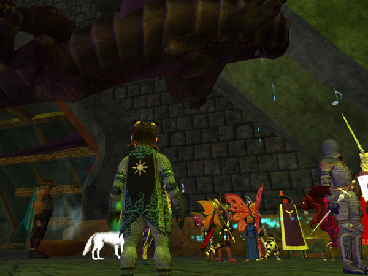
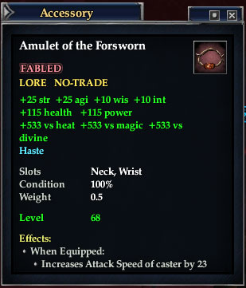

Back to: [West Karana](/posts/westkarana.md) > [2007](/posts/2007/westkarana.md) > [October](./westkarana.md)
# EQ2: Harla Dar is dead and a certain halfer is welcome in Deathtoll

*Posted by Tipa on 2007-10-06 03:21:59*

I upgraded to the latest Wordpress and changed my theme just so I could use larger screenshots...

After a couple of disappointing attempts at the last dragon I needed to finish my Deathtoll access with my own guild, a pickup raid smooved in and ganked her, with me singing my little lungs out. Like Clockwork Menace, once you kill the first mob you're on a timer. We had thirty minutes until the trash mobs we cleared would return.

We finished with five minutes to spare!

It was great to be part of such an awesome raid.

After that, a run down to Naggy... well, a glide. I won a Fae Wing Cloak in Emerald Halls the other day, and that gives even plump pie-maidens the ability to flit through the air like a Fae. So I jumped all the way from the top to the bottom of Solusek's Eye, but in trying to find just the right ranp on which to land, I misjudged my glide and ended up in the lava.

So... once I'd revived... I didn't glide quite so far down.

Naggy went on and on blah blah blah blah. Why is it that dragons, seemingly above mortal cares, always keep droning on and on about how powerful they are, how insignificant I am, how their plots will be the undoing of the world... ***YAWN***. Look, Naggy. I'm a simple bard. My poor mortal mind can't understand all the hidden meanings and complex plots you're always on about.

Me, I'm mostly just waiting for you to shut up and give me some treasure. Okay? Thanks.

Anyway, he finally coughed up my reward for months and MONTHS of hard work -- the Amulet of the Forsworn. And this is a NICE bit of jewelry. I finally get back the haste I lost when I ditched my FBSS, and it was a fantastic replacement for a legendary bracelet I was wearing.

Thanks Nag, you're a good sort after all. Good luck with your schemes, and I'm not just saying that to be nice, because me and nice don't have much to do with one another.
## Comments!

**[cyanbane](http://www.eq2-daily.com)** writes: Good post, Love the new look! :)

---

**[Keen](http://www.keenandgraev.com)** writes: I like the new layout. :) Grats on your amulet.

---

**[MrrX](http://mrrx.wordpress.com)** writes: The curtsey in front of Naggy had me LOL.

---

**[Tipa](https://chasingdings.com)** writes: And let me tell you, it's not easy lining up a shot with a droag who is three times your height and a dragon that is TEN times your height and still be a part of the picture. I'm standing WAY in front of the other two. 

Great to see you back, MrrX!

---

**[Lishian](http://lishian.wordpress.com)** writes: Do you call humans, Wholers?

---

