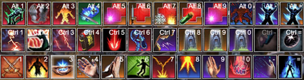

Back to: [West Karana](/posts/westkarana.md) > [2007](/posts/2007/westkarana.md) > [October](./westkarana.md)
# EQ2: Basic Interrogation Techniques

*Posted by Tipa on 2007-10-09 07:44:25*

 *Dera's appearance armor -- Blackened Iron Vanguard, tier 2 mastercrafted, made by her.*

I play several classes and can't claim I'm any good at any of them. But I have fun, and my guild still lets me raid with them, so I can't be a total failure.

*Interrogation technique #1: Significantly or moderately increase fear level of detainee*

Anyone who's taken the time to level a character from one to seventy, though, has figured out a few things. And one of those things is... how to deal with so many buttons. As a cleric in EQ1, I had my main bank of ten which covered my heals and short term buffs like Divine Intercession (protect target from death), Divine Barrier (protect self from damage and also give a little heal over time), and Yaulp (faster mana regen while standing). I had a second bank for rarely used abilities and items. And that really was it.

In World of Warcraft, I had two banks of twelve keys that covered all of my abilities and a third bank for buffs.

In EQ2, I have five banks of twelve buttons, and I still don't fit everything on. I should really make a sixth.

*Interrogation technique #2: Invoke feelings of futility in detainee*

Newcomers to EQ2 start out fine, but by level twenty or so, the sheer number of abilities becomes a little overwhelming. I hear lots of talk that after twenty or so, EQ2 is just a matter of hitting buttons -- any of them, all of them -- as fast as you can. The trick is to fit them into a theme -- the eighty-eight piano keys don't seem like so many when you divide the keyboard into octaves and the notes into chords. Your achievements are the chords.

An clerics in EQ2 wear heavy armor, and the cleric achievements reflect an "in your face" playstyle. The strength line gives a chance to interrupt enemy casting; agility gives double melee attacks; stamina boosts melee crits; wisdom severely hurts the undead when hit by melee (VERY handy in MANY EQ2 zones), and intelligence grants critical spell hits. Six lines and five of them deal with melee.

That's a hint. The inquisitor-specific achievement line gives another hint -- a line that turns your offensive spells into combat arts. It's called the Battle Cleric line.

Yeah, I liked the sound of that. I bought that line, and on the cleric tree went for Stamina (gives me more health, melee crits, heal crits, and divine aura -- 10 seconds of damage immunity. EQ1 gave 18. Sigh.). My second focus was intelligence -- spell damage doesn't fit with the theme, but the end ability -- Divine Recovery -- which increases casting speed by 50% and recovery speed by 33% comes in handy.

*Interrogation technique #3: Convince detainee interrogator knows all*

I've brought my three most heavily used bars here to show how it all comes together. The other two are largely buffs and item triggers.

Starting from top left are Debase and Convict. The first decreases the target's intelligence and strength, somewhat decreasing their spell and melee damage. The second decreases the mitigation of the target against all damage by a substantial amount. Since these are single target, they are only really useful in longer, boss fights. Still, while soloing I use them. Every little bit helps. Next over is Heretic's Destiny, a fun spell that makes the target explode when it dies, damaging every other enemy in its group. It also gives the inquisitor the kill shot. Forced Obedience, next over, effectively makes the target encounter melee as if it was a level lower than it is. The next five buttons cure various ailments; the last cures the entire group of elemental and arcane effects -- very handy. The next, Disorientation, drastically reduces aggro on the cleric, and the next two are instant group and single target reactive heals, for emergencies.

The keystrokes for that are burned into my brain.

*Interrogation technique #4: Playing on the hate of detainee for a specific group*

The second row start with my transmogrified combat arts. They hit faster than their spell forms, if not quite as hard. Leaving time for heals, though -- sometimes groups do want me to toss them the occasional heal -- is pretty important, so if I can rattle off three or four melee hits between heals, then I'm doing my job both healing and doing damage.

The first, Affliction, is another debuff -- it decreases mitigation vs mental damage (all troubadour attacks are based on mental damage...), and adds a small mental-based damage over time. Divine Castigation comes from an achievement, and does medium divine damage. Invocation Strike is another divine hit, Strike of Corruption decreases the wisdom of the target (and hence its resists), bashes it about a bit, and leaves it with a small DoT. Hammer Smite is another achievement strike, this one knocking back and stunning its target, as well as doing some moderate damage. Foreboding Conversion makes the target run a short distance away, and then become mesmerized and unable to act for half a minute. Don't use this in crowded rooms.

Those are my spam buttons. If I'm not needing to cast a heal, and one of them is up, I whack the monster with it (well, except for the fear). Keeping all the debuffs and dots up makes things go much faster.

*Interrogation technique #5: Threat of imminent death to detainee or his family members*

Continuing on, Fanaticism is one of the two inquisitor trademarks. The inquisitor can't cast (there's an achievement that removes this restriction), but the people in her group nuke harder, hit faster and refresh spells faster. This spell can be brought up or down in an instant, so whenever the inquisitor is not having to heal -- trash clearing, for instance -- this is always up.

The row ends with my three rezzes (two single target and one group, hope never to use them), an expendable power item trigger and my manastone.

The theme of the second row was melee. Inquisitors don't do nearly as much damage as a fighter or scout, but what they do hit, hurts for a long time, either through debuffs or dots.

*Interrogation technique #6: Convince detainee that interrogator has mistaken detainee for someone else*

The last row are the spells I use *all* the time. The first -- starts autoattacking. A cleric should always be auto-attacking, especially if they have achievements toward melee crits, stuns, etc. The second, does heat damage and sets the target on fire, but confusingly reduces their resistance to... divine damage.

Suffering Penance is the single target reactive heal. This is very effective on plate tanks, with their high mitigation. If a scout or brawler is tanking, their lower mitigation but higher avoidance makes this less useful -- stick to the next two heals.

Devoted Ministration and Fanatical Healing are the medium and heavy heals. Devoted Ministration is only for emergency use. *Most* healing should be done with Fanatical Healing, as it is the most efficient of the direct heals. If they aren't hurt that bad, they probably don't need heals at all.

Don't coddle them. You're *supposed* to be *evil*. This is what their food should be doing for them.

*Interrogation technique #7: Interrogator is from country with reputation for harsh treatment of detainees*

The next is Verdict, the second inquisitor trademark. Verdict brings the target from a certain percentage of its life (depending on its strength; below 50% for weak mobs, 2% or below for epics) to **1** hit point. Yup. Depending on the total health of the mob, an inquisitor could do 100K damage with one spell.

Too bad that doesn't count for our DPS in the parse. This spell used to take six seconds to cast, making the timing of it tricky. Now it's instant! No raid with an inquisitor in it should ever need to kill a boss further than 2%. Verdict uses the subjugation skill, and is pretty much the only spell that does. I had a lot of training to do with it when I first got the spell.

Fanatical Vengeance (#7) and Compelled Repentance (#0) do damage to the monster when it completes a melee attack or uses a combat art, respectively. If the mob isn't epic, Compelled Repentance will also stun it for a couple of seconds. I largely use these soloing. Nothing like having the mob kill itself more with every little thing it does. Works great for duels as well!

Litany Circle is an AE melee attack; it hits every mob in the immediate area *and* interrupts anything they were about to cast. That's the inquisitor philosophy right there. Stop a mob from doing anything, and when they do manage to squeeze off an attack, make it hurt them as much as it hurts you.

*Interrogation technique #8: Convince detainee interrogator has inaccurate file which must be fixed
*

Reproachful Alleviation heals the group and pulls a lot of aggro. Fortunately, clerics can handle some aggro. Offtanking, though, isn't recommended, as mobs will turn the tables on their interrogators and interrupt their casting. Malevolent Diatribe is the group reactive heal and pulls just as much aggro as the group direct heal. Facing a mob that is really hammering on the tank, a cleric might stack this and the single reactive heal together for twelve total reactive heals, often giving enough space to cast some of the better debuffs.

The final spell is another achievement, Divine Recovery, mentioned above, a 24 second group buff that substantially increases casting speed and recovery speed. There's no reason not to use this whenever it's up and you're facing a group of mobs or a single tough boss.

*Interrogation technique #9: Stare at detainee to increase discomfort*

I'm not the best cleric out there, and my inquisitor isn't my main. EQ2 classes are deep and richly complex, and when I hear someone say that playing a toon in EQ2 is nothing more than button mashing, well, I just have to respond.

I also play a 66 necromancer and a 70 troubadour, so I might talk about how I play them (especially soloing) at some point. My son has a 70 brigand -- a class very much described as an exercise in button mashing -- and he may talk about the special playstyle demanded by the stabby sorts at some point.

Gratuitous picture of my troub in her Beegees appearance armor :) Found that on a vendor in Somborn Village.

The interrogation techniques used as section headers were from a [table of interrogation techniques](http://hrw.org/backgrounder/usa/0819interrogation.htm) approved for use against terrorism suspects by Donald Rumsfeld.
## Comments!

**[Tipa](https://chasingdings.com)** writes: This post was inspired by a [discussion of Inquisitor healing](http://www.mmognation.com/2007/10/06/from-steam-to-sand/) over at MMOG Nation.

The use of advanced interrogation techniques has been used to good effect in Babylon 5's Season 4 episode "Intersections in Real Time" and in Alan Rickman's riveting movie, "Closet Land".

---

**Rofl** writes: Interesting to look at the makeup of an Inquisitor. I play a Fury on nagafen, and i only have one recommendation really, and that is to free up slot 1 of bank 1 (from the 'auto-attack' button). You can simply hit the tilde key to begin auto-attacking (shift+tilde to start ranged auto-attack), unless you've rebound that key.

---

**Spyte** writes: Great write up! I'm going to look again at my lowbie Inq

---

**[Lishian](http://lishian.wordpress.com)** writes: Cool post! Blackened iron armour rules, btw!

---

**[Tipa](https://chasingdings.com)** writes: @Lishian -- yeah, I'm not sure who mentioned how good it looked, might have been you, so I went back and dang, it DOES look good.

@Rofl -- True, I should get rid of the auto-attack key. Problem is that ever since EQ back in 1999, the '1' key has always started auto-attack on every character... I don't know if I could change now!

---

**Az** writes: Some really great tips there! Thanks for the write-up. I can't wait to get Verdict on my baby inquizzy!

---

**[Lishian](http://lishian.wordpress.com)** writes: I remember mentioning that to you

---

**foozlesprite** writes: Always hitting the 1 button even when it's not autoattack? Replace the icon with something more useful, like your manastone. If it's not ready you won't do anything, and if it's ready...

a healer can always use more mana =D

---

**[Tipa](https://chasingdings.com)** writes: @foozle -- oooo that's an EXCELLENT idea!

---

**foozlesprite** writes: Why thank you :)

---

