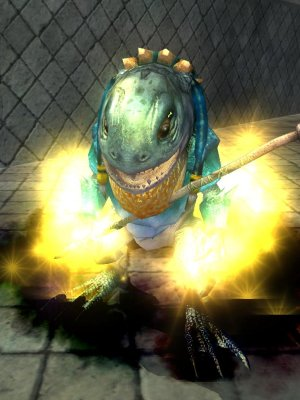
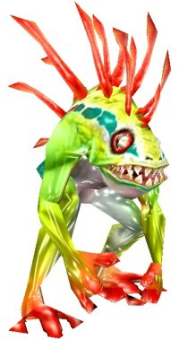

Back to: [West Karana](/posts/westkarana.md) > [2007](/posts/2007/westkarana.md) > [October](./westkarana.md)
# EQ2: Dude, you're getting a Murloc!

*Posted by Tipa on 2007-10-11 16:39:24*

I was reading Allakhazam's [interview with SOE's VP of Global Sales & Marketing, Torrie Dorrell](http://eq2.allakhazam.com/db/guides.html?guide=1089), and it was a good read. I was having fun, learning new stuff, and unlike some other recent interviews I'd read, focused more on asking questions than the [interviewer's lame roleplaying](http://eq2.allakhazam.com/db/guides.html?guide=1086).

About midway down, though... I couldn't believe my eyes. We're getting [MURLOCS](http://en.wikipedia.org/wiki/Murloc) in EQ2! No necks, fish face, clawed feet... not quite as bright as WoW's, but I know a Murloc when I see one.

Rawgrlgrlgrlgrlgrrgle!

I'm not sure what else they could be. There was a race of underwater goblins (which I suppose could be how EQ2 will call them), but they sure didn't look like Murlocs. And the frogloks of Kunark looked much like the froglocks everywhere else.

Nope, these are Murlocs, true and through.
