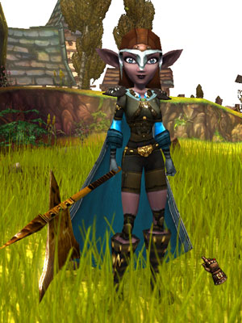
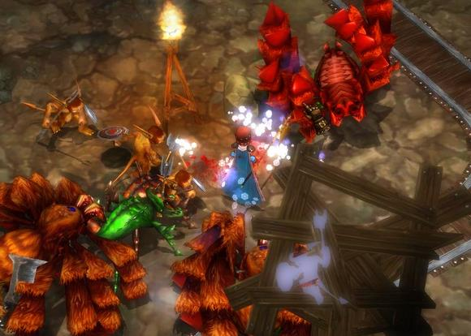

Back to: [West Karana](/posts/westkarana.md) > [2007](/posts/2007/westkarana.md) > [October](./westkarana.md)
# Mythos Beta

*Posted by Tipa on 2007-10-25 01:03:30*

I don't know whether to thank JoBildo or not for sending me a Mythos beta key just when I'd resubscribed to Dungeon Runners. Both are point-and-click kill fests, but where Dungeon Runners takes the Diablo 2 formula a little toward the MMO world, Mythos unashamedly brings the legendary dungeon hack to the present day. I haven't run DR once since I installed Mythos...

With Hellgate: London (by the developers of Mythos, Flagship Studios) in beta, and Tabula Rasa providing another take on the formula, 2008 could well be the year the Action RPG comes back. While World of Warcraft is still rampaging around the MMORPG world, playing in a different genre just makes sense.

You start the game as one of three races (Human, Gremlin and Satyr), each one of three classes (Bloodletters -- melee, Pyromancers -- casters, and Gadgeteers -- ranged fighters) and three different talent trees.

They do like the number three...

The game dumps your newly-created character in front of an old man who is complaining about monsters in the monastery -- the very one before which you stand -- and if you could roust them out, that would be wonderful. One step and -- I swear this is true -- you descend into a copy of Diablo 1's first dungeon. Sure, it's been fifteen or so years so some details might be a little off... that's what I saw.

I'd learned the controls and leveled up some by the time I finished, so I set out to the main town, Stonehill.

Quests? Every NPC has a quest, and most of them add new waypoints to your world map. But heck, who wants to do quests anyway. Mythos wants you to be out killing stuff and bagging loot as fast as you like. You can buy maps from a cartographer, or find them as drops, which open up a special instance on the world map, just for you.

Want a solo dungeon for levels 8-10 that you can finish in fifteen minutes? No problem. Want a group dungeon for five players between levels two and four? Right click and its yours. A portal lets you travel on the world map -- usually you still need to fight (or run) through a zone to get to the actual instance.

  
*A Minute of Mythos*

Like Diablo and other games of this type, upgrades come fast and furious. Go for AE attacks with a huge two hander, one shot kills with fast dual wields, or step back and direct your pets to do the killing? Set up traps that kill anything that comes close? Cast spells that jump from monster to monster, killing all?

Climb the tree. Each character is unique -- mine specializes in AE melee attacks and my gear tends toward health regeneration so I can run around and draw a crowd, then kill them in one stroke.

Mythos is anything but a hard game. Casual chat among the other players show character building as a high art -- and after awhile, every character essentially becomes a god of monster death, killing by their very presence.

  
*Creepy...*

If what you're looking for is an online dungeon-hack experience where you can be wopping creepies, laying waste to vast dungeons, hauling buckets of treasure back to town and playing with talent trees all in fifteen minutes -- Mythos might be your game.

## Comments!

**[JoBildo](http://bildos.blogspot.com)** writes: Aye, sorry for sending it to you after you wasted 5 bucks. Simple truth is, when it comes to action rpgs, Mythos beats DR hands down. And hey, at least Mythos won't have a monthly fee eiter. Instead it'll be using a cash shop for items and little baubbles that you could get without spending a dime too. Very cool ideas these guys have going, and one heck of a great casual yet deep Action RPG they've made. Lead designer is the same guy who make FATE. Figures he'd know how to replicate Diablo so well. :)

---

**[Lishian](http://lishian.wordpress.com)** writes: Looks like a neat little game.

---

**Rob** writes: Hi there. Just a fellow looking for a beta key. If you have any extras my email is zrobbie100@msn.com Thanks
-Rob

---

**[Tipa](https://chasingdings.com)** writes: They haven't given me any yet, but you can sign up for the beta at www.mythos.com and likely get your own before I get any :)

---

**JakeCourtney** writes: I'm looking for a key if anyone wants to share. Thank you. jakecourtney@gmail.com

---

**Varsonin** writes: Aye, I be some random stranger off the internets hoping to play this game. I don't mean to be a bother but if I could get an invite sent to mr\_glockifier@yahoo.com it would greatly be appreciated. =)

---

**[Tipa](https://chasingdings.com)** writes: Well, Mythos hasn't given me any invites or I would definitely share them :/ All I can suggest (and it isn't much, but it's all I got) is to register for the beta at www.mythos.com if you haven't already, or just play Hellgate: London which is essentially the same game in gameplay if not in setting, from what I understand.

---

**PekkaR** writes: Nice short look at the game, thank you.

You didn't mention other players much except for grouping. Diablo-like online games (Dungeon Runner is the one I've given a good try to) seem a lot like multiplayer Diablo in this sense, but you can meet a lot more people in town and only those in your party can get to the same dungeon instance as you. Does this apply to Mythos? Are there any circumstances where players can fight against each other?

---

**[Tipa](https://chasingdings.com)** writes: Mythos has more places than just the main towns where you can meet people; there are hubs scattered throughout the world. And once you are grouped up, you can go to special "epic" maps, made for groups, unlike Dungeon Runners, where the regular dungeons adapt themselves to your group, getting harder the more people you have. I don't believe there is PvP yet. Given how overpowered the players are, I'd expect PvP battles to be brutal and short, if there were any.

---

**kang** writes: I want to play the mythos.

---

**[Taylor Balbi](http://www.flagshipstudios.com)** writes: Hey guys! Well, you don't have to WAIT for an invite. You can head over to our IRC channel where we have given two of the long time fans a bunch of invites. The server: irc.forthegamers.org
The chan: #mythos
The Inviters: G-15 and Sulfuric!

See you guys there!

---

**[Taylor Balbi](http://www.flagshipstudios.com)** writes: Oh yeah, I forgot to mention! I am Taylor Balbi from Flagship Studios ^\_^ The Community Manager for Mythos! See you in the world of Uld! Great post!

---

**[West Karana » Still looking for a Mythos Beta invite?](https://chasingdings.com/index.php/2007/11/12/still-looking-for-a-mythos-beta-invite/)** writes: [...] looking for a Mythos Beta invite? Taylor Balbi, Community Manager for Mythos, has given a bunch of new invites to a couple of people and all you have to do is go to their IRC channel and ask! Hey guys! Well, [...]

---

**fluffyandevil** writes: been looking for beta key for a while now and sadly lost the cb giveaway contest qq ....so if anyone know how i could get a beta key email me at fluffyandevil@hotmail.com :)

---

