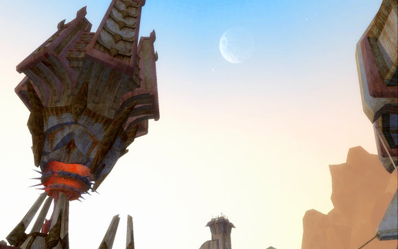

Back to: [West Karana](/posts/westkarana.md) > [2007](/posts/2007/westkarana.md) > [October](./westkarana.md)
# EQ2 Screenshot Throwdown!

*Posted by Tipa on 2007-10-27 08:39:57*

Syncaine over at [Hardcore Casual](http://syncaine.wordpress.com/2007/10/25/screen-shot-comparison/) thinks EQ2 is "flat, boring and lifeless", and as examples, puts up some [rather poor EQ2 screenshots](http://syncaine.files.wordpress.com/2007/10/eq2.thumbnail.jpg) (which he got from the official site so you'd expect better, though I suspect he got at least one of them from a player-submitted shot). Sure enough, in comparison, EQ2 suffers.

Well, comparing Lord of the Rings Online's graphics to those of EverQuest 2's is legit... but at least use screenshots of similar quality. I went to the exact same spot of Syncaine's screenshot in the satyr area of New Tunaria (and thanks to having to come there a hundred times for the Sword of Destiny quest, I knew where that was), and snapped this shot:

(Appearance armor: Actually, aside from the bandit mask, that's the armor I wear...) I turned around and caught this nice scene looking the other way:

Boring, flat and lifeless? I don't think so. Here's another from near zone-in. Walking into New Tunaria -- this is what you see.

(Appearance armor: Some dress I made. I wanted to dress kinda elfy or something so they wouldn't catch on I wasn't one of them hoighty-toighty high elves. They caught on to me right away -- friggen bandit mask. But it's soooo comfortable...)

So people say, yeah, Echoes of Faydwer looks great, but those old world zones -- BLECH! Especially FREEPORT!

I dunno. I *like* the way Freeport looks. Here's a shot I took in West Freeport while doing the Hallowe'en mask quest. This is Overlord Lucan D'Lere's floating fortress, with the un-blowed-up moon Drinal high in the sky:

And this shot is of the Pit of Execution in front of the militia house. Jump in that smoky, dusty pit and find yourself out in the Commonlands. Well, I guess being sentenced to the Commonlands is *like* death... unless you're an orc or an armadillo.

You can judge EQ2 many ways, but please, if you're going to compare screenshots, make sure you at least try to get decent ones...

Oh yeah, before I end this, check out this screen shot. Undergrowth, trees, a little hobbit home in the background, smoke rising lazily from a chimney, ruins, monsters, it's got it all.

THAT shot... is from Everquest 1. Misty Thicket. My old home town....

## Comments!

**[Syncaine](http://syncaine.wordpress.com)** writes: Some great shots Tipa. What graphic setting are those taken at?

---

**[Keen](http://www.keenandgraev.com)** writes: Thank you Tipa for posting these. I've been trying to defend that EQ2 is definitely beautiful in comparison and haven't had the opportunity to take screenshots yet with my account reactivated.

---

**[Tipa](https://chasingdings.com)** writes: The EQ2 shots were taken with a custom setting which would probably correspond to High Quality -- the step above balanced. It's what I play in when not raiding. For raiding, I do straight balanced. You can store multiple profiles and switch between them.

The EQ1 screen was done with all settings at max except shadows turned off, because EQ1 shadows are really weird.

The sad truth is that EQ2 *is* a beautiful game, but the default settings don't do the best job of showing this. There's some sites that go over adjusting the settings for the best blend of performance and looks, and with them, you can make EQ2 look like this without turning the game into a slideshow.

---

**[JoBildo](http://bildos.blogspot.com)** writes: I really think it's a matter of artistic style more than anything else. To me both games look somewhat "off". Not sure how to explain it. They look shiny and purdy, but not very appealing to me. I'm more for the exaggerated cartoony style of WoW, Warhammer, TF2, etc. But that's just personal preference/

Both games, EQ2 and LotRO are a sight to behold though on high settings. Some really nice lighting and shader effects. man I hope spelled all that right. For some reason a lot of Tipa's comment box is cut off in IE for me.

---

**[Tipa](https://chasingdings.com)** writes: I'll check out the comment thing. My sister had the same problem.

As far as graphic styles go, I, too, like having a more "fantasy" feel to the graphics, though I think WoW is a little over the top, especially with regard to armor. They have the best looking boss mobs, though.

---

**[JoBildo](http://bildos.blogspot.com)** writes: Definitely agree with the armor and even weapons in WoW. They look cool... but do they really have to be so big? I mean, really? Gnomes with that stuff don't look menacing, they look hilarious. I think somewhere in the middle, maybe like Final Fantasy even, is best for looking artistic but not too cartoony. Though I'm not fond of the anime -look either in FFXI. Bah, I'm just too picky. Out of them all, though, WoW feels the most cohesive. All of its settings and art feel in place. That's why it works.

---

**[Lishian](http://lishian.wordpress.com)** writes: eq2 rules

---

**[Lishian](http://lishian.wordpress.com)** writes: BTW: My graphics card is dying.. Thought I would be a cheap used one or something for the meantime. Got suggestions?

---

**[Lishian](http://lishian.wordpress.com)** writes: be=buy

---

**[Tipa](https://chasingdings.com)** writes: My laptop has an nVidia 8600 PCI-E. My other machine has a nVidia 6600 PCI-E that works nearly as well. My old desktop computer had a nVidia 7900 AGP 8x which stunk.

PCI-E cards are way better than AGP -- a nVidia 7800 PCI-E should be cheap and good. My son's laptop has a ATI Radeon Xpress 200M in it, and that does really well for a cheap graphics solution (I believe it is integrated into the motherboard, though). Still, where I wouldn't have recommended ATI three years ago, they've caught up.

---

**Quylein** writes: And then there was [this Vista](http://bp2.blogger.com/_bz8VdDqVgis/RgBQPnGyZvI/AAAAAAAAABo/8FpXcDrs8l4/s1600-h/EQ2_000322.jpg) it's one of my favorites cause you can only get it once per toon :)

Im sorry but on the debate of EQ2 and LOTR, EQ2 wins hands down. While LOTR is nice and more fantasy it still lacks in the effort of EQ2 realism. And I'm not sure what everyone's complaint of Shadows are on eq2 they work fine if you dont have the memory leak of zoning alot or in bad zones where the leak is prevelent. I play on Extream settings w/ shadows on blast until they fade and I have to relog my computer to get them back but other then slight problems here and there I have EVERYthing turned on unless I raid. I only turn off spells and shadows if Im on raid and I get 40+ FPS.

---

**[Tipa](https://chasingdings.com)** writes: EQ1 shadows suck. I like EQ2 shadows but like you say, occasionally they get lost. I can't raid at full settings; FPS drops to 6-8 and I just can't play like that. Balanced gives me 20-30 and that's fine.

---

**[Xaxius Shadowspire](http://AntoniaBayle.com)** writes: EQ2 has the most realistic graphics I've ever seen in a MMO. The trouble is, EQ2 also has one of the worst screenshot mechanisms incorporated in the game. The result is most screens being taken at 80% quality and in .jpg mode. However, done right... you can really show case some truly magnificent shots. Here are a few I've taken myself...

http://i193.photobucket.com/albums/z274/Xaxius/eq2\_001564.jpg
http://i193.photobucket.com/albums/z274/Xaxius/eq2\_001208.jpg
http://i193.photobucket.com/albums/z274/Xaxius/eq2\_000001.jpg
http://i193.photobucket.com/albums/z274/Xaxius/EQ2\_000220.jpg

---

**[Tipa](https://chasingdings.com)** writes: Nice screenshots -- that LFay screenie is amazing.

I use Fraps to take screenshots -- I can choose the format and more importantly WHERE it stores it. Vista seems to be kinda random about where it places screenshots due to the protected nature of the program folder. And it works with every DirectX game same way. Since I started using Fraps, my screenshots have become *identical* to what I see on screen, instead of being duller and blander for no reason I could ever find.

---

**Quylein** writes: LOL well EQ1 maybe true since when I played it there wasnt even an option for shadows. BTW there is a optiong to put Jpeg to 100% when snaping a show under options you not sure if you mean they still look bad even when you do that?

---

**[Tipa](https://chasingdings.com)** writes: I had those settings high as could go and it was compressing my 1680x1050 screen bitmap to 65-70K. Just throwing information away. I changed EQ2 to save screenshots in Targa format, and those were better, but the colors were still desaturated. I mean, the results are clear when compared with Fraps, which just gives you what's on the screen.

---

**yunk** writes: One thing LOTRO just released their beta code for DX10 and I turned it on for awhile and it just blew me away, I could not believe the difference in their own 2 versions of the game. Of course, Bioshock using DX10 is amazing. I can't wait till things get more stable and more games can use it. (I had to turn it off in LOTRO due to some memory leak).

You use fraps? Hmm that might solve some problems I have...

---

**[Openedge1](http://Nonerightnow)** writes: That comparison site was full of it...it was a laugh...
I actually left LOTRO 3 months ago...and found EQ2 2 months ago...and was so impressed at how much better it was...
It is a more rewarding experience, and if the graphics are tuned just right...looks better and runs better.
I even noted in YOUR shots that the ground is kind of smudgy...I had that and switched my video cards drivers to 16x...and the ground is unbelievable...

Anyways...I have been in the LOTRO/EQ2 argument for months now, on various sites, including MMORPG...and it is hard to win...the game is great for the player who has 60 minutes or has a ton of friends in a guild...but, if you want a game with everything (solo/group/raid/various starting areas/variety of class and race)...then it is only EQ2 in my opinion
Cheers!

---

**[Tipa](https://chasingdings.com)** writes: There don't have to be winners and losers in the MMO wars. People play what they enjoy, and that's okay. If someone doesn't like EQ2's mix and prefers WoW or LotRO, well, then I'm glad those options are available for them. We live in a world of gaming riches.

But if I were to start ranting that WoW sucked because, say, the zeppelin ride from Orgrimmar to the Undercity took twice as long as the EQ2 griffon ride from Freeport to Nektulos, well, WoW players would say that was not a fair comparison, and that I carefully picked my test such that my game would win.

EQ2 has great graphics :) My laptop won't update its video drivers; I think I have to get them from the Asus site. I would love to have nice graphics, but the shots I took were *not* at max graphics settings, so it could be that I just needed to amp up the settings a little more and the ground would have looked nicer. I checked and I do have Flora turned on, but at the lowest settings.

---

**[The Common Sense Gamer » Rise of Kunark Impressions](http://commonsensegamer.com/?p=529)** writes: [...] This has always been a complaint of mine with EQ2…their use of color. However, I do hear and have seen screenshots of “brighter” spots all over the game that I probably have not been to yet. [...]

---

