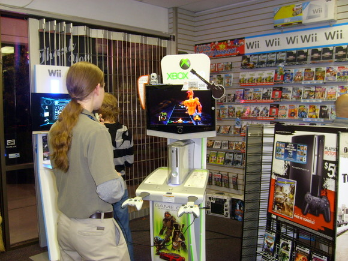
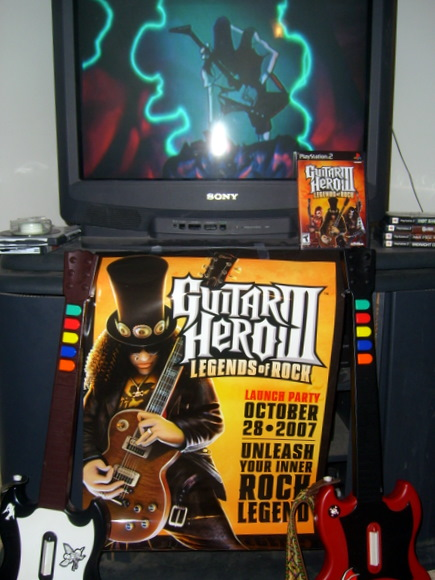

Back to: [West Karana](/posts/westkarana.md) > [2007](/posts/2007/westkarana.md) > [October](./westkarana.md)
# GH3 FTW

*Posted by Tipa on 2007-10-28 02:20:17*

We gathered at midnight well, 11pm, to get our hands on Guitar Hero 3. Actually. I'm not sure how I ended up there, then. It's not as if GH3 won't be all over every store but, when we were in Gamespot this morning getting .hack/G.U. 2 for my son, I somehow walked out of there with a receipt for GH3 and a promise to be there that night -- tonight -- to pick it up.

The store was fairly deserted. Turns out they opened at 11pm, but weren't giving them out until midnight. Sigh. Back home. Forty-five minutes later, I go back -- line is *enormous*. I deftly take out my DS and start beating the crap out of the Elite Four just to be mean. I reach the counter just as Staravia cuts up some critter with Steel Wing.

Oh yeah, speaking of Pokemon, I caught Mesprit the other day. That squishy critter made me so mad. I finally recruited a Gobat from Victory Road to hold it in place with Mean Look while I pelted it with ultraballs. Moving on...

First set was fun, second set was okay and then... Rage Against the Machine's Tom Morello challenged me to a boss battle. He'd play, and I had to copy it (luckily, I was merely on Hard while he had to struggle through Expert). Oh yeah, exxcept instead of Star Power, you get Rock Power or something, and you use that to do nasty things to your opponent. I was trying to keep alive while he kept hitting me with stuff, ending it with a Death Drain that took me rock meter to zero and that was it.

I started it up again, and this time, every time I earned an attack, I waited until he was in a difficult passage and nailed him with it. Just kept attacking and attacking and then he lost, I won, and he and I duoed a Rage song.

That's the secret. Those bosses are going to ruin you unless you do some ruining first.

I ended with The Who's "The Seeker". GH3 also has a coop career mode, so Andy and I can restart tomorrow -- no waiting for one of us to unlock all the songs before we can play them together.

Apologies to the SUWT crew :P But... Guitar Hero...

## Comments!

**[Tipa](https://chasingdings.com)** writes: Defeating Slash wasn't as hard as I thought. Just use Battle Power on him whenever he's trying to build up Battle Power with which to attack you. Then he's got nothing.

---

**[Genjer Leigh](http://www.michaelstuartsalsero.com)** writes: I look forward to playing it around Thanksgiving. lol Jazz is addicted to the Guitar hero II her dad boughter her. But now she wants the songs from guitar hero I and 80s. She rushes (still) go get ready for school eary so she can play a few songs. She got me playing with her on Sunday - so hard to play the blue note 'cause my finger doesn't go that far naturally. This game is meant for those with big hands :(

---

**[Tipa](https://chasingdings.com)** writes: If you play on Easy, only the first three notes are used. If you're playing on Medium or higher, you'll need to get used to moving your hand some. After awhile, your hand will get used to moving from one position to another, no stretching required. A lot of older GH songs work best if you move your hand even if you don't need to stretch -- repeating ascending or descending runs during solos seem to naturally lead your hand up and down the fretboard.

GH3 seems to have many more four and five note runs -- the five note runs means moving the hand (for me at least) *during* the run.

GH3 has different set lists for co-op and solo play, so Andy has been helping me get to songs available only through co-op, like BOC's "Cities On Flame".

Rock Band is coming up this month, and we still don't have a machine to play it on. Sony dropped the price on the PS3, but Andy wants only the Xbox.

---

**[Genjer Leigh](http://www.michaelstuartsalsero.com)** writes: Well I guess I am going to have to practice moving my hand off the keys but that is going to be very hard. GH3 sounds difficult, probably won't be playing that when I'm at your house. Playing at the medium level is challenging enough. 

I finally found a place that sells webkins - went to the webkins website and used their store locator. They sell it at this obscure candy shop near my job. I know she's going to be extremely excited when she sees it. She'll likely be on the computer most of tonight playing it.

---

**[Tipa](https://chasingdings.com)** writes: GH3 is fairly light on easy songs in Hard mode. I'm on the final set, though, so it can't be that bad. That said, the only tune on the 80s GH I couldn't do first try was the Extreme song. This one has given me a couple of problems and much of the last set I'm still working on.

Andy plays on Medium and he could not pull off Metallica's "One", and there were some times when he was on bass that he had trouble keeping up -- runs kill him, but he does pretty good walking the bass, but, unfortunately, you don't find much walking bass in rock these days.

---

**[Genjer Leigh](http://www.michaelstuartsalsero.com)** writes: Well, I am getting better at GH2 - I played some songs last night that I never thought I'd be able to. I am getting better at using the blue key. But the red/blue combo notes are a killer. I am really going to be able to shred on the guitar by the time I see you next!

---

**[Tipa](https://chasingdings.com)** writes: Oh, the chords? Those aren't that bad. You'll be acing those in no time. Then you'll get the spread chords, like green/blue, which could be hard with small hands, then the three note chords, then all the aforementioned mixed in together :)

Shred all you like :) By the time you get here, we should have Rock Band (I hope). I was really thinking you would do vocals, though. Andy wants to be drummer, I figured Jazz for bass and me, lead guitar of course :P

---

**[Genjer Leigh](http://www.michaelstuartsalsero.com)** writes: I don't mind cords - it's the red/blue cord that is hard. You were serious about mie singing? Do youvalue all the glass in your apt.? Because it might well all crack/break after I get done singing.

---

**[Tipa](https://chasingdings.com)** writes: Start practicing your Jeff Beck, is all I can say :)

---

**[Genjer Leigh](http://www.michaelstuartsalsero.com)** writes: Is screaming int a mic a skill? I don't need to practice that - it just comes naturally. What can i say.

---

