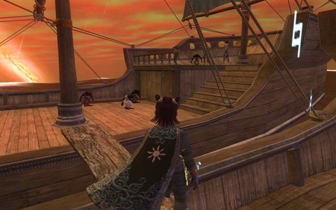
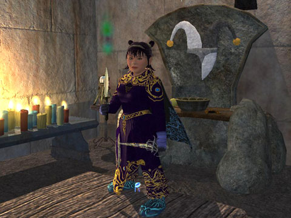

Back to: [West Karana](/posts/westkarana.md) > [2007](/posts/2007/westkarana.md) > [September](./westkarana.md)
# EQ2: Bristlebane, Kunark, and Dressing up for Live Update 38

*Posted by Tipa on 2007-09-14 11:16:01*

Everquest 2 still astounds me sometimes with amazing scenes. This shot is a boarding party from Kunark trying to take on my ship with me as its lone defender (after the ship's usual defenders fall in the first seconds of the battle).

What's happened is that pirates from Kunark have found us. We're not the only ones rebuilding after The Shattering fifteen years back; the Iksar and the Sarnak of Kunark have been doing it better and faster, and now they're taking that opportunity to attack our shipping and, likely, will begin striking against the mainland at any time.

We glory-hunting adventurers have been assigned to travel with ships of the line to repel attacks and find out, if possible, how to take the battle back to Kunark. Perhaps maps, written instructions, anything...

In line with the projected level range for Kunark, you should be 65 or over to take on this quest, given on the docks of Freeport and Qeynos. That said, my 64 necromancer didn't have any trouble with it at all, though everything was 64-65 and came in groups. But necros are uber :)

 

 

LU38 also brought the "Appearance" tab, which lets you equip gear for looks only. I wish more games did this! FINALLY one does! I've always wanted to wear a really nice bathrobe into battle.

Chronicles of Spellborn and Hero's Journey both are said to offer the ability to tailor your look as you like it, and it's likely they'll do it better -- there isn't a lot of statless "just for looks" clothing out there because, until now, there has been about zero demand for it.

Now that we can change our appearance, I hope to see a lot more 'role-playing' clothes. For my part, I would love to have brightly colored minstrel clothes, and I'll be on the lookout for some. World of Warcraft has an embarassing amount of cool-looking statless or low-stat clothing you can make. EQ2 should take note.

Bristlebane's altar is against the wall behind Dina. Our loveable bard has given up Rallos Zek for the god of mischief, jokes and halflings. I've only finished the first two quests, but the entire chain seems soloable, though it would be a good idea to do it with a druid because it involves a fair amount of travel.

Luckily, I happen to have a druid right here in my pocket :) Dear old Verd is now also a follower of Bristlebane. He is wearing one of the custom outfits I made while leveling tailoring; so instead of looking like a half-pint with a leather fetish, he looks like someone who sleeps in the only clothes he owns.

But he's so cute :)

Dorah won the right to buy and wear the Ceremonial Coalition Forge outfit by virtue of building high faction with the Coalition of Tradesfolk by doing approximately one zillion and three jewelcraft writs. She couldn't WEAR the clothes because they were statless.

Now, instead of looking like a poisonously dangerous mage, she looks like someone who works in front of a hot forge every day, making horseshoes and swords and stuff. I bought her a cheap forge for her apartment in Neriak so she could look busy. Ignoring the sad fact that jewelers use workbenches and not forges and also the reality that she does all her crafting at the Coalition tradeskill instance in West Freeport, not her room in Neriak.

 LU38 also brought the changes to dual wield and one handed weapons. They didn't effect me as much as I thought; my dps actually increased, but not by much. More important, as a bard, were my resist songs now affecting the entire raid instead of just my group. The other troub and I were able to keep last night's raid covered with strong elemental and arcane protection. It was very nice.

The best dual wield weapon in the game was supposed to be the Grinning Dirk of Horror, and one dropped in Lyceum last night, the first time I had seen it since the update. It was nice, but I don't think it was by any means the 'best'. It doesn't even have a native proc. I'll have to see it again. It may have been really slow and hit hard, which is usually considered a selling point.

I didn't win it -- I didn't even roll on it, because I didn't know who to send a tell to. I left our Ventrilo channel a few days ago because the language, always crude, had crossed the line for me. So I miss stuff I'd rather not miss but, damn, there's stuff I just don't need to listen to. I don't know how I'll deal with it. If you can /ignore certain people in Vent, I'll probably end up doing that.

Looking back fondly to Crimson Eternity, a family-style raiding guild where language was enforced. It really made a huge difference in the quality of people who called our guild home.

 
## Comments!

**Aktad** writes: Dang Tipa,

It just looks so pretty - and it sounds like fighting pirates is truly big fun... Makes me think about resurrecting my eq2 account with my lvl 65 Ranger and assorted mages/shadowknight type toons...

But...

What killed eq2 for me actually had far more to do with two kids in high school and hours+ of calculus/biology/physics homework each night. Getting home from work at 6:30/7:00pm at night, eating dinner, helping out with homework and actually spending some time with my wife would run the clock out to 10:30 or 11:00pm. Then having to get up at 5am to head out to work just squeezed any eq2 play time right out of my life .

Even casual/solo play just ate up too much time and proved to be too big a distraction for the stuff I HAD to accomplish on a daily/weekly basis.

Not complaining really - it's my life and I chose it and I'm happy with it - just wish there was more time in the day.

At least I can enjoy EQ2 through your stories and pictures - please keep em coming..

Cheers,

Aktad

---

**[Tipa](https://chasingdings.com)** writes: Thanks, Aktad!

Family should always come before gaming, but even better is, I think, to do it with your family. I had a lot of fun playing console games with my kids while they were growing up; gaming was a family activity -- as well as hiking, bicycling, going to the aquarium, visiting friends and so on.

Both my kids are now grown and both are gamers :)

---

**[OneDruid](http://onedruid.com)** writes: Bristlebane abilties look great, but for my Fury I'm holding out for Karana in the expansion. Back in my EQ1 Druid days, I had one of the few Half Elven Karana worshipping druids. I look forward to being able to do that again. Until then, Silverfur has to put it with the tree hugging Tunare.

---

**[Tipa](https://chasingdings.com)** writes: It's not like you can't change. Dina has worshiped Innoruuk, Rallos Zek and now Bristlebane in her short life, and she has the cloaks to prove it. The cloaks are reason enough to do the quests; the RZ cloak is still the best for scouts.

Dorah went from Brell to RZ with Dina, but then went back to Brell, and all it took was touching the RZ shrine to leave RZ, and then the Brell shrine and *boom* she was back at the same level as before, didn't have to do the quests over or anything. Her status with Brell was set to zero, though.

The name of my blog is West Karana... I think it's safe to say I'm waiting for the big guy, too :)

---

