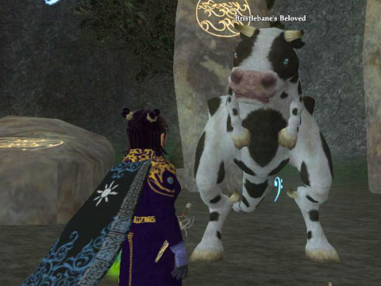

Back to: [West Karana](/posts/westkarana.md) > [2007](/posts/2007/westkarana.md) > [September](./westkarana.md)
# EQ2: Finished Pranking in the name of Bristlebane

*Posted by Tipa on 2007-09-15 01:22:35*

Leave it to Bristlebane to have a favorite pet who looks designed by a committee. A *drunk* committee. That had just spent a sleepless night being chased by giant pink rabbits.

I left off last night having pulled a prank on a goblin prophet (er, profit) of the King of Thieves. I baked him a horrible pie. The goblin had an idea for an even BETTER prank to play on the haffer what pranked him -- make him a horrible pie!

Genius! So original!

So tonight, the haffer wanted to get even sneakier -- he wanted me to (as a joke) replace some gold coins in the goblins' vault, deep in their hideout, with *chocolate* coins.

I was very sneaky, I didn't get seen, I did it, rushed to the goblin to see what he had to say and MIRACLE! The gobber was overjoyed -- the smelly hard useless coins had been transformed to YUMMY CHOCOLATE!

That gave the gobber an even more clever idea -- he would replace the pie-sellers pies with GOLD COINS as a joke! But the pie seller wouldn't leave her stand, so I had to run to Loping Plains for a special idol that she might like to use to gain Bristlebaby's favor. That done, she left to donate it to BB, I grabbed the pies and left the gold coins (well, most of them. Shall we just say, several of them?) in return.

She was happy, everyone was happy, but this haffer standing to the side, he was not happy. Everyone had lost sight of the true meaning that the Royal Rascal brings to life -- it's not about revenge-pranks, it's about having fun...

And so I was off to Antonica to look for a really big egg that we could use for an omelet... I mean, for a trick... I arrived just in time to save this cow-raptor critter from a team of exotic animal collectors (I was just informed today by Digg that importing exotic animals illegally is the #2 illegal import, after drugs and ahead of Canadian recording artists).

The moo-saur was so happy, she gave me an egg. I brought it back to the little man at the docks and he hatched it... and then put me INSIDE it! I'd been pranked! I ran around and scared the bejeezers out of the two prophets and then... I couldn't talk to anyone... except to say MOO! in unusual ways... nor could I figure out how to return to my own body... so I camped and when I returned I was me once more... and the moo-saur had shrunk and become my own little pet...!

More like Moo-CAT! The little critter thinks my bed is hers... and the cloak the haffer gave me made me even SMALLER!

I don't dare ask what Ol' Barefeets will do to me next... and I don't care, as long as it's fun!
