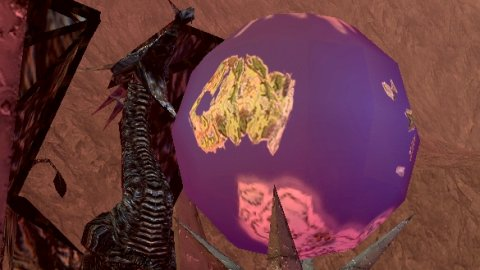

Back to: [West Karana](/posts/westkarana.md) > [2007](/posts/2007/westkarana.md) > [September](./westkarana.md)
# Remembering Kunark 

*Posted by Tipa on 2007-09-17 22:48:01*

*The Butcherblock shuttles with the ship to Kunark waiting offshore*

They don't have boats in Everquest any more.

I guess it's faster to zip around the world via the Plane of Knowledge, or the translocator gnomes now. Back in the first couple of years of Everquest, you went from place to place in boats. I was late to work the morning Kunark came out, and I was on the first boat out.

These weren't the dinky boats the humans built. These were elven ships of exploration, sweeping and beautiful. Velious would bring clanky gnomish ships. Luclin had spire travel. There were never ships like this in Norrath again.

*The Outpost of Firiona Vie*

The outpost of Firiona Vie. King Tearis Thex was so broken up at his daughter's kidnapping that he invaded Kunark and built this outpost among some old Iksar ruins and built a statue of his daughter two hundred feet high, undefeated, unclimbable...

*Climb to the top of the ruins, float at top speed to the pedestal, climb up the staff, over to her bust, up her shoulders, up the staff some more, float over to her head. Go ahead. Try.*

*Almost* unclimbable... Don't try this unless you have a couple of hours. And levitate. And bind. And SoW. Actually, if you're not a druid, just forget it.

I was only level 30 when Kunark opened. Yeah, I know, I was a slow leveler... but I'd changed mains from my first character, an Erudite wizard, when I discovered other races *weren't* blind half the time. I was perfectly happy in South Karana and nosing my way into the Temple of Cazic-Thule.

Kunark turned EQ from a game I'd play a couple of times a week into one I played nearly every night. There was just so much to do and I thought I could never do it all. I met a lot of friends, many of whom I still hear from now and again.

EQ had problems, every game does. Given how little the EQ devs had to go on, making stuff up as they went along, really, it's amazing how much they got right. And the wrong things, like the way you could die in locked zones (Old Sebilis and Howling Stones) and have to do the access quests all over again, naked, just to get your stuff.

*The globe of Norrath in Skyfire, showing Kunark, Velious, and Timorous Deep.*

## Comments!

**[OneDruid](http://onedruid.com)** writes: As you said, EQ1 Kunark is where the game really came alive in scope and possibility. The friends I made, the places I went, the 3am corpse runs I endured. When I think back on my 7 years with the game, I mostly remember time spent in this expansion.

Bah, now I'm going to have to dig up my old Kunark screenshots for my blog.

---

**Aktad** writes: Old Sebilis - man oh man does that bring back memories... make the run all the way over there or "bind" right outside the zone-in. Venture in yourself hoping to find/create a pick up group or try to follow a group in and find a "safe" solo spot. Scary, creepy, dangerous and fun fun fun...

I used to bring my chanter in there to work on solo skills and can clearly remember the feeling of "Oh Fudge!!" when I died just outside the prison. How in the heck was I going to recover corpse and stuffs!?!?! Any guildies logged on - yeah but not the right alts or busy with other stuff. Any friends logged on? no - it's 5am east coast time and most of them are west coast players. Wait, wait, wait by the zone in hoping some kindly people would come along. Finally making it down the tunnels and hallways, thru the doors, recover!!! dash for the exit and swear to GOD you're never going in there alone again... but 5am the next morning (in the one hour you can play before having to leave for work) there you are, lurking in the dark halls and tunnels, planning, praying your spells land and loving every single moment of it... Those were some awesome battles down in that hole, in the dark, the scary scary dark...

---

**[Cordanim](http://blog.worldofcord.com)** writes: Thanks Tipa for the short jaunt down memory lane. I remember many a night in the Emerald Jungle and another adjoining zone (can't remember the name right now) looking for certain frogloks for a quest for hours - ohhhh, the xp though :)

---

**[Genjer Leigh](http://www.michaelstuartsalsero.com)** writes: Ah yes, kunark - I remember it well.

---

**Shahlai** writes: Wow!!

All I can say is a huge heartfelt 'thanks' for the memory jog. I was also around level 30 when this expansion came out. The boats, I loved them. Yes, they were time consuming but it all added to the 'feel' of the game for me. It was also a handy break so i could go and make a drink :).

I don't think I have the nostalgia for any game as much as I do for EQ upto the Velious expansion. I still wish sometimes I could rewind time to experience it again. I have thought about reinstalling, but in reality I know I would probably just be dissapointed now.

Once again a huge thanks. You have made my morning !

---

