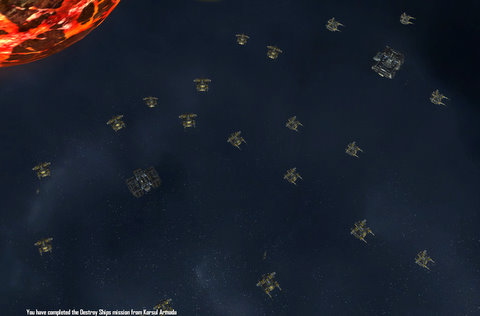

Back to: [West Karana](/posts/westkarana.md) > [2008](/posts/2008/westkarana.md) > [April](./westkarana.md)
# Influence and betrayal in Sins of a Solar Empire

*Posted by Tipa on 2008-04-06 09:27:02*

I really suck at these exploration-conquest games. I don't know why I like them so much! I'm just glad, at least, that I don't play against other people. That would be really humliating. (Don't send me email insisting you suck too, and we should play together sometime. I suck more. It wouldn't be pretty.)

So I started a regular game with three computer players vs little ol' me with some trepidation. Almost immediately, my scout ships reported an enemy close by. It turns out that, in this three star system, my system was shared by one enemy and, of course, the pirates. I had my first capital ship built before long and had taken over a couple of adjoining systems and started along the research trees for support craft and colonization -- the volcanic planet you can see a little of in the upper left was my second conquest, and I needed the skills to exploit it. What that picture mostly shows, though, is a couple dozen planetary defense platforms and hanger stations.

That's because this particular planet is close to a wormhole, which allows those empires with the technology to zip right across the solar system; what they would do is warp into my system, go to the wormhole near the star, zip to my planet, and attack it. So not only was I fighting the enemy in my system and the very rapacious pirates, I had another empire on my doorstep with seemingly inexhaustible resources, continually trying to take this planet. I had to have three fleets -- one to expand, one to keep driving the extra-solar invader back to the wormhole, and an uncommitted tiger team fleet to respond to pirate incursions until I could get one of the other fleets there.

Once I got those defense platforms built, though, that empire let me alone for awhile, and eventually offered a truce. I took it, of course. I even made a truce with his enemy, and together we all wiped out my enemy and my ally helped deal with pirates by basically putting hundreds of ships into play in my system.

Yeah, I knew where this was going to end. I had a plan, though. The pirates in my home system had at least two hundred ships around their base. The only POSSIBLE way of assaulting them was to send a small force through one side of the system, then bring in a larger force in from the other side and pick them off from behind -- and run as soon as they turned, because they would just be brutal. So I said, screw this, and just left them to my ally and went and explored the uncommitted system.

My ally was getting pissed that I wasn't doing enough about his enemy, so along with the tiger fleet, the expansion fleet in system #3 and the planetary defense fleet back in system #1, I made a new fleet whose sole purpose was to slowly take care of my ally's enemy while also being a knife at the throat of his home planet when he sprang his inevitable betrayal.

Oh yeah. Influence. So the first thing my erstwhile ally does when he gets to my system is capture a planet that had been razed by pirates and start broadcasting his heretical filth. Little purple lines creeping through my system, making it hard for me to keep planets should we ever become enemies. So next to every trade post would be a broadcast satellite to spread my creed around. Sometimes two or three -- whatever it took to keep MY system under MY influence.

I made sure to start spreading my influence around my ally's system as well. Enough influence, and planets can fall of their own accord. Anyway. I declared war on my enemy's enemy and started moving through system #2, making its planets mine. Now, this guy was a coward -- he ran from every fight (of course, he was also dealing with my ally and with pirates, who were as strong in system #2 as system #1. One of my first jobs in system #3 was to take them down -- without an empire in that system, they had never needed to become powerful). When I assaulted his home world, though, ah, suddenly we see his fleet. I could tell they were torn between defending their home world and just grabbing the cat and the baby and taking off. I wiped them out, took their world and hit a victory condition. Yay! Eight hours and 31 minutes of conquest fun, another day wasted playing Sins.

When I ran the game this morning to get a screenshot of my planetary defenses for this article, my ally broke the truce and declared war :) Duh!

## Comments!

**[Rick](http://slashrandom.wordpress.com)** writes: I'm a little afraid of starting Sins. It totally looks like the kind of game you start playing at 10 pm, and the next thing you notice is birds singing outside and dawn breaking. I've had too many nights like that playing Civilization :)

I suck too at multiplayer too. I can manage to avoid embarassing myself in FPS games. I'm fairly competent in mmorpg's. RTS and turn-based games own me in multiplay. I usually have enough trouble finishing scenarios in RTS or turn-based games, let alone winning against computer opponents. 

I think that putting in enough work to be good at those games would somehow take the fun out of it for me, too much like work, maybe. Although, like you, I'm not exactly sure why I enjoy these games when I'm Not So Good. Maybe it's because I don't play skirmishes very much!

I'm sure I'll be trying this game in the future. Have you played any of the Galactic Civilizations games? I've heard lots of good stuff about them on game podcasts, but I haven't had a chance to play them either. Damn mmorpg addiction, takin' away all my time to play other stuff, ya know?

---

**Einhorn** writes: I want to play this so badly. Must avoid it! Too addicting!

 This seems like the kind of game I'd rather watch others play instead of actually playing anyway. I felt the same way about Resident Evil - I loved the game, but never want to play it - I always just wanted to watch =)

---

**[Relmstein](http://relmstein.blogspot.com)** writes: Yeah I recently got done with a rash of Civ 4 playing and was able to start beating it regularly on monarch (lvl 6) but only on certain map types. For some reason inland sea is freaking impossible for me.

Anyways I hit a plateau in Civ 4 and thats when I found out about Sins of the Solar Empire. The scope is a little large for me compared to Civ 4 and I'm always forgeting where I sent my ships. Once I get use to it though I'm expecting to lose large amounts of time.

---

**[Tipa](https://chasingdings.com)** writes: I have rallying points set up -- I send fleets to regional rallying points, usually at uncontested space debris clusters or dead asteroids with a lot of intersecting jump paths -- when they aren't doing anything, and I send new ships there as needed. I had one two jumps outside the main pirate system, because they were ALWAYS attacking. Planetary defenses and light cruisers would hold them off if things worked out well while a fleet made it there. After awhile they started attacking several places at once and I more or less stopped worrying about it. They hardly ever razed civilian structures, so I'd just let them take the planet. then pop a colony frigate over to re-take it.

I loved Civ 2, that's the last one I played. I was a big fan of Sid Meier's Alpha Centauri for a long time as well. I play them on easy, I have fun, I'm not hurting anyone by sucking :)

Oh yeah -- make about, I dunno, fifty scout ships and keep them auto-exploring. I guess that's obvious but it was an epiphany for me.

---

**Graktar** writes: Are the unit caps different in the demo than the full version? The numbers of ships and platforms you describe are completely impossible in the demo, even after upgrading your planets.

---

**[Tipa](https://chasingdings.com)** writes: Mmmm I have no idea. I only played one "short" game in the demo before moving to the real thing. You have to fully upgrade your tactical slots and there's some research you can do for even yet more; also, you can upgrade your fleet capacity in the special research tab for that and also I think there's a military research item that expands the cap further. Once you get into the endgame and have all research done, you can put astounding numbers of hardware out there.

I don't think the pirates have ANY limits, though. 200+ ships at one base, 120+ ships at another. They are virtually unassailable if you don't take them out early.

---

**Tangurena** writes: 
> When I ran the game this morning to get a screenshot of my planetary defenses for this article, my ally broke the truce and declared war

 
I've noticed that about GalCiv and GalCiv2 as well - alliances seem to be recomputed when you restart the game from a save.

---

