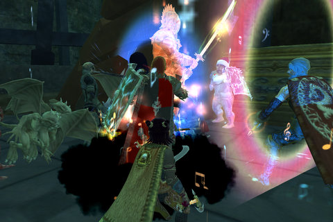
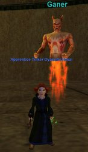
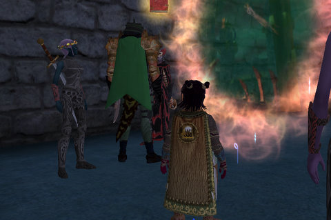

Back to: [West Karana](/posts/westkarana.md) > [2008](/posts/2008/westkarana.md) > [April](./westkarana.md)
# EQ2: Raiding the Shard of Hate

*Posted by Tipa on 2008-04-09 08:19:28*

I took the night off from writing last night because, well, some things are more important. Sometimes, a gamer has just got to GAME. And if not the night when the Shard of Hate returns to Norrath, well, when? Before I get started, though, I want a shout out to a person who has always been there for me, held me up when I was falling; gave me strength to carry on; he is the wind beneath my wings; and -- well, he wants to know why I never mention him on my blog.

He's our MT, and I loves the dorf.

Delusions of Grandeur is kinda unique in always meeting at the same spot before every raid -- on the Sinking Sands dock. I'm not sure why we meet there -- I think it probably goes back to when the guild was on the Guk server. In a raid it's too busy to socialize, and in guild chat everyone is just a name. Gathering together in one spot in the game each night, well, this is the guild. We can give each other stuff, duel, check out everyone's new appearance armor and illusion spells... it's where masters are rolled upon and given out, it's just really nice to all be in one spot. It means also we move from place to place together, as a guild.

After a bunch of discussion, off we went to the Shard of Hate in Nektulos Forest. Turns out there's a really quick way to get there -- take the carpet from Sinking Sands to the Darklight Woods, run west to the Nektulos Forest zone, and that lets you out within a few feet of the Hate zone. See? There's a reason we gather there.

Almost every raiding guild on Befallen was there along with us. I saw Clan of Shadows (hey peeps!), Defiant, #1 guild Virulence (including my former Revolution guild leader, Xagain! HEYA X!)

The zone is a huge loop with two Tier 1 bosses, a Tier 2 boss and two Tier 4 bosses -- five bosses total. We went up to the right first, and killed the SK one who had this amazing knockback and stun. We learned an important lesson -- clear ALL the trash. We did this and got him down second time. We also got the quest to use the mender, which requires killing the three easier nameds.

He dropped a Beacon of Loathing, I believe? A nice mage item.

Off to the left now, and past Master P'Tasa, whom everyone was ragging on for being named after [Master P](http://en.wikipedia.org/wiki/Master_P). 

 I remember camping him for several days on my mage for my epic back in EQ1. This was after the Plane of Hate was changed to a group zone, and people would be roaming through the place at all hours farming stuff, not least of which was Magi P'Tasa's staff for the mage epic, which could easily fetch 100K plat or more. Mages are decent at soloing, but a level 60 mage is doing about all she can to keep the place even barely clear, especially when the hated Clerics would spawn. Or those magic resistant spite golems. At this time, my cleric was still on the Stromm server so I couldn't two box her (which would have made it easy), so I used my daughter's cleric from back when she played, and over the course of those days, got her four or five levels. Lots of people from CE would stop by now and then so I could get some sleep, because if I ever stopped camping the place, it would be taken.

After taking care of the other easy named (dropped a server-discovery mage dagger), we turned to no longer Magi, but Master P'Tasa. If you attack him, he has a chance to go invulnerable for four seconds. He also has a rather awful curse, and though we tried a lot of things, we didn't kill him last night. At least one guild killed him with a scout tanking him, and there were rumors that fighters could not attack him at all without triggering Bad Stuff, though I think we showed that wasn't the case.

That will wait for another night, though. It was a heck of a lot of fun being someplace new. Running through the T1 and T2 raids all the time is getting a little old.

---

What would new content be without a quest? This one starts with a happy or delighted mob of some sort in everyone's home city. Well, unless you're good-aligned, in which case I guess they would be alarmed or frightened, but really, who cares about them? I'm just happy that my quest led me to the most awesome city in all of EQ2, Neriak.

In Neriak, you must sow hatred and discord throughout the land to show your fealty to the Lord of Hate himself, Innoruuk. First task; kill the night janitor at the opera house. Gee. Well. I am sure news of his death will resound throughout these cavernous.... HEY! Give me something a little more heroic than that! Okay, next task: Mine twelve rancor quartzes in Neriak. HUH? I throw myself into devotion for one of the big mojo evil gods in the game and this is what you have me do? She takes my stones and sends them into the Shard of Hate to soak up the hateness, and gives me some already-filled with hate stones and wants me to bury them in Darklight Woods.

Okay, so here I am, in the most evil city in the game doing a quest for the most evil god, the same one who warped high elves into dark elves, created the most supremely evil race in the game from the one with the most good, and my jobs are: Kill a janitor, mine some rocks, and bury them?

Yup. That's it. That's my evil task. Not even a puppy to kick.

Got a nice barbecue grill out of it, though. Anyone want a stake? Er, STEAK! Ignore that vampire standing there!!!!

## Comments!

**[Darlith](http://www.therelentless.org)** writes: Thank for the info on the Shard of Hate! My guild just made our venture into Tier 2 and this zone seems like a good spot to go for the first 3 bosses at least! Now to talk the officers and raid leaders into going.

---

**[Tipa](https://chasingdings.com)** writes: Yeah, it's an awesome zone for all RoK guilds, but not one so easy that it will be beat quickly -- but I wouldn't be surprised to hear some guild clears the last boss before the week is out, even so. There's a LOT of loot in that zone, and the first two mobs we killed are so easy and drop such good loot that it's crazy NOT to go. Once with figure out Master P, I guarantee we'll be fitting Hate into our T1-2 rotation. Here's hoping we clear T3 soon so we can go to VP...

---

**[Darlith](http://www.therelentless.org)** writes: Just for my own numbers, how much trash loot did you see if any at all?

---

**[Tipa](https://chasingdings.com)** writes: No chests from the trash, but we only cleared the front of the zone. When I sad a lot of loot, I didn't mean that we were tripping over master chests; just that the first few bosses give a lot of varied and wonderful loot, one loot at a time. We'll be going back for awhile to grab it all.

---

**[Jioja](http://)** writes: I went last night. It brought a lot of memories back from old EQ1 days. The first difference is, you aren't attacked immediately after zone in! We learned on the first named as well, to take out all surrounding trash. The knockback was huge and the curse and poison he hit you with also was annoying. We got him on the second try, and he dropped very nice item (I think it was a wrist slot) with a 3% power reduction to all spells. Our time was up after that, but I look forward to going back!

---

**Einhorn** writes: I'm hoping the Maestro is just as sinister as he was the first time - I was always absolutely FASCINATED with the Maestro in EQ1, but as such he was the character I knew the least about.

Was there ever a big story on the Maestro of EQ1? I'd love to read more about him, and my googles have proven fruitless.

---

**[Tipa](https://chasingdings.com)** writes: I remember they re-used Mistmoore's model for him after they removed MM from MM Castle. Well, that's what I heard, anyway. I don't know if he had any particular lore back then, but the whole music-for-evil's sake runs through the EQ2 troubador quest, and there might be a connection between the Maestro and the Performer in the EQ1 zone, Theater of Blood, part of the Prophecy of Ro expansion. I, alas, quit EQ before getting a chance to go there, even though I had my ToB key.

The original Maestro fight in the original PoH was challenging, but very similar to other boss fights at the time. He was challenging, but not *difficult*. In the redone PoH, he became a lot trickier and summoned help. I don't remember the specifics of the fight, but I remember it was really complicated in the manner of later EQ1 raids, with different groups doing different things. I know the EQ2 Maestro summons all the low-tier nameds to him if aggroed, but don't know if he summons all the trash as well. And, sadly, know nothing of the fight except that it's hard. This being EQ2, I expect absolutely crippling AEs and summoned adds.

---

**[It has been a while &laquo; Mightydar&#8217;s Weblog](http://mightydar.wordpress.com/2008/04/09/it-has-been-a-while/)** writes: [...] West Karana Talks about the new raid zone in EQ2.  Also from West Karan a link to a new Wii game in Japan that will keep you laughing all day. [...]

---

**[Davic](http://www.dcstanton.com/EQ2blog)** writes: Yeah I love hanging out in the sinking sands. It seems just better somehow than getting an e-mail saying meet up at x spot at y time or something. Also damn mayve for having more illusions than me!

---

**[Tipa](https://chasingdings.com)** writes: Woot! Another blogger in the guild!

---

**Einhorn** writes: Yes I was absolutely thrilled to read your tales of Epic-getting here at WK, that was the reason I found you and your site in the first place. I wanted to know more about the bard epic in EQ2, and hoped to hell it had something to do with the Maestro. The walkthroughs were cold and sterile, and also a spoiler. The way you typed your stories still leaves some mystery to find on my own while stoking the fires I have of wanting to quest for mine.

Once again, I must take this time to thank you for your website, your efforts, and the inspirations you have given me!

---

**[Tipa](https://chasingdings.com)** writes: Heh thanks ))

I have logs of all my conversations with the epic NPCs with all the lore. There's some fascinating stuff about the fall of Saryrn and the rise of two lieutenants in her place in there that I have seen nowhere else. I asked Lyndro about it but he had no idea what I was talking about.

If I remember, I'll separate it all out and make it into a post. It won't give much help with the quest, but the lore itself is awfully cool.

---

**[Openedge1](http://simple-n-complex.blogspot.com)** writes: @Tipa

My most amusing moments come from traveling various forums discussing games, and how so many say that EQ2 HAS NO LORE...

WTH? Do these people even read?

I will admit to being an old school clicker...(i.e: click through all the quests to read the goal, instead of the story...this was WoW's fault, as you nknew all quests were going to be the same, or with stupid in - jokes...blah)...but, I have started to read more of the story in EQ2, and that is a major bonus...well, it does help to have voice overs also...

I am quite pleased everytime I play this game...and great new content always helps...

Cheers!

---

**Einhorn** writes: I always sort of hated questing in groups because no one wants to let you take time to read the text. They all try to rush and are just disgusted that you are attempting to learn something. I got removed from a group once for taking too long for this very reason - the last thing they said to me was "God, go to a library or something." and then I was removed.

Pitiful.

---

**[Ogrebears](http://www.ogrebear.com)** writes: o wow that looks pretty cool i'm going to have to do that quest as well.

---

**Fencek** writes: Any trick in defeating Master P'Tasa??

---

**poop** writes: how do u start to play this game

---

**[Tipa](https://chasingdings.com)** writes: @Fencek -- apparently, taunting the Master makes him angry. So don't.

@Poop -- Download the free trial at http://everquest2.com/freeTrial.vm. If you find you like it, then buy the Rise of Kunark box (contains all adventure packs and expansions) at any games store and join the adventure.

---

**Faragel** writes: pet pull the master back a good ways, if you follow the road toward the door there is a little nook between 2 walls that you can tank him in

its a long fight with that 2% proc on him but just take it slow and use your hp -> power items

not sure if this is true or not but he has an aoe similar to the crab from isle of mara, seems to drain more hp the closer you are but if you are too far off you lose alot of power, i was standing halfway in the street from where our tank had him (aprx 45 meters) and went from 85%power to 0% but when i was meleing on him i lost 80% of my hp but only like 15% power, so im thinking there may be a "sweet spot" for him

---

**[Tipa](https://chasingdings.com)** writes: Thanks for the tip!

---

