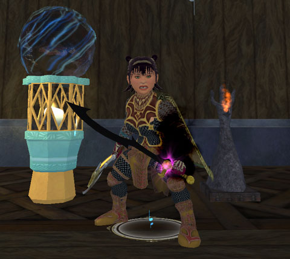
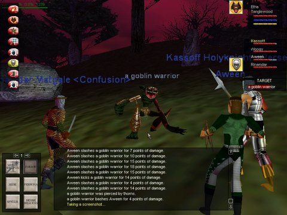

Back to: [West Karana](/posts/westkarana.md) > [2008](/posts/2008/westkarana.md) > [April](./westkarana.md)
# More Shard of Hate, Nox Noctis for teh win, and the fate of Liz Strickland

*Posted by Tipa on 2008-04-15 07:31:47*

After we cleared Protector's Realm tonight, we said, hey, what the heck, let's pop over to the Shard of Hate and see what we can pull from the place. Since the last time we went, a lot of the Epic x3 mobs have been changed to Epic x4. Why is this important? When an Epic x3 is fought by a four group raid... it drops no loot. This probably explained our abysmal drops the first time we we went. This time, it was fine. We got several chests, some masters, some nice pants -- just from trash. The first boss dropped a [VERY nice bow](http://www.lootdb.com/eq2/item/-1586819283) which could have been made specifically for a bard (and a bard did win it!), and [Davic](http://www.dcstanton.com/EQ2blog) tells me that mob also drops the most perfect bard weapon in the world, [Marrow's Song](http://www.lootdb.com/eq2/item/-742519407); same delay as our epic, boosts our run speed song and our proc song; full of all the stats we love best.... But for some reason, this uber bard weapon which, let's face it, is nearly as good as our epic, is usable by ALL scouts PLUS guardian and berserkers. Any non-bard who even so much as bids on this in jest... should be hung, feet first, outside the gates of Freeport or Qeynos, exposed to the ridicule of the crowds. I don't have the DKP to even consider such a weapon, but I'll bid what I can just so nobody gets the idea bards don't want this for some reason :) Of course, when bards bid against bards the bids go up by ones or twos :)

Naturally, when bards THINK they're gonna be bidding against other bards, they might make their first bid too high. I bid five points on [Nox Noctis](http://www.lootdb.com/eq2/item/1667730261)... and won it. The delay is too fast, but it will do until I get Marrow's Song, I guess :) Could have more stats, but the boosts to double attack and dps make it a good replacement for my Jade Reaver, I hope. I'll still have to woodshed it some to see if it really improves my dps.

We killed a lot more trash than normal for their random drops, but only attempted and defeated the two Tier 1 bosses.

Tobold noted that this is the [eighth anniversary of the Ruins of Kunark](http://tobolds.blogspot.com/2008/04/where-is-wows-ruins-of-kunark.html), EverQuest's first and (arguably) best expansion. The designers had somehow figured out all the things that were right about EverQuest, and made more of all that, while adding things we had never seen. That is what a game's first expansion is for; it's a letter to the players saying, we watched you play, we took notes, now here's what you wanted. The game at launch and the game at first expansion provide the datapoints from which to plot the game's ultimate direction. What sort of direction did the Burning Crusade give to WoW? A further emphasis on high level grouping and raiding? Anyway, happy birthday, EQ, and as a present, a screenshot from one of my first groups in Kunark, fighting goblins in the Lake of Ill Omen.

Massively's Kyle Horner reports that Pirates of the Burning Sea is [dropping 7 of its 11 servers](http://www.massively.com/2008/04/15/potbs-drops-seven-servers-four-remain/), a merge of Vanguard-ian proportions. Liz Strickland's server, Guadaloupe, is among those under the axe, so I'll have to choose another server; leaning toward Antigua. This move should serve to concentrate the players and make PvP more fun. Personally, I always ran from PvP. PotBS is a decent game, but real life eats up a lot of my time, and if I could only have time to play one MMO, in the end, it wasn't going to be PotBS. I don't feel every MMO needs to address every kind of gameplay, but once I figured out how to win the NPC battles (board as soon as possible, defeat enemy crew in melee, loot ship, rinse and repeat), it became dull. I was nowhere near skilled enough to win the whole shooting at each other game, but boarding would always come through for me.

I have more, but it's time to head to work :)

## Comments!

**Einhorn** writes: What's with Tipa's teeth in that picture?

I reckon it looks like she done growed herself up in the South!

She should be wearing a polka-dot shirt tied closed, and some cut-off jeans.

Looking forward to hearing more tales about Tipa "Muddy-May" Suggins very soon.

---

