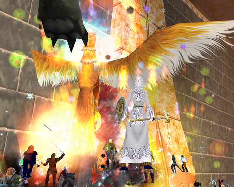

Back to: [West Karana](/posts/westkarana.md) > [2008](/posts/2008/westkarana.md) > [April](./westkarana.md)
# Actually, EQ is NOT dead. Wanna play?

*Posted by Tipa on 2008-04-17 02:08:51*

Based on last week's discussion where we started off wondering if it was ever possible to get back that "first MMO" feeling, that veered into nostalgia, a few of us thought, maybe we would give EQ a try again. Well, that sounded good to me, so I reactivated my other account, and there for the first time in a year stand my two mains in EQ -- Brita the cleric and Tipa the rogue. After raiding Thuuga and Emerald Halls on EQ2, I logged over to EQ to chat, and then omg... a pickup raid. Tonight was the last night of Fabled, and the raiders were trying to get them all killed before they were put away for another year.

I had Brita re-activated, but I didn't have her UI, I didn't have her macros, her hot keys, her spell-sets... I had NOTHING. So naturally I head right over to the Plane of Fire and join up. Everyone there was red to me. Since I've been gone, the level cap raised from 75 to 80, but clerics get in anywhere even if they're gimp like me. It felt GREAT to be in a TEAM again. Raids in EQ2 are so tiny, but in EQ1.... rawr.... you're a professional fighting force. Since it remains so incredibly hard to level in EQ, and since you need to group for nearly all of it. Every. Single. Raider. KNOWS their job. We had eight or nine groups, many of whom had never raided together before, and everyone knew exactly what to do. This is something you simply do not see in other games. That air of professionalism.

I had forgotten how much I liked being part of a team of professionals. Raids in EQ2 are laissez-faire. We clerics fell into a dynamic CH pattern, with some of us dropping to fast heals when needed -- and nobody said a thing. We ALL knew what to do and how to adapt our healing for each mob. I guess it helped that we had all done the non-Fabled versions of these mobs many times in our own guilds.

That's Quavonis Firetail there. He shadowsteps the raid -- MA, healers, everyone. All the time. It's friggin annoying... I saw a bunch of old guildies there, and they wanted to see me in a raiding guild again. After tonight, I would be really tempted. I wrote an article for Massively awhile back about 5 MMOs better than WoW, noting that EQ raiding blows WoW raiding away. The encounters may be of similar complexity, but get together 50 people with NO ADD ONS, all they have to use is their brains, memory and training, all working together like a team -- controlling aggro without aggro meters, figuring out who to heal without rows of health bars -- doing so much with so little information. Well. raid in WoW with twice as many people but no add-ons and no voice (never really caught on in EQ)... you get the idea.

EQ has a lot more mounts now...

A few of us have decided to see if we CAN recapture some of the EQ magic by bringing a static group that meets once a week from level 1 to whatever, seeing all the new zones and, one last time, seeing Norrath as newbies. We have five characters now -- Einhorn as tank, Stargrace as monk, Cordanim as rogue, Egat as enchanter, and me as cleric. We could use a sixth :) Or if there are enough people who think this would be kind of fun, we could make two groups. We'll be starting off on the Luclin server every Friday at 7PM Eastern Time. It's going to be fun!

## Comments!

**[Cordanim](http://blog.worldofcord.com)** writes: Definitely going to be fun - got back into the "feel" of it last night as you and I ZIPPED through levels 1 and 2 :)

See you on Friday! For a screenshot of you showing off, too, check my post :)

---

**[stargrace](http://mmoquests.com)** writes: Wow your first night back and you're raiding Tipa? Maybe I need to go take a seat at the baby table.. *grins* 
I never did get into EQ1 raiding as much as I'd have liked. I only played a year and a bit before EQ2 came out. I remember Bertox raids as my enchanter, and Thul raids, Halls raids, and getting flagged for all that lower tier stuff before they removed restrictions. It was great.

---

**[stargrace](http://mmoquests.com)** writes: P.S. Check your mail when you can =x

---

**[MmoQuests.com » EQ Nostalgia Group - Getting Ready](http://mmoquests.com/2008/04/17/eq-nostalgia-group-getting-ready/)** writes: [...] group consists of Tipa (ranger, as of now at least), Cordanim (rogue), Egat (enchanter), Einhorn (warrior), and Ishbel [...]

---

**[Bryzon](http://bryzon.blogspot.com)** writes: I have to say, I'm abit envious. Having a static group is really the only way I would ever come back.

---

**[Tipa](https://chasingdings.com)** writes: We have an opening :)

---

**Einhorn** writes: Yea, having a static group that adheres to the rule of only leveling when everyone is present - unlike SOME people!

We all get a memo last night from Tipa: "Uh, me and Cord "accidentally" got to level 3, so you guys go ahead too!'"

*shakes head* And so it begins!

=P

---

**[Cow Nose the 50 Pound Cat](http://cownosethe50poundcat.blogspot.com)** writes: Hi Tipa, I have always wanted to play EQ but I never had the chance. I am busy with my own things at the moment, but man I wish I could join your group! Still, I really look foward to seeing what kind of great posts and content this brings to your blog.

---

**[Captain Angry](http://www.captain-angry.com)** writes: I would join you but my two classes WAR and ROG are both accounted for, and I'm not gonna be Captain Angry the Tree Hugging Druid.

---

**[Tipa](https://chasingdings.com)** writes: No reason we can't have another warrior or rogue. But hey, if you like warriors and rogues, have you considered the berserker? It's a warrior/rogue hybrid in EQ1 and they have some rather cool group buffs, as well as snare and a bunch of other things. Back when I was raiding, berserkers would outparse rogues in many fights.

Plus, Captain Angry the Berserker. Kinda has a ring to it, don't you agree?

---

**[Captain Angry](http://www.captain-angry.com)** writes: See now I had long quit before all this berserker nonsense. I pretty much jumped ship as soon as the plane of knowledge made travel completely trivial. All my money is on the combine server. Last time I started playing again, some stranger handed me 1000p and now my level 8 warrior has the same 2H sword my wife's 52 SK had on retirement.

I guess I'll will check out Berserker, especially if I can be a Troll or Ogre

---

**[Tipa](https://chasingdings.com)** writes: I have no money on Luclin :) I hope to xfer a character with some, though. Both trolls and ogres can be berserkers, as can dwarfs and Vah Shir. I don't remember if Drakken can.

---

**[rao](http://raoworld.wordpress.com/)** writes: EQ, from all indications, is starting to get an infusion of old blood. I've been reading a lot of bloggers going back and talking to a lot of old EQ friends who have recently returned. Each day, I'm more and more tempted to make a return myself.

Sounds like you all are organizing to have a great time.

---

**Egat** writes: Berserkers can be lots of fun, and yes, all the "big" races get can be berserkers.

I've played a warrior for 8 years now, let's see if I can make a decent enchanter.

---

**[Can you go home again? &laquo; Gestalt Mind](http://raoworld.wordpress.com/2008/04/17/can-you-go-home-again/)** writes: [...] there is Tipa and Stargrace.  Their little project sounds fun as [...]

---

**Einhorn** writes: I might even be uh, willing to revoke my position as tank. Who knows!

Willingly choosing to be the warrior twice in your life is...yea...ouch.

---

**[The Grouchy Gamer » SWG Deserves a Second (or Third) Look, Too](http://www.thegrouchygamer.com/?p=111)** writes: [...] has an article over on West Karana about getting back into EQ, at least a bit back into it.  I’m going to say the same thing about another Red-Headed [...]

---

**[stargrace](http://mmoquests.com)** writes: Is it Friday yet??

---

**Malfi** writes: Oooh! This sounds fun. Maybe I should dust off those two accounts and see what EQ has to offer again. I've spent WAAAAY too much time in EQ2 to have the slightest clue how to play EQ anymore.

---

**[Captain Angry](http://www.captain-angry.com)** writes: I always play a tank, I guess I like the abuse.
My wife reminded me that shadowknights are tanks too, so who knows

---

**Noffin** writes: What you need is more HAFFERS!!!!

---

**[Tipa](https://chasingdings.com)** writes: This is true. Wanna play?

---

**Noffin** writes: I will see if I can get on )

---

**[Tipa](https://chasingdings.com)** writes: Join the forums at nostalgia.chasingdings.com.

---

**[wilhelm2451](http://tagn.wordpress.com/)** writes: Ooooh, Luclin server is where I had my last few EQ nostalgia periods, so I have a couple mid-teens characters wandering around there already. Hrmmmm.

---

**[Tipa](https://chasingdings.com)** writes: Hmmm... make a level 1 :)

---

**[Choices &laquo; Ardwulf&#8217;s Lair](http://ardwulfslair.wordpress.com/2008/04/18/choices/)** writes: [...] I’m hearing out of the tech beta is actually positive. Hell, I’m even tempted to join in with Tipa’s nostalgia bunch and give EQ1 an honest whirl for the first time. But I know that I will move on from all of those [...]

---

**[Sayanora Norrath &laquo; The Ancient Gaming Noob](http://tagn.wordpress.com/2008/04/20/sayanora-norrath/)** writes: [...] Sony Online Entertainment, entertainment. Tags: MMO Nostalgia trackback Just because Tipa has the EverQuest Nostalgia ball rolling again with the declaration that “EverQuest is Not [...]

---

**[rmckee78](http://otherlivesthanthisone.blogspot.com/)** writes: Wow, this sounds really cool. Sadly Friday is my pen and paper RPG night.

---

**[Krystalle](http://www.massively.com)** writes: Got room for a late comer by any chance? I'd love to give EQ a whirl again, but I haven't played it since at least 2004-2005 or so.

---

**[Tipa](https://chasingdings.com)** writes: There'll be room tomorrow :) And I think we almost have enough for a third group, but I think there will likely always be someone missing on any given day until the third group gets going.

Register at http://nostalgia.chasingdings.com and I'll give you access to all the guild goodness.

---

**Ghais** writes: well.. i haven't played EQ in forever and I just typed in google "how many people still play everquest 1" and this site popped up making me want to play again lol. I loved EQ raiding.. Plane of Time and Fire were my favorites.. I hated Water :(

---

**[Tipa](https://chasingdings.com)** writes: Water was okay, but in Kedge Keep, I could barely breathe IRL my first time there. It was horrid.

Ghais, LOTS of people still play EQ, but later this month I think, or early next, the first new EQ server in years opens, the 51/50 server. New characters start off at level 51 with 50 AAs, so day 1, people will be taking down Vox and Naggy and Phinny and then moving right on to the newer content. I'm really excited about it.

(This post is a year old, we actually had a lot of fun going through the 1-70 content last year in EQ, with a LOT of Naggy and Vox killing along the way!)

---

**Ghais** writes: haha yea I noticed it was a year old after i replied... Sweet.. do you know when later this month it will happen? Cause that will be awesome.

---

**[Tipa](https://chasingdings.com)** writes: We expect the announcement at Fan Faire. I'll let you know when I find out :)

---

**Rowdey** writes: Wow, I'm not alone! I feel like I left a piece of me back in EQ when I left. What a wonderful game. I was talking with my brother in-law last night about the old EQ1 days and he said that it was still live. We talked about maybe reactivating and giving it a whirl, but I'm afraid no one will be around and I'll have no idea what to do after all this time. I read that there are now 15 expansions and 1,500 zones, and I have no idea what changes have taken place since me and my brother left in about 2004. It's a little overwhelming to think about and I shudder to think of the old wound that would be re-opened if I had to leave this wonderful experience behind once again.

What have been your thoughts about conquering the learning curve after such a long time? Where did you go? How did you decide where to level/group at when you went back? Oh, and thanks for your original post. I was pleasantly surprised when it turned up in my search on EQ1 :)

---

**Ghais** writes: haha i have got hooked on this game again... :( lol going back to all the old zones i leveled in before. I love it all over again! :-P

---

**Tyler** writes: Dear Tipa, I started everquest when I was 13 or 14.. I actually grew up with the game. Currently i'll be turning 23 in august. Being that I was so young I really just hung out most of the time... Explored. Felt the actual magic the game had to offer. Lol six years of everquest and my highest character ever turned out to be 65. I lastest through luclin and pop. A couple afterwards but things started to die ... I miss everything. Honestly, I check and see how EQ is doing through forums and such every other month or so. Are you guys still playing? I'd really like to finish up what I started years ago and feel what I havent felt out of a mmorpg in a long time. 

Another funny ps.

I now play wow..... Characters name happens to be Qeynos ;) hahaha

---

