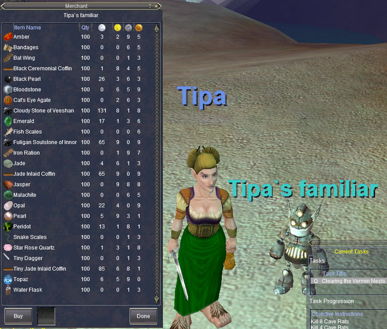

Back to: [West Karana](/posts/westkarana.md) > [2008](/posts/2008/westkarana.md) > [April](./westkarana.md)
# EQ Year 10 Veteran Reward

*Posted by Tipa on 2008-04-18 07:48:02*

Tonight is the first meeting of our EQ Nostalgia group, and I've been swamped with work to do. I had to [create some forums](http://nostalgia.chasingdings.com/), try to pull a roster together, try to make this a fun experience for our little group. I think I'm ready for tonight.

One advantage EQ vets have over people entirely new to the game is the huge variety of veteran rewards -- from double xp to full xp rezzes (once a week) to buff pets that follow you around; there's a lot of good stuff here. Along with that come all the /claim items for the expansions. I never used any of them except the horse barding, but they include damage auras, bags (I claimed one!), faction items, mounts (there's a robo-boar and a warg in there)... cool stuff.

Right now, I'm a level 2 ranger waiting in the Gloomingdeep Mines for 7PM to roll around. I made a Drakkin wizard alt last night and took her partially through the tutorial. Although the first couple of quests are easy, a group will make the last few far faster. I worry, though, that our experience will be nerfed too much because of being grouped... but, hopefully, we'll be able to kill so much more stuff, so much faster, to make up for it.

The just-added tenth year veteran reward is a little clockwork merchant that very much reminds me of the WoW repair bot that also sold useful items. Here's me, my bot, and the stuff he sells:

If you're in the Nostalgia group, register for and [READ THE BOARDS](http://nostalgia.chasingdings.com)!!! And see you tonight :)

## Comments!

**Einhorn** writes: Go go team Nostalgia!

---

**Egat** writes: Holy cow! It cells Sky and Hate teleport reagents!

---

**[wilhelm2451](http://tagn.wordpress.com/)** writes: Oh wow, now that is a handy 10 year reward. It makes me want to go reclaim my original account... except that my friend deleted all my characters over time. Damn him.

---

**Graktar** writes: Out of curiosity, are the veteran rewards based on when the account was created, or how long the account was active? I'm assuming it's the former and my EQ account was created 1 month after release . . .

I'll be interested to see how it goes, and how you feel the game compares to more modern MMOs such as WoW and EQ2.

---

**[Tipa](https://chasingdings.com)** writes: I *believe* on how long the account has been active.

As for how it compares to modern games, well, EQ has done a lot to improve its bad points. It is still very much a group-centric game, but they have made xp much faster -- we all reached at least 10 last night, those that were there the whole time anyway -- and the gear you got through the tutorial was excellent. The tutorial has a lot of group content.

I expect it will take another night to get us all to LDoN level, and after that we'll be working on those for loot and xp while taking detours to other interesting places. There is really nothing similar to LDoN in WoW or EQ2, and I think that expansion is near the top of everyone's list for the game. It really re-invigorated it after the raid focus of Planes of Power. Got it back to its group roots.

---

**Kunagi** writes: It is base on how long our account has been active. /played will give you your "Total Time Entitled". That number is where you are in Veteran Rewards tier.

---

