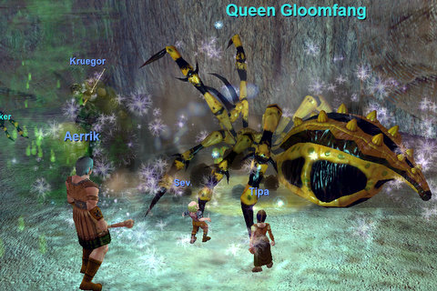
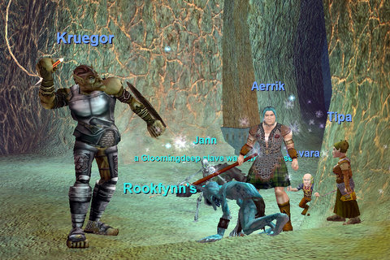
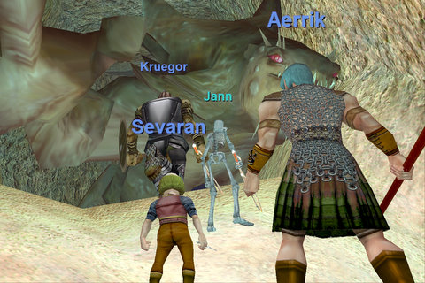

Back to: [West Karana](/posts/westkarana.md) > [2008](/posts/2008/westkarana.md) > [April](./westkarana.md)
# Nostalgia the Tutorial

*Posted by Tipa on 2008-04-19 10:57:43*

It was a wild, exhausting first night for our EQ Nostalgia group. We had more show than could fit in one group, so we made two and went our separate ways. The beginning bit with the spiders -- didn't really need a group for that. So things started slow. They picked up when we got to the kobold area; the fight against the giant beast Krenshin definitely capped the evening! The kobolds also dropped a lot of very nice Gloom armor that quickly prepared us for the wider world.

When we finally did manage to leave the tutorial and explore the wider world -- that's when it first really hit me with nostalgia. I felt at home again. And not anything like I feel when I play my old cleric main. There I feel like I should be farming something or working on faction or trying to find a raid guild or just plain working at something. In the Nostalgia group, nobody wants ANYTHING from a level 10 ranger. The freedom of the noob, I guess.

First named of the evening. She isn't as bad as she looks.

Die, goblin lord, DIE!

Krenshin FALLS! He was red to all of us. I don't know how Aerrik kept us all alive.

Neat thing about EQ is how it puts you RIGHT into the action. Grouping, making teams, learning to work together and fighting really challenging things -- in the TUTORIAL, if you can believe it. If only WoW and EQ2 could learn that lesson instead of saving it for so late in the game.

## Comments!

**Aktad** writes: Go tipa go!!!

---

**Mayadhros/Aerrik** writes: Was definately fun. It felt really feeling like a noob again, with the whole wide myseterious world in front of you.

Looking forward to next friday.

---

**[Cow Nose the 50 Pound Cat](http://cownosethe50poundcat.blogspot.com)** writes: Awesomeee

---

**Einhorn** writes: Yes everything went well for Team Tipa.

But Team Einhorn (aka Team Gimp according to Ishbel...yea, thanks for that) finished a little bit after Team Tipa, and we only had 3 people including myself.

We had a lot of fun despite not being in the main group, but I agree with Tipa - the fun didn't start until after we left the hideously stuffy tutorial. I showed up a few minutes late, and we began immediately after that, so I felt rather "thrown in". But wandering about the old world is the best feeling of all, and I look forward to next week!

---

**Noffin/Sevaran** writes: Was alot of fun, can't wait til next week to see what I can blow up or die to ......

---

**[stargrace](http://mmoquests.com)** writes: Hey hey now, I said team gimp with MUCH gusto and love! Don't forget that =p

---

**[MmoQuests.com » Nostalgia Group - Night One](http://mmoquests.com/2008/04/19/nostalgia-group-night-one/)** writes: [...] in some ways as well. I’d had my heart set on FINALLY getting to group up with the fabled Tipa and play with her (after all, it was just three of us who wanted to give EQ1 another go originally) [...]

---

**Noffin/Sevaran** writes: Was alot of fun. Can't wait til next week..

---

**Noffin** writes: Was alot of fun, can't wait til next week.

---

**[Tipa](https://chasingdings.com)** writes: Hate to break it to you, Einhorn, but you WERE the main group :) I didn't realize all your dps had vanished until it was too late to do anything about it; I or Sevaran could have swapped over. This is where a vent server or guild chat would really help.

---

**[Captain Angry](http://www.captain-angry.com)** writes: Glad to see you captured my good side in those shots. I look damn good.

---

**[The World of Cord » Nostalgia Guild - First Night Together](http://blog.worldofcord.com/?p=142)** writes: [...] is a bit late, as my friends Tipa and Stargrace have already posted on this, but it was just too damn nice out this weekend to [...]

---

