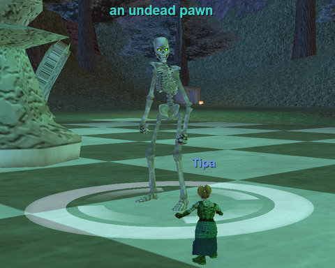
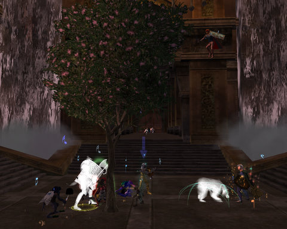
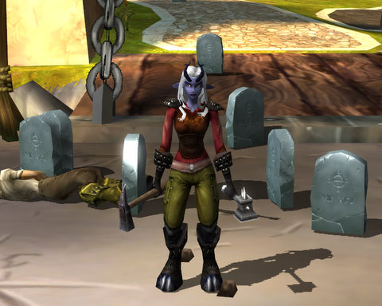

Back to: [West Karana](/posts/westkarana.md) > [2008](/posts/2008/westkarana.md) > [April](./westkarana.md)
# Weekend Gaming

*Posted by Tipa on 2008-04-21 08:10:18*

Nostalgia the Guild took most of my time this last weekend. It's supposed to just be a very casual, once-a-week grouping experience through EverQuest's old world, and it shouldn't really require as much work as I've put into it. However, I don't see how it could have taken any less, either. If you have a static group, how do you keep everything arranged? Maybe I just want everything planned out. 

I haven't been getting a lot of cooperation from SOE. Their guild creation page appears to work but never gives any sort of confirmation, and a petition revealed that all the times I had filled out the form were pointless, as the request was not in their system. The guild creation page mentions that you might not hear anything from them for weeks or longer at the best of times. This is frankly unacceptable. I won't be a nice consumer and silently wait weeks or longer without knowing that the request has been at least received. I'll call SOE tech support this afternoon. Creating a guild for a small number of people who are returning to EQ for a time should NOT require petitioning and a call to tech support and weeks of time. Ever.

Aside from that, EQ is going well. I did the halfling ranger armor quests given out in Rivervale and made level 15 during the camps. Every time I have done these quests -- I've done them for my Stromm cleric (and wore at least one piece into my 40s, the shoulders), I did them for my druid for looks, and I did them for my rogue -- it's been camping those stupid thorn drakelings, and this weekend was no exception. Most of the experience, though, came from camping the orc lumberjacks beyond the Wall. I wasn't sure if they had placeholders, so I killed all the wandering goblins and orcs and anything else that conned blue to me. I dinged 15 before I'd gotten enough of the right kind of orc lumberjack, so I gave up because I didn't want to get too far ahead of the rest of Nostalgia. The last I checked, we were spread out between 10 and 15, which is very good as we head to Kurn's Tower basement this coming Friday.

There's just something funny about seeing a flowering tree in the middle of Kor'Sha. Like, oh, this place is so dreary. Wouldn't a tree right here brighten up the place? It just radiates health and good living! I hadn't know about the warden tree before I was doing some sort of quest with my son (who played a warden) and a couple of other people, and was getting kind of annoyed because whenever I tried to fight something, it seemed there was always a tree in my way. I'd move a little ways off to get a clean shot and THERE WOULD BE THE TREE AGAIN! WTF??? I think Andy nearly killed himself laughing. He'd been summoning it, of course. Anyway, we cleared the Temple of Kor'Sha and killed the Overking all in a couple of hours, which was really a hopeful sign. We've been taking two nights to do it recently. Perhaps it was the addition of a couple of old friends from Eternal Chaos. I don't know if they were just there for the progression kill or if they will be staying, but it was nice to do it all in one night. Maybe soon we can begin work on Leviathan again.

I spent a little time in Mythos this weekend. I have been leveling a satyr bloodletter on the FFA PvP "Shadowlands" server. Since towns are deadly places, people mostly stay out of them except for quick runs in to sell. There are no safe spots and as such, there is no chatter, no community, no nothing except tombstones and sudden death from above. Seconds after I snapped this screenshot, a gremlin pyromancer ported in, pinned me down with a pet and blasted me to bits. Even in FFA PvP, if you're going to build any sort of community, you have to have some safe spots. Compared to the vibrant, active community on the PvE side, PvP seemed barren and dull.

Turns out a lot of Massively writers are MMO fans -- who knew? And a lot of them play City of Heroes/Villains. So, take a bunch of people who work together and play the same MMO and pretty soon you have a supergroup. Ours is called Maliciously. I transferred Madame Scurry v1.0 from Virtue to Freedom and spent time running a few missions. EQ is hard to return to, but CoX welcomes the occasional player. You just mash the buttons for the win. Stalkers are particularly nice, since they cannot be seen by enemies and have a one-shot assassination from hiding attack. It's the power of the cockroach not to be seen and to survive any disaster. Scurry lives!

## Comments!

**Einhorn** writes: Correction:

EQ is hard to return to if you do that stuffy and awful tutorial.

Once you get back out in an open Butcherblock night sky and smell that sweet air, and hear that droning gurgle of ambient creatures among the mountains....you're home.

Or at least, Dwarves will be home.

---

**Malfi** writes: Tipa! We love you for all the work you're putting in. Nostalgia is fun fun fun! I can't wait for us to get together this weekend. Now to finish gathering orc bones in GFay so I can finish off my armor! Got my sleeves yesterday. But gathering up enough Coarse Spider Silk is gonna be a challenge....

---

**[Ardwulf](http://ardwulfslair.wordpress.com)** writes: Am I reading that right - that you have to submit a form outside the game to create a guild?

---

**[Ardwulf](http://ardwulfslair.wordpress.com)** writes: Aside from that, I am reading with interest here and on Stargrace's blog. Sounds like lots of fun.

---

**[Tipa](https://chasingdings.com)** writes: They'd like you to think that. Didn't work for me. I had to talk to tech support, and maybe now it will go through the system.

---

**Sirhyl** writes: EQ has been getting more and more addictive the longer I spend playing it again :)

I cant wait for Friday night!

---

**[Tipa](https://chasingdings.com)** writes: I'm sitting right in front of Kurn's Tower right now! I ducked in to check out the level of the mobs -- blue to red to a level 15. We should be good to go.

---

