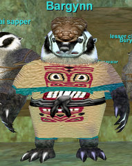

Back to: [West Karana](/posts/westkarana.md) > [2008](/posts/2008/westkarana.md) > [April](./westkarana.md)
# The fall of Kurn's Tower

*Posted by Tipa on 2008-04-26 08:47:21*

I think we quite possibly may have been the first full, normal, untwinked, level appropriate group in Kurn's Tower in quite some time. We can't know for sure, but none others showed up while we were there.

By the time everyone showed, we had seven people at Kurn's, two people still leveling through the tutorial, and three who couldn't make it that night. Ishbel volunteered to solo the upper skeletons. We bid her adieu and headed downstairs, to the land of the Burynai.

 The Burynai are compulsive diggers. They'd dug right through the basement of the tower into some caves and waterways and were causing a heck of a ruckus. A big chieftain by the name of Bargynn (possible last names: Hunter, Finder, Basement) had been taunting us on tracking for the entire evening, and we'd made it our job to put that red-con badger to sleep.

I don't remember who started with the badger song on Vent... but when he shouted out MUSHROOM MUSHROOM I nearly lost it. So dead-on :) We had a minor tragedy; Said, our wizard, took the wrong branch of the underwater tunnel we'd been following and died. It was all very confusing, since at the same time, Bargynn (Boutique) rushed us with his three sapper (cleric) friends, and a couple of skeletons who'd been in the area. Now, Said is dps enough for three groups, Mister Killshot, and with him, this would have been easy. We managed to defeat them somehow, and we were done. We got Said's corpse, rezzed him up good, and left.

Kurn's is fantastic experience; everyone got four levels easily. Unfortunately, since we had lower attendance, some in the progression groups are a little behind. We may need to go back again before next week to get everyone caught up because next week is the Lost Dungeons of Norrath!

## Comments!

**[Cow Nose the 50 Pound Cat](http://cownosethe50poundcat.blogspot.com)** writes: THESE EQ1 BLOGS ARE AWESOME!!!

---

**Mayadhros/Aerrik** writes: Most fun I have had in an MMO in a long time.

---

**[Coldheat](http://www.eq2-guides.com)** writes: Too bad I did not have my Revive spell. ;-( I do now!

---

**[Myrix](http://myrix.wordpress.com)** writes: Nice to see people going back and enjoying some of EQs best content!

I recently stumbled across your blog and I find it a joy to read. Keep up the great work.

---

**Megasheep** writes: I wish that I had the time for EQ nowadays. When I was single, and not a father, I used to play regularly for 8 hours at a time. I never was much of a raider though. I recently started up WoW again. Is there still room for people to come and join up? Even if I can't regularly play on Fridays (although I would be able to sometimes)?

---

**Malfi** writes: Such fun! Being back in Kurn's was a great time! Onward to LDoN!!!

---

**[Tipa](https://chasingdings.com)** writes: We're always looking for more progression players whether or not they join the groups. Plus, we will almost certainly be branching out to different nights.

Check us out at nostalgiatheguild.org

---

**Einhorn** writes: That was me who began the singing of the Badger Song, Tipa.

I am ashamed you forgot! But then again, you STILL can't remember my name (U-R-T-O-G!). so why am I surprised? =P

I'm still kicking myself for not just naming myself Einhorn. But a Dwarf named Einhorn is just....wrong.

---

**[Tipa](https://chasingdings.com)** writes: I thought it was you, Ulfarg.

---

**[Cameron Sorden](http://random-battle.com)** writes: Kurn's is one of my favorite dungeons. That's awesome!

---

**Einhorn** writes: That's Colonel! Get it right!

---

**[Tipa](https://chasingdings.com)** writes: Colonel Utnorg.

---

**Earnholm** writes: Colonel Urftirg, the stout tank of "Nastelgia the Grind".

Lead by Teapot Tonguleweed

Other members:

Molfi
Curdheart
Ishbean
Cardinum
Sehd
Kroolgar
Arrok
Bankxzsz
Sevenurp

---

