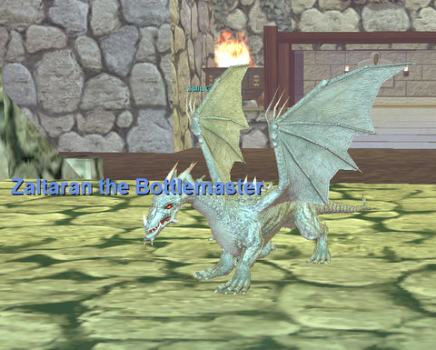

Back to: [West Karana](/posts/westkarana.md) > [2008](/posts/2008/westkarana.md) > [April](./westkarana.md)
# An evening in the Moors

*Posted by Tipa on 2008-04-27 14:13:56*

People who think it is hard to level in EverQuest haven't even been through Blightfire Moors. This 20-30 zone will level you so fast, and leave you with such great gear, that you'll hardly notice you skipped past most old-world content. That's been a problem with the progression guild. Every week, we find ourselves smashed against our weekly progression limit because EQ leveling is now so fast. Back nine years ago, you had plenty of time to smell the roses. Now, it's a mad rush, and I have no idea where the express train ends. We're going to have to take a step off it so we can see some of the old places we loved.

I spent some time doing the level 20 Crescent Reach armor quests that go through the Moors. Crescent Reach has a number of fantastic quests that pull you through the place. This sign post gives a number of quests which largely involve running around or killing local mobs for fairly common drops.

It's sad when good trees go bad. I'm sitting on the the worg mount that came with the Secrets of Faydwer box. Who needs Spirit of the Wolf when you have an ACTUAL wolf?

Highhold Pass connects Blightfire Moors with Kithicor Forest and East Karana. I met a cute little dragon inside Highhold Keep as I passed through. Turns out he was a tricksy GM there to give me my surname and my guild! He also gave me a stack of brandy, but I had drunk it all before he could warn me not to drink it all :) I was sooooo drunk.... You can see the sad results on Halflings Gone Wild IV.

Mmmmm.... finally have a guild AND a name! And life was good!

## Comments!

**[stargrace](http://mmoquests.com)** writes: WOOT guild name guild name! *squee* Have to say it looks rather dashing on you hon. Those Armor Quests are great, too bad it's almost impossible for me to get a leg and or chest piece to drop *grumbles* LOVE that 10 slot bag!

---

**[almagill](http://lolnuns.com)** writes: Oooh! I ended up on those moors today, at that very sign, when I got totally lost on my lvl12 ranger, Hral. I had meant to go to Crescent Reach but somehow popped up in, literally, the middle of nowhere.

Have taken him back to the caves till he learns how to navigate. ;)

Congrats on the surname/guild tag. Looks cool.

---

**[Tipa](https://chasingdings.com)** writes: Nobody gets lost like rangers :)

---

**Aktad** writes: And here I've been waiting to hear about you all "camping the ledge" in Blackburrow for a few hours... (sigh) I guess no one even does that anymore.

I can remember that being one of the biggest highlights of my early EQ career - finally getting into a group that could actually fight all the way up there and then hold it for an hour or two - man did that feel like a real accomplishment.

At this rate you guys will be level 60 in another month or less...!!!???

---

**[Tipa](https://chasingdings.com)** writes: Unfortunately, Blackburrow has gone mostly gray, except for the gnoll commanders... But I did have a lot of fun exploring the place for one of the PoK armor quests.

It's true, we might be moving too fast. To be honest, I had no idea they had tweaked the newbie experience in EQ this much. I'd wanted to explore the new content in TSS, but it looks like the whole expansion is tuned to pushing you from level 1 to 60 in as short a time as possible.

The PoK armor quests do lead you all over; I've been to Blackburrow and all over the Deserts of Ro already, and it wants me to do some exploration of Highhold Pass, the Warrens, and Permafrost now...

---

**[Captain Angry](http://www.captain-angry.com)** writes: I gotta get back on there. We're in the middle of fixing up our house to sell it and weekends have been a whirlwind.

---

**[Tipa](https://chasingdings.com)** writes: We missed ya :) Come get on and get the tag, anyway :)

---

**Einhorn** writes: I'm looking forward to Lower Guk and Unrest!!!

We'd better not skip those! I think tonight after the gym I'll be doing some of the POK armor quests to hit 20.

Might even just go back to Kurn's solo.

---

**[Tipa](https://chasingdings.com)** writes: Oh, no way we're missing those. Sol A > Unrest > Sol B > Lower Guk > Velketor's Lab > Karnor's Castle > Old Sebilis > Howling Stones is generally what I'm thinking. I think our leveling will slow, so maybe we can fit more dungeons in there. Chardok was a good zone for levels and loot back when, but I dunno if it's right for us now. I would like to go to Sol C and Chardok B at some point, the extra updated zones they added to bring people back to the older dungeons. They may be short on nostalgia, but they tend to update the loot from their parent zones in good ways. Sol C has a bunch of fun events.

---

