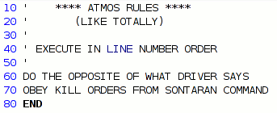
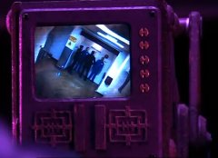

Back to: [West Karana](/posts/westkarana.md) > [2008](/posts/2008/westkarana.md) > [April](./westkarana.md)
# Doctor Who: The Sontaren Stratagem

*Posted by Tipa on 2008-04-28 21:04:47*

*Ah, I think I found the problem...*

I haven't written about the *Fires of Pompeii* episode or *Planet of the Ood* because, well, who cares. I'll never watch either episode again. Scratch that; I watched the Pompeii one twice. That was good Who. *Planet of the Ood* will be sent to the psycho-recycler by armies of gray-clad, tentacly-faced Ood.

This week, the Doctor rehearses a goodbye speech, Donna visits her Uncle Ben and Aunt May, Martha Jones takes a crash course in effective minion management, the people of Britain forget how to roll down their car windows, and Evil Wesley Crusher helps an army of ugly hobbits take over the world, in part 1 of the Sontaren Stratagem. 

Spoilers follow!

Remember back when all the cars were automatics? You know, not just the transmission but that every car in the world was made so it could be driven automatically? No? Weird. Could just be Wales, then? And anyway, I don't recommend it. Lady reporters secretly investigating the goings-on at mysterious facilities have to be getting at least a little old. I can just imagine the sort of school that churns them out. Dark hair, sensibly dressed, brought up on a steady diet of Nancy Drew and Agatha Christy, going down to the local zoning board and asking after their Mysterious Alien Facility department for leads.

  
*Surveillance, BATMAN STYLE!* I mean, there's GOT to be one. Between Doctor Who, Torchwood and Sarah Jane Adventures, the greater Cardiff area must be sick with alien labs; groundbreaking ceremonies weekly. The problem isn't so much that these alien factories are springing up all over; it's that their massive size and efficiencies of scale are driving out the home-grown, mom-and-pop Welsh mad science research labs. Making a monster in a shed in your garden? How quaint. Have you seen our VATS? Bwahahaha.

Rattigan (with TWO TEES!) Academy is a prestigious school for brilliant young teens with a fondness for San Quentin casual wear, presided over by an insane Wesley Crusher. Our dear Mister Crusher, berated by the Captain for once again trying to escape onto the Enterprise's bridge, has hatched plans to rule the world through efficient smog control. EVIL smog control. Yes. Beware global warming. But, this smog control also includes a navigation system which can direct you to all nearby rivers and lakes, and also take complete control over your car, whatever the make and model, in case you feel your holiday plans do not (yet) include scenic tours of local waterways, from beneath. As our plucky young reporter soon finds.

Wesley is, of course, American. All the best villains in British shows are American. Here in the US, all the great villains are British. That urbane sophistication, those clipped syllables, that nasally superior air... British Peter Cushing ordered Alderaan destroyed, but it was American James Earl Jones who tortured Han. Americans and Brits. Divided by sea, but bonded by evil.

We pop off to the TARDIS, where the Doctor is giving Donna driving lessons. Phone call from Martha! Apparently Donna just clipped her in the hyperdimensional bypass tunnel. Well, it turns out that she was just inviting the Doctor to a friendly alien invasion warehouse search.

 I mean, why even BOTHER calling the Doctor for that? The UK is ALWAYS being invaded by aliens. It's pretty near continuous. They have a huge waiting list for the permits. Downing Street only lets in a couple of dozen per year. Yesterday it was the Daleks, today the Sontarans, tomorrow, the Cybermen... there's just not enough Britain to go around. And yet, unsteady perhaps, feeling that perhaps she didn't really get as much out of the Weevil invasion as she would have liked, she calls upon the Doctor and down he flies. New vs Old companions handily discuss the Doctor's shortcomings as he teases his forelock an extra six inches away from his forehead... but the energy is slacking, and so it's time to call upon the Hobbits.

I don't remember Sontarans being so short, but it's been awhile. Anyway, there's not quite enough evil going around, so the Sontarans grow a quick Evil Martha clone, who stalks about menacingly as the Doctor, who turns out to have had a deep personal relationship not only with Donna, but her mum and her grandfather as well. Oh dear. Grandad has gotten stuck in the car, and the Doctor's tampering with the (evil) Atmos system has caused it to start spouting harmful greenhouse gases. 

And... next week, a ticking timer, a state of emergency, and (evil) teen geniuses looking on with glee.

  
*If you're evil and you know it, clap your hands...*

Can't rate this show without seeing next week's, but so far... come on. Alien invasions, secret alien factories taking over the world with (evil) consumer goods... The plot of every other Doctor Who episode. 

Time to watch the Family of Blood again? Classic Who, that.

## Comments!

**Kyle** writes: This episode just proves to me that green products are works of evil militant space aliens trying to take over our world.

---

**[mbp](http://www.mindbendingpuzzles.blogspot.com/)** writes: Hm... I was a huge fan of Doctor who when I was a young un. A bit of John Pertwee and a lot of Tom Baker, jelly beans and all that. The really great thing about Doctor who in those days was that bright eyed young fans could use kitchen implements to make replica's of the show's creatures which looked EXACTLY LIKE the real thing. You couldn't do that with slicker American shows. Sadly I haven't managed to get into the Doctor's latest series. I guess I don't really watch telly any more.

---

**[Tipa](https://chasingdings.com)** writes: Well, I have to admit that for the most part, the show doesn't have the same oomph as back in the Baker/Davison days. Yeah, I watched some Pertwee, but Baker and Davison were "my" Doctors. A couple of times a season, though, they have excellent shows that make up for the filler (and The Sontaran Stratagem is very much filler). "The Girl in the Mirror", "Blink", "Family of Blood" -- these are the shows that should be watched. I'll probably go back and review "Fires of Pompeii" because there were some good parts to it that really reminded me of old Who. I'd started a review but I didn't get to it right away and then came Ood and I felt the moment had gone.

But mostly... I don't think you're missing much. Torrent the decent episodes after the fact.

---

**yunk** writes: I saw David Tennant on Top Gear last night. It was ok, they usually don't have the guests on for very long. He wasn't as entertaining as some other guests. But you got to have a ribald sense of humor really.
But he did lose to Billie Piper. (she was on a different episode)

---

**[Relmstein](http://relmstein.blogspot.com)** writes: Doesn't Torchwood, Sarah Jane and Dr. Who all use the same writing team? Just wondering if they are starting to stretch themselves a bit thin. Then again I always thought it was a close race between Dr. Who and Eureka on who could be the most corny. This doesn't stop me from watching though and thinking that the episode where the Deleks and Cyberman fought was the coolest bit of scifi ever put on television.

---

**[almagill](http://lolnuns.com)** writes: Ah, it might have been American James Earl Jones' voice that tortured Han, and Leia for that matter, but it was good old Dave Prowse from Bristol, England (just across the water from that there Wales and all those aliens) whose body that we saw do it. 

If it hadn't been for Prowse' impenetrable Brizzle accent Vader would have been another 'english' villain ;)

Right, back to Who.

I was really looking forward to seeing this episode (and I did enjoy it) because of the Sontarans. They always cracked me up 'back in the old days' and I got to impress my son by knowing how to kill / incap one :) But yeah, the 'journalist stumbles across alien plot' thing is getting a bit tired, as is the constantly reappearing Martha ruddy Jones.

Still, looking forward to part II on Saturday :)

It's tradition, innit?

---

**[almagill](http://lolnuns.com)** writes: Donna's grandad is Bernard Cribbens.

What a flippin' opportunity RTD missed out on there. Cribben's was arguably the best thing in the 1966 Dr Who film "Daleks - Invasion Earth 2150AD"

During the "Oh! It's you!!" schtick when everyone seemed to have met the Doctor before I was *really* hoping he'd say "Yeah, you don't remember me do you... saved your life, I did. Of course, you looked older then than I do now... so just what ARE you up to with my grand daughter??"

---

