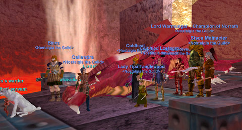
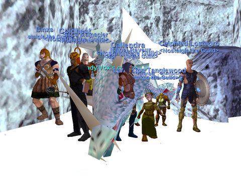

Back to: [West Karana](/posts/westkarana.md) > [2008](/posts/2008/westkarana.md) > [August](./westkarana.md)
# EQ: The Last Dragons

*Posted by Tipa on 2008-08-02 11:48:12*

Come Hell or high water, we were going to start leveling again after last night's dragon raids. Everyone has been getting antsy about perpetually staying at level 52 solely to farm the dragons. Last night, we killed them both, and have killed each of them three times. Nostalgia the Guild has gone back in time nine years to when mega guilds used to roam the world, throwing themselves against the greatest monsters of the age. But now, we're moving on to EverQuest's first expansion. Next week: Veksar, the city hidden beneath the smoothly lapping waves of the Lake of Ill Omen. Nostalgians, remember that for the next two weeks, we're meeting on Thursday instead of Friday. And that the new level cap is 55.

First up, Lord Nagafen. We had a fantastic turnout, but, unfortunately, were gnome-less :(. Soaridor had transferred his monk, Sisca, over (along with a lot of very nice arrows -- THANKS!), so we had a puller once again. First pull was a disaster in slow motion. First came the two giants in the room. And then Magus Rokyl decided to join in. And then Warlord Skarlon and HIS friend join in (!!). And then, NAGGY. Okay, I was very nearly almost laughing. We got the first two giants dead and Rokyl most of the way there before the last of us died.

We rez up (I remembered this time to move the campfire to the ready room), and kill Skarlon and his friend. Sisca manages to split Rokyl, so we kill him, then rush in for the Naggy kill. It took a little longer to position him than normal, but we took the old lizard down -- live! on the web!

Ceipheid was broadcasting our raid out on the web (I would have announced it here if I'd known in advance), and it was bizarre watching the raid live on my computer, and then watching the raid a few seconds delayed from the MT's perspective on the other computer. Plus commentary from the random visitors who wandered in. One of them mentioned he could solo Naggy, I guess he must have been 52 or lower but he claimed to have 15K hit points. Well, okay. But we're not raiding to be uber. We're raiding to have fun. And to get a second Red Dragon Scale.

We didn't get one. Naggy is being stingy. Someone asked if that meant we were coming back. Nope. It just means we're heading to the bazaar. 7500 plat later, and Ceipheid got his GREEN scale, which means he doesn't need to do the quest to turn a red scale green, which is a huge bonus. 

[Brown Chitin Protector](http://lucy.allakhazam.com/item.html?id=4409) -- Guild Bank
[Razing Sword of Skarlon](http://lucy.allakhazam.com/item.html?id=5412) -- Ceipheid
[Cloak of Flames](http://lucy.allakhazam.com/item.html?id=11621) -- Binxs
[Gauntlets of Fiery Might](http://lucy.allakhazam.com/item.html?id=11624) x2 -- Guild Bank
[Gold Plated Koshigatana](http://lucy.allakhazam.com/item.html?id=11630) -- Guild Bank
[Torn, burnt book](http://lucy.allakhazam.com/item.html?id=19071) -- rot.

With Naggy dead, his love Vox would be pining away. She needed to be killed just to set her soul at rest. It would just be cruel to leave her alive, really.

The hardest part of the Vox fight was clearing the giants from her room, there was an extra one or two in with the pack that I guess we normally kill separately. Two ice giant priests and their complete heals made the whole thing tedious, but not particularly dangerous. After a few minutes we had them dead, and Sisca pulled Vox to our normal kill spot in the flag room (to the displeasure of the peanut gallery on the webcast, who wanted to see people get flung into pits by tentacle terrors as we took her down. Nope. There's a REASON we don't fight her in her lair.)

Without any mages and nobody to drain her mana, Vox took a much longer time to die, but we stepped up our dps just at the right time and she had no chance to either complete heal or gate away.

Both of them will be back next week after their forced vacation courtesy of Nostalgia, but we won't be. It's been absolutely wonderful to be able to raid them these past few weeks.

[Dragon Bone Bracelet](http://lucy.allakhazam.com/item.html?id=11606) -- Guild Bank
[McVaxius' Horn of War](http://lucy.allakhazam.com/item.html?id=11607) x2 -- Ceipheid's bard, Maromi
[White Dragon Scales](http://lucy.allakhazam.com/item.html?id=11602) -- Maromi

Afterward, we kicked Urtog, Gozad and Malfi from the Fellowship and added Callendra, Sisca and Warmunger in their places. Sorry guys :( We needed the spots, and those three are there every week. I wish Fellowships were larger. Nine seems to few; there's no middle ground between campfires and guild banners. I'd just prefer to set up a guild banner someplace. Make it six people in the guild that need to be there instead of thirteen, and that would work out fine.

Lackey was tearing up the Crypt of Nadox with his cleric, and invited anyone to come join. I thinks I will, I said, rushed over there, turned on my Lesson and ended up 72% of the way through level 53 when the group split up. It felt good to be able to level. This morning, I returned to Nadox to do the [Icewind quest](http://everquest.allakhazam.com/db/quest.html?quest=2380). Lots of people claim this can take days, but it only took about an hour of killing before I got the drop, went back to Gunthak and am now the proud caster of a sooper dooper ice nuke.

I also got a pair of [Steel Wrapped Leggings](http://lucy.allakhazam.com/item.html?id=40202) and three pairs of [Gloves of the Fallen Spirit](http://lucy.allakhazam.com/item.html?id=40178), coming soon to a guild bank near you.

## Comments!

**[stargrace](http://mmoquests.com)** writes: Warmungar and I hung around until we each dinged 55 and a bit into it (have got to love that buffer!) and I have to agree, it felt GOOD to be leveling again! Plus, all those nice new shiny aa are available now.. *drools*

---

