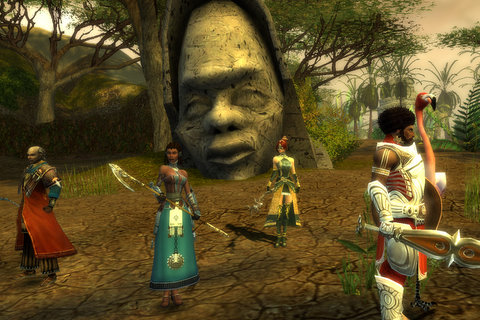
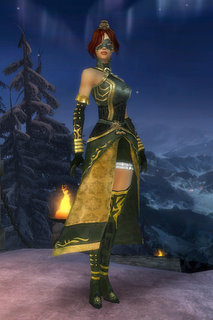

Back to: [West Karana](/posts/westkarana.md) > [2008](/posts/2008/westkarana.md) > [August](./westkarana.md)
# Guild Wars: Nightfall, Day 1

*Posted by Tipa on 2008-08-04 07:50:19*

  
*In search of... Ancient Erudites...*

When a bunch of the most knowledgeable people in MMOs suggest to me that I should probably look into Guild Wars because it sounds like I need something different, well, I buy the game. And yeah, even though the game could be best compared to Dungeon Siege II with massively multiplayer cities, I do consider Guild Wars an MMO. Every city, town, hamlet, guard post and quest hub I came to were filled with people, selling stuff, looking for groups, looking for escorts to far away places, offering 100% no fail inscriptions -- it was alive in a way that only MMOs manage.

So, first day. I started off as a Mesmer, not knowing really what the class did but someone said "try Mesmer!" and so I did. Mesmers shut enemies down. If the monster tries to cast a spell, it hurts. If the monster tries to attack, it hurts. If a monster has a buff, it hurts (and is removed). If they stand around doing nothing, it hurts, but not as much. With elite skills (which I clearly don't have), Mesmers can prevent monsters from using a skill, or even take that skill away from you and use it against you. It's a pretty unique class, I've never played anything like it before. It does tend to infuriate monsters, so I am using the command window to send my heroes and minions ahead to get aggro before I start with the mesmering.

I chose Ranger as my secondary class, because of Franz Mesmer, the scientist who discovered "animal magnetism" (later called Mesmerization, and even later, Hypnosis). So it just seemed proper that I have an animal companion.

When I looked up my build (Me/R) on various Guild Wars sites, it wasn't listed at all. Those two classes don't work well together. But, they suggested, a Mesmer can do quite well without worrying about their secondary class. Push points into Domination so stuff hurts a LOT, and into Inspiration to regain some health and energy, and you'll make your mark.

So, until I do the respec quest and can change to a more conventional build, that's just what I've done. At level 12, I've put the vast amount of my points into Domination, with some in Inspiration and some in Fast Casting. And if I need to swap this around for specific missions, it's just as easy as visiting any non-instanced zone. I've done a little bit of traveling for skills.

There are games out there where you know just how and where to use a skill, and then you do that, over and over. Guild Wars is not that kind of game, and without the many, many wikis which teach you how to choose your skills and use them together, I would be entirely lost. And I want some of those higher level skills, which build upon each other to make cities of pain. I think City of Pain is a Mesmer skill, actually.

I chose to start GW with the Nightfall expansion, because that gave you heroes which leveled up with you, and for whom you could choose their skills and gear. You start off with the hero Koss, an out-and-out tank. He tanks the mobs so I don't have to. In fact, it gets to be such a furball of mobs most times that I don't WANT to play a melee. Standing off a bit making things hurt makes me happy. Of course, they come at me anyway... but every time they attack me, it hurts them so much I smile :) I went with healer and motivator (javelin-throwing) henchmen. As we leveled, I played with Koss' build a bit so he could better protect me and not worry so much about the damage. Next to come was a healer hero, and last, a disruptor hero. And not long after I had bid adieu to my last henchmen, my party size increased to eight and I was able to get them all back again as I headed to some truly awful killing fields.

Just going out and killing things won't get you much of anywhere in Guild Wars. Quests help (and are very often the same sort of kill X, run from here to there quests you see everywhere). Your rank in the Sunspears, the impartial, a-political guardians of the region, is a major plot driver. You gain rank not only by doing quests, but by talking to the scouts on guard outside resurrection shrines, who give you a bounty buff for a certain sort of enemy in the region. While you have that buff on (permanent until you zone), you will get double experience for enemies of that type, PLUS you gain rank in the Sunspears. So the first thing you do when entering the wilderness is look up the local scout and get the buff, and if you see anything matching it, you kill it. You can have multiple bounty buffs, so in larger wilderness zones, you might be running with two or three and really pulling in the bounty.

The wilderness zones are full of side quests so that you never find yourself setting off to do just one thing. In fact, it's incredibly easy to get distracted. Like, I'm supposed to be clearing this quarry of mobs, but this guy standing near a monument needs his tools. He doesn't want US to run off and get them, FOR ONCE. Instead, HE'LL run off and get them, all we have to do is just guard the monument until he returns. Easy money.

The moment he leaves, the lizard-like Skale decide to attack. Wave after wave after wave of scaley awesomeness. I still haven't survived that encounter. But combined with a Skale bounty buff, it's excellent xp and rank, until I die, anyway. There is a sort of debuff you get when dying, but since it's entirely cleared by just popping into the nearest town or outpost, it really only gets annoying when you're deep into a zone and you don't want to have to fight through all those monsters again.

There is a main plot to the game, which you pick up as you gain rank. Some evil queen wants to rule the world, and she wants the Sunspears out of the picture before the astronomical event known as Nightfall. Isaac Asimov once wrote a story about a planet with five suns, and once in several thousand years, they'd all end up on the wrong side of the planet and night would come and the stars would come out and civilization would collapse. I don't know if the GW Nightfall has anything to do with that. But they seem to just have the one sun. My best guess: an eclipse. Anyway, the first mission -- which can be repeated for better scores -- was to save a village from invasion. I did that with all mission objectives completed. The second mission was to delve into some ancient ruins, solve various puzzles, be under continuous attack and take down the monster Apocrypha, who, it turns out, was the only thing keeping the undead from invading the land (oops). One secondary objective was to not kill any Sunspear ghosts, but temporary-ally Koromir, local head of the Sunspears, didn't get the memo and attacked every one she saw. After the first one, I found you could just run away from them and Koromir would give up on it after awhile to follow. So I need to return and redo that one. These missions are full of cut scenes and remind me very much of the similar plotline missions in Final Fantasy XI Online.

Crafting is pretty complex, given you don't do it yourself. You bring raw materials, which can be found, bought, or salvaged from trash loot. One of the first things I did was change into a nicer looking outfit. Most stuff can have "inscriptions", which give some benefit to the armor or the weapon. You can remove the inscriptions from items that have them, giving the occasional piece of trash loot a value it otherwise wouldn't have. You can further supplement certain items with runes, so pretty much everything you (or your heroes) use or wear will eventually be specific to you and your needs.

And everything you unlock, be it runes, inscriptions, types of weapons or armor, will be available to you on any PvP character you make. Because the PvE game is only half the story. I haven't done PvP yet -- it starts at 20 -- but I have observed some matches. I bet the best teams know all about each others builds and work together for real pwnage. I'm not normally that into PvP, but this one seems based more on skill than items... might be worth a look.

And that was just the first day. Impressions? Most WoW-likes just give you little bits of the game at first, then gradually give you more, so that after a few months, you have it all. Guild Wars seems to take the opposite approach. Give you everything, VERY quickly (at level 12, I am more than halfway through the leveling process, and I think the pre-20 game really must be considered an extended tutorial). And then you spend the rest of your time in the game refining your play. And PvPing.

It's definitely a whole new game.

## Comments!

**[Van Hemlock](http://blogs.chimpswithkeyboards.com/vanhemlock/)** writes: Keep an eye out for Cry of Pain on your travels - it'll show up later on during the story from one of the Sunspear Trainer types. It's an excellent AoE blast which I never leave home without, and it gets more powerful the more Sunspear Rank you gain.

Mesmer definitely seems one of the more complex classes on offer, heavy on reaction times and reacting to what the enemy is trying to do. Mind you, all of the GW classes have surprising depth of gameplay, I've found. Domination is the best bet for PvE play, while Illusion leans more toward the PvP debuffery. Insp and FC are handy whatever the circumstance.

Good to see a fellow sophisticate, instead of just another Elementalist! What's so clever about just setting someone's head on fire, eh?

---

**[Openedge1](http://simple-n-complex.blogspot.com)** writes: Grats
 And just wait until you "Alt" in the game. Each class is so unique and different.

Anyways, that is quite a write up. And what really is fascinating is how you state the up to level 20 is like a tutorial...
You would not be far from the truth.
If you open your map, zoom out and see that LARGE land mass to the north? I am there, and it is ALL level 20...
In so many words, what you are doing now is only the beginning.

Another way to look at Nightfall is to have a sense of an RTS. In the mission where Kormir will kill the Sunspear ghosts, I really had to play around in that to force her to attack other things or not attack at all. I used my Heroes to do all the work instead, and I would stand back if a ghost was near. Kormir would stay with me.
After a certain point this becomes a non-issue when you start working with the ghosts.

That is another key. Learning when to attack and not to attack thanks to the Heroes dynamic. A great trick is to tab to your target (always learning who is the healer in the group, and kill them first), but using the "Call Target" tactics, holding CTRL and hitting SPACE, which starts your attack which causes a ding sound (and you will see an announcement in your chat window "I am attacking..."), then you stop moving and your Heroes will continue to attack THAT specific target.
Great stuff (and you need to learn that if you group with others, as THEY have a target caller, and all you have to do is hit T to attack the same target)

As you can probably guess, the overall combat is different than most MMO's.

I like that!

Glad your enjoying...

---

**[Scott](http://pumpingirony.net/)** writes: Wow, great first GW post! Did Van Hemlock taint you with his mesmer rantings? *ducks and runs* That's one class I've never actually played myself but I occasionally take a mesmer hero along in certain areas where I just can't get past without mass interrupting. The reaction times are so criticial (and hero's are ungodly psychic in that area) the mesmer could arguably be considered the first true 'twitch' class in an RPG. But there's nothing quite as satisfying as seeing a tough mob or boss begin to cast one of those spells that make you say "ohhhhh.. crap!" and wonder how long before you wipe when a mesmer smirks and says "I don't think so," and interrupts the spell.

Oh, and for those stuck in that "casters must be in the back line" mentality of Holy Trinity RPG's I'm sure Van Hemlock would be delighted to show off his Mesmer/Assassin shadow tanking!

Once you start grouping with others you'll see other mechanics the game provides for tactics and on-the-fly communicating such as target calling (in fact, if the tutorial didn't teach you this already, as a caster you'll probably use it all the time for your heroes) and pinging/writing/drawing on the minimap.

My only concern, and this is a personal thing, is using the wikis so soon. They provide good information to be sure, but it could be too much information, completely spoiling the fun of discovery. But that's how I play, some people just want to immediately learn every mechanic and start min/maxing from the get-go. I find the longer I can keep a sense of freshness about something, the longer its sense of pure fun and enjoyment last.

---

**[Tipa](https://chasingdings.com)** writes: I started using the Wikis when it came time to choose my secondary class. I had no idea what to choose. I went with Ranger because I thought I would mostly do Ranger stuff but use the Mesmer stuff to deal with enemy healers -- and being able to shut down a certain enemy's continual healing of its allies looked great. But actually, with less emphasis on Ranger and more on Mesmer I could do even MORE damage, so I knew I had made a mistake and went to the Wikis to recover. And there I found out about how to play a Mesmer.

Yes, I am a devoted listener of Van Hemlock's podcast and Mesmer sounded interesting, even if I happened upon a "comedy build" all on my own. I don't have all the skills, naturally, so I am putting together blends of my own based on the monsters I am encountering.

@Openedge -- so THAT'S what that is! I didn't know if the mainland was another expansion or what, but my title progression for explorer is like 8% discovered or something. But they keep up opening things on that little archipelago I'm starting on.

@VH -- the Mesmer looks similar to the EQ2 Brigand class -- interrupting, chaining actions, using an action to repeat other actions -- looks much the same. In fact, without having tried it yet, I would bet the Me/A build would be very close to an EQ2 Brig. Love your podcast, very inspirational :)

---

**[almagill](http://gudeman.co.uk)** writes: Right, that settles it.

GW gets reinstalled tonight. Though I think I'll have to hit the wikiverse and bone up on some of the changes in the game since I last played.

Heroes? That.. that almost sounds like twoboxing on one account in one instance of the game :) I'm SO up for that :))

---

**[Van Hemlock](http://blogs.chimpswithkeyboards.com/vanhemlock/)** writes: Re: the build you show, try dropping Shatter Enchantment or Drain Enchantment (which both do broadly the same thing), and putting in Comfort Animal instead, which is the pet heal/rez... which you probably have on board by now. Should let you act as healer for the pet, and bring it back if it dies. The rest of it looks like a respectable enough early-game Mesmer offensive build; Empathy and Backfire continue to be useful to me all the time.

Me/R is a tricky pairing, as you've found, but I believe pretty much any pair can do fairly well - just needs a bit of lateral thinking and imagination! :)

Here's one I had fun with: http://blogs.chimpswithkeyboards.com/vanhemlock/archive/2007/10/31/1818.aspx

It's a kind of poison archer, that then uses Mesmer skills to make the poison spread targets and last longer, for a sort of mini-rolling epidemic. Works even better if teamates are causing the other conditions as well; burning, cripple, etc. Not sure where all the skills for it are offhand though. (In hindsight, I wouldn't bother with Pestilence though...that gets out of hand very quickly!)

It's the tinkering I love :) Look out for Illusionary Weaponry, and all it implies!

---

**Krabat** writes: You can respec (change your build) freely, but to change your secondary profession you have to pay. In NF, the trainer is near to the Sunspear sanctuary, so it's like two stops away after you get to the mainland. Recommended second professions are usually elementalist (most often just for http://wiki.guildwars.com/wiki/Glyph\_of\_Lesser\_Energy), and assassin (but I've never tried those since I don't like to melee). But also Me without any secondary does well.

I started my playing back in 2006, bought Factions first. It was quite tough, without heroes - and I made it a point not to look up builds from da Interwebz. Now, I could take any profession with a good build and heroes and slice through Factions...

It helps a lot though to find good builds also for heroes, and to buy them runes/etc. Note that the whole tanking/healing paradigm doesn't work in GW, mobs choose targets based on a quite fuzzy formula (the one with least max hp/worst armour/closest/...). This means it pays off for you to get +hp stuff for yourself, until you feel comfortable enough.

Sunspear points - this is what I meant by saying that NF has some grinding. You also later have to get lightbringer points.

Also bear in mind that there are several different campaigns, and you may choose either to play through all three by using the same character, or by learning a new campaign by levelling a new character, preferably from a different profession.

Some caveats: I have found it to be VERY hard to pug in GW. Because heroes are just great, most people prefer to solo - claiming that most of the other players are worse than heroes (might be true). And after finishing the campaigns (which have great storylines and cool missions), there's no other endgame in PvE - you can continue to farm money for ubercool looking gear (yawn - too wowish for me), or go to PvP. Or just shelve the game for 3 months and then level another character. But you can do it because there's no monthly fee!

---

**Graktar** writes: A very nice summary of Guild Wars. I've been playing it off and on for years since there's no subscription to worry about, and as a result have gradually amassed all the campaigns and extras. I think Nightfall is definitely the strongest of the three campaigns from a gameplay point of view (especially for newbies since Heroes are much better than Henchmen), while the original Prophecies is the strongest from a story telling point of view. Once you beat the Nightfall campaign I highly recommend the Eye of the North expansion. It has a three pronged story progression with MASSIVE amounts of 'side-quest' type content, and a bunch of new PvE only skills that are not class dependent.

Like you said, the leveling process is really a tutorial for the game. The vast majority of content in Guild Wars is played at level 20.

I will say that trying to play with friends is pretty ungainly. I recently convinced a friend of mine to try out Guild Wars with the intention of us duoing with 3 heroes each, and it just didn't work too well. It's too easy to get separated, doesn't appear to be any way to see what quests each person has, etc. Grouping is great for missions and dungeons where you stay focused in a single zone for a long time. But for regular questing you're better off soloing, and that kind of defeats the point of it being a multiplayer game.

---

**[Sente](http://adingworld.wordpress.com)** writes: Quite an extensive first day report!

I have not looked at specific builds for any of my characters yet (filled up my 8 slots), but did try to get some commonts on secondary profeession options. LIke you I had no clue from the general descriptions of the professions really. But I will try to play a bit with every profession as a primary to get a feel for them.

That scale attack quest is pretty neat, but it is also just a little taste of what you will encounter in "Attack of Beknur Harbor" quest. I will try to complete that one at *some* point. 

Brigand was my favourite class in EQ2, a combination that works similarly to that one would be fun to play. Have not picked a secondary for my mesmer yet, but he is on survivor duty so not sure if assasin would be a good choice for that.

@OpenEdge: I did not know that calling targets works for the H&Hs, but now that you said it it makes perfect sense... Good to know!

---

**[Scott](http://pumpingirony.net/)** writes: @Graktar: you only pay once though to change secondary professions, after that you can switch back and forth between all the secondaries you've trained for. So it's only a one-time fee per secondary, not like WoW where you pay each and every time regardless.

@Sente: there are actually two ways to call targets. CTRL + [skill] (or [space] for normal attack) will call the target and begin your own attack based on whichever [skill] you clicked or pressed. Or (I use this on my monk constantly) CTRL+SHIFT+Space will simply call the target but will not cause your character to attack, which is great for casters to send their tougher heroes into melee then stand back while we stand back and deal with things without being the first one into aggro radius.

And of course, you can individually select targets and lock a hero onto them from the hero control bar. That's fun to send a warrior in to get aggro to "tank" better, then the other heroes react and join him. Or set a mesmer/assassin/ranger onto a healer boss to interrupt his heals while the rest of the group takes down the other mobs.

---

**[Openedge1](http://simple-n-complex.blogspot.com/)** writes: I agree about the AI Scott
It seems they are TOO smart sometimes. May be the reason that completing certain quests with Heroes works better than henchies or PuGs.
I had also forgotten about the CTRL SHIFT / Space/ Skill...I have my Monk from Prophecies that I just gained her Heroes, and sure could use that method of calling.
I love the map ding for regular groups, and the draw feature has worked well with my wife duo.
Man, all this talk makes me ready to play...
Gotta run!!!!

---

**[jackson](http://www.podserver.info/guild-wars.html)** writes: The main difference is level, gold and items don't help that much in a fight. The game is more skill based.

---

**[Crimson Starfire](http://word-of-shadow.blogspot.com/)** writes: The Mesmer class works really well with an Elementalist secondary for PvE. Get an elite called [Signet of Illusions](http://wiki.guildwars.com/wiki/Signet_of_Illusions), put 16 in Illusion and 13 in Fast Cast. Fill your bar up with fire skills, and use Signet of Illusion to cast each one. You'll do as much damage as an Elementalist with half the cast time.

---

**[mbp](http://mindbendingpuzzles.blogspot.com)** writes: I too was a Mesmer lover although I did find a Mesmer harder to play in Nightfall than the original Prophecies campaign. Imho the Mesmer excels at taking out individual high value targets and is perhaps less well suited to the large groups of mobs that you get in Nightfall. 

Its been over a year since I played so any advice I give is out of date but as has already been mentioned you should probably stick with a full Mesmer bar for the moment. A lot of Mesmer skills work well in combinations so the slot given over to the less than impressive pet could probably be better used with another Mesmer skill. 

With a few points in Inspiration Spirit Shackles is a great skill - It complements Empathy nicely to drain energy every time a mob attacks. Good against casters (even healing mobs are too dumb to stop attacking) but equally against non casting classes who have small energy pools but still need a bit of energy for their special skills. Throw in Energy Burn and Mindwrack and you have the basis of a nasty Energy Denial combined with Damage Dealing build. 

Also - don't forget that even though GW has no taunt skills it does allow body blocking. Don't be afraid to move around in combat to put a beefy warrior between yourself and a nasty mob. With practise you can actually hand over mobs from your character to another by standing behind the desired recipient. I have even used that technique to pull mobs off my healer and move them to my tank. Just be careful not to expose too much of your back to your foes because hits in the back while fleeing are automatic criticals.

---

**[Openedge1](http://simple-n-complex.blogspot.com/)** writes: *Also - don’t forget that even though GW has no taunt skills it does allow body blocking. Don’t be afraid to move around in combat to put a beefy warrior between yourself and a nasty mob.*

This is an important point. Actual movement in an MMO that works. 
You can, for example, run away from AoE spells, move behind someone to get away from a mob. 
Since you took Ranger, you may want to get the run skill as soon as possible. This will allow you to kick in the run skill to get away from particular mobs. Nothing ticks off mobs (or PvP'ers) more than a runner...hehe. 
Mobs will forget about you and people will call you names, and you can smile...

The collision detection can also be a detriment. I still remember being out and about and henchmen trapping me in a corner, and I had to map out..ARGH.

But, heroes can be controlled, and the strategies involved in all this makes GW so much more than the standard MMO.

Waiting with bated breath on your further adventures..

---

**[Tipa](https://chasingdings.com)** writes: Thanks for all of the encouragement :)

My usual GW fight goes like: 

Order tank to engage monsters. 

Then let aggro bring in everyone else.

One or two monsters come straight for me even though I have done nothing.

Debuff them so that they start taking damage. By clicking on them, the tank is coming back to pull them off, which he does, leaving a furball centered on him.

I step back out of the fight, free of aggro.

I tab around looking for the healer or failing that, nukers.

I shut. Them. Down. That makes me smile :)

I was tired last night, only got to level 14. Just working on some side quests for money and salvage items to upgrade my gear until I work more on the main quest again.

---

**[Hudson](http://hudshideout.blogspot.com/)** writes: I had a totally different experience my first night in. HA HA

http://hudshideout.blogspot.com/2008/08/night-in-guild-warskinda.html

Thats about as detailed as I get

---

**[Tipa](https://chasingdings.com)** writes: @mbp -- you don't like my Flamingo of Death? :(

---

**[Hudson](http://hudshideout.blogspot.com/)** writes: By the way great write up. Ill be checking back to learn more about things as you go on.

---

**[Tipa](https://chasingdings.com)** writes: I LOL'd at yours :)

---

**[mbp](http://mindbendingpuzzles.blogspot,com)** writes: Oh ... that's a flamingo? I thought Koss was just doing his secret hand salute.

---

**[Sean](http://www.seanpurvis.net)** writes: Hmm.. I think I'll have to check out Guild Wars. Hmmm...

---

**[MmoQuests.com » Tipa&#8217;s Fault&#8230; Again.](http://mmoquests.com/2008/08/12/tipas-fault-again/)** writes: [...] have been following Tipa’s adventures through guild wars for the past little while. They sounded interesting. All of the comments made it sound double [...]

---

