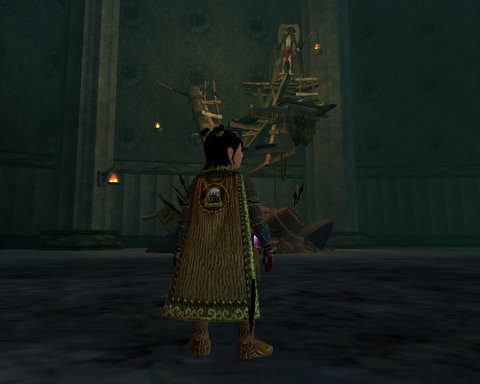
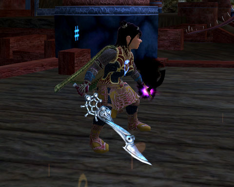

Back to: [West Karana](/posts/westkarana.md) > [2008](/posts/2008/westkarana.md) > [August](./westkarana.md)
# EQ2: Night of the Living Goblin

*Posted by Tipa on 2008-08-07 07:46:20*

Last night, I was going to get my necromancer, Dorah, over to Najena. No matter what. I tried their automated transfer system with a couple new names. Neither were in use, according to EQ2Players. Since Sony TSRs can't actually move characters themselves, their jobs are to pass you along to someone else -- either make it my fault somehow, or have me contact an in-game GM. But I'm pretty sure in-game GMs can't perform a character move, either, so I was not going to leave until the TSR gave me a different solution.

It's like one of those old fights against a demon you read about. They try to distract you, they shift form, but you just have to hold on until they tire and then do your bidding. I got instructions to petition. On how to petition off-line. Instructions for configuring my Internet Explorer correctly (which was funny, since I was using Firefox 3 under Linux. No IE there.) The site tried to discourage me from coming by having a certificate with credentials not matching the site, which had my browser warning me of a possible phishing attack.

At the end, I got him to send me a form asking for a manual character transfer. So I filled that out and returned it. Maybe it was just another, successful, attempt to get me to go away, but it was something I had not seen before. I believe, though, that TSRs should have the ability to escalate concerns to people who can do the things they can't. Maybe I'll find out, at last, why I am being accused of a Service Violation whenever I attempt to transfer a character that needs renaming.

Anyway, that was pretty exhausting, when all I really wanted to do was to play. So, last night was gonna be the no whining, gonna get a goddamn group and PLAY EQ2 night... and it was.

I talked with some friends for awhile, almost joined a Shard of Hate raid, but stopped myself in time; almost joined a couple of instance groups, joined a guild just for someone to talk to... Oh yeah, you're looking at one of the newest members of Dark Alliances. A high end raiding guild on the Befallen server. Another one, actually. The raiding guilds on Befallen can be split into four types. Those that can clear Veeshan's Peak, and therefore can get you your Mythical epic. Those that are working on clearing Veeshan's Peak. Those that are working on Tier 2 or 3 raids, and every other raiding guild. Serious raiders go for the first type. Most of the rest are scattered through the VP guilds that are still working on the gateway encounters. Every other guild is just essentially a feeder guild for the top ones. This is the standard ladder for raiding guilds everywhere -- in EQ and WoW, it was the same way. Simple raider economics.

I told them up front I would be able to devote no more than two days to raiding, and they eventually accepted that. Tonight was to be Protector's Realm, the most lucrative Tier 1 raid, but I can't attend because tonight is Nostalgia night, and nothing is more important than Nostalgia. Rescheduled from Friday because tomorrow is David Cook night. Oh, yes. I will be talking about the American Idol tour Saturday -- sorry :)

Long story short (a phrase I should be prevented from uttering), I'm in a guild, and a bunch of us went to Runnyeye and ruined the day of a bunch of goblins. First time there with Dina. They wanted me to bring Dera, my inquisitor, but after being kicked from the last group I joined there, mid-dungeon, me sitting there in a tent deep in the dungeon while one of the group brought a healer bot to replace me, made me reluctant to try healing there without an uber raid geared cleric, so I said no, no, a thousand times no until they relented and I brought the bard.

Troubadours have little love from SOE. For one thing, our class name is misspelled. SOE is on a one-company mission to convince the world that troubadour is spelled "troubador". Reminds me of the time they unveiled the space shuttles and the banner for the *Endeavour* was misspelled *Endeavor*, which actually is the correct, modern spelling, but the space shuttle was named after Francis Drake's Captain Cook's ship, and that was spelled *Endeavour*. Anyway, troubadours punch up mage DPS, and themselves depend upon mage buffs to increase their own DPS. Last night's group had the usual number of mages, which was zero. It did have a guardian, three scouts (including me), and two healers. A dirge, that buffs melee, would have been perfect, and since the vast majority of groups have far more melee than mages, a dirge is nearly always a better choice.

Anyway, long story sh... oh, sorry. We descended to the very depths of Runnyeye with only a couple of wipes of which none were my fault (thankfully, way to make a first impression and all), and did hunt, kill and slay. I got a new bow and a new mage/bard cloak (no mages, defaulted to me, nice) that has a tattered graphic, so I will continue to wear my Brell Day cloak over it. The swashie was just hauling in the chain armor, the Blackened Iron stuff which aged well on its 500 year journey from old Runnyeye.

Afterward, I was pumped to continue, so I went out in search of void storms of my level. Darklight Woods didn't work for the quest, unfortunately. Neither did The Bonemire. And neither did Loping Plains, though the scary beasty in the picture above dropped some unusual weapons; a long bow and this weird sword. So I guess this kind of stuff can drop even when the mobs are gray to you. I still hope to finish the quest enough times to get the black chain armor, as I have on my Arasai assassin. But I saw [the gi that Stargrace's brawler has](http://mmoquests.com/2008/08/03/void-storm-continues/), and I might get that for my own young Arasai bruiser, [Winterwing](../../../index.php/2007/11/30/eq2-failure-cascade/).

Anyway. Tonight: EQ1, Veksar! A trip to the original zone to get psyched for its re-emergence, Ry'leh-like, in EverQuest 2. I'll be tracking some of the easier Luclin raid mobs; not Va'dyn, but there are others we might be able to do that people may have forgotten about. I have stopped playing Wizard 101 -- it's a fantastic game, but I am now waiting for release so I can play it for real. Saturday is going to be all about the Guild Wars, and I'll write a "Day 2" post, which might, hopefully, bring me to level 20. 

Have a great Thursday!

## Comments!

**[stargrace](http://mmoquests.com)** writes: Did you make sure to grab the 4 quests (not all of them are inside) that reward you with gear for RE2? There's one in Maj'Dul, Butcherblock, and Enchanted lands, aside from the ones you find inside the actual instance. The gear is not so bad for bards, depending on what you're wearing. My warden ended up transmuting it all.

---

**[Tipa](https://chasingdings.com)** writes: I was just happy to be going :) Maybe next time...

---

**[Openedge1](http://simple-n-complex.blogspot.com)** writes: WoW...
I actually like that sword. I never found really cool looking stuff while I was playing dangit!

The rusted looking cutlass for my Warden was really boring. And I wore the same appearance armor for almost 20 levels.
But, I also am not a big "groups" person, so I probably just removed myself from that "cool" stuff thanks to not entering many good dungeons, etc.

And awaiting the Day 2 stories. I have just gotten to level 20 with my Dervish alt in Nightfall, and have worked on my Factions missions as well.
More on that on my site later.

Cheers

---

**[Tipa](https://chasingdings.com)** writes: As much as SOE hates to admit it, EQ2 is a group game. You CAN solo, but it's not enjoyable, and all the fun stuff is done best in groups. Me, I like groups, and prefer it to solo, but I am glad solo is an option in EQ2. That sword I got solo from a gray mob in Loping Plains :) The stats aren't as nice as the looks, unfortunately, so I guess I'll have to go back to using my epic :/

As for appearance armor, well, everyone looks how they want to look, pretty much. Plenty of easy-to-obtain armor with unique appearance but indifferent stats to design your own look. Most of what I am wearing there is appearance armor. My actual armor is a patchwork of low-tier fabled and legendary RoK sets.

---

**Malfi** writes: Luckily, Tipa, once you complete the quest the first time on an exp storm, you can do grey storms thereafter to farm notes. I used the storm in Jarsath Wastes, by the skelly meteor crash site between the Howling Stones sokokar post and the archway that droags and iksar are fighting over. Had to wait a few minutes for it to respawn after the Guard there finished his up, but then it was smooth sailing. Thanks to Star's suggestion, I've been doing my note farming in Peat Bog. Only 100 more to go for me!! :-)

---

**[Tipa](https://chasingdings.com)** writes: Do you have to keep going back to your city to pick up the quest each time?

---

**[almagill](http://gudeman.co.uk)** writes: Only pointing it out because you were flagged up SOE's shortcomings but Cook captained the Endeavour. Drake was a little earlier and captained the Golden Hinde.

*Arr, this be the log of Captain Cook o' the good ship Endeavour on her long journey to places unvisited, lands where no hand has set foot. And Australia. Arrr..*

---

**[Tipa](https://chasingdings.com)** writes: Heh :) Noted. and I KNEW that Drake sailed the Golden Hinde. Just proves there's always time to do the research to be sure of the facts.

---

**[Myrix](http://www.thewanderingrogue.com)** writes: I think the "weird" weapon looks really cool. :)

EQ2 is so inconsistent with its aesthetics. Some things look so good, while others (a lot) are absolutely hideous. That's probably one of my main complaints about the game.

---

**[Tipa](https://chasingdings.com)** writes: They really upped the graphical ante with RoK, and Shadow of Odyssey is looking to boost that even more, if the stuff we're seeing in the world quests leading up to it are any judge.

The sword does look cool, but it bugs me that it is not held by the hand guard, but behind it, on the hilt that should be there to counterbalance the huge stuff in front. There's no way anyone could wield that weapon held as it is.

As far how things look, I am a devoted reader of The Ancient Gaming Noob's blog, but [the picture of his group](http://tagn.wordpress.com/2008/08/07/auchenai-crypts-target-maladaar/) at the end of their latest adventure looked so bizarrely weird that in the future, whenever anyone mentions how characters in EQ2 look, I will point them to that picture and ask them if they still feel that way. No offense, Wilhelm. But WoW just looks so silly.

---

**[Openedge1](http://simple-n-complex.blogspot.com)** writes: @Tipa
Ouch...lol.

You are still on the WoW Haterade Bus Line...

Yea...I gotta admit though. 
The picture looks silly, but then we can do this for most games..

Look at what I find when I do a search in Google for "EQ2 images"

 [Pic 1](http://eq2.mondespersistants.com/images/images_art/200.jpg)
[Pic 2](http://img.photobucket.com/albums/v494/bombardon3/curtschilling.jpg)
 [Pic 3](http://api.ning.com/files/LwG*AtNDAjzou7dhGfCEZmpejg6Kl1VsL5RiqOiPTOU_/Renfaire2006011.jpg)

Uh...wait...that last pic is me...
I CAME UP IN AN EQ2 SEARCH...lol

Told ya EQ2 had silly images also..(especially that last one...*shiver*)

---

**[Tipa](https://chasingdings.com)** writes: Are you sure that first one is EQ2? I don't recognize the armor. The second one was kinda yucky, yeah, but that was a special deal for Curt Schilling. 

I think your outfit is cool :)

---

**[Openedge1](http://simple-n-complex.blogspot.com)** writes: hehe...sorry...my garb was for Renfaire

Anyways, yes the first one IS EQ2...found it on a French guilds website..

Hmm...maybe the French had models to look like them, kind like the replacement models for the Asian countries in SOGA?

Lets call that the TOGA models...or maybe the GOGO models?

lol

---

**[Tipa](https://chasingdings.com)** writes: But anyway, I'm not a WoW-hater. I just don't think very much of games -- WoW-likes -- that aim to just copy it, with minor differences. Be that as it may, WoW's graphics are not aging well to my mind. I rather liked them back in 2004, but now, those madly grinning, barrel-chested human mages just seem creepy.

---

**[stargrace](http://mmoquests.com)** writes: There is no quest once you complete the one that's currently given by the librarians - when you do a ring event for a void storm, grey or coloured, it'll drop a chest (once the storm itself is defeated) and you'll get a shard. Turn that shard in to any adept who stands around the storm locations, or the librarians themselves, and get your note. No quest once that first one is done (which requires a coloured storm to complete it by).

---

**[stargrace](http://mmoquests.com)** writes: Oh, and the armor of that first picture of EQ2, is actually an npc in New Tunaria.

---

**[Tipa](https://chasingdings.com)** writes: Ah, okay :) I just don't remember seeing an armor with short sleeves like that. I think I want it :)

---

**[Myrix](http://www.thewanderingrogue.com)** writes: To be fair, that shot of the group seems to be taken a very low settings. Lots of jaggedness and poor quality textures. Add to that the fact that they're wearing what many call the "clown suit" - a mix and match of relatively poor gear from TBC quest rewards - and yeah, you have a fairly unimpressive screenshot. 

I can't log on and take some better shots at the moment, but I have a few laying around that I think at least show how the game looks at proper settings.

[Zanarmarsh](http://www.thewanderingrogue.com/wp-content/uploads/2008/08/wowscrnshot_092307_182707.jpg)
[Shattered Halls](http://www.thewanderingrogue.com/wp-content/uploads/2008/08/wowscrnshot_022708_195738.jpg)
[Jack O' Lantern Helm](http://www.thewanderingrogue.com/wp-content/uploads/2008/08/wowscrnshot_102207_161101.jpg)

WotLK is adding proper shadows to the game finally, addressing one of my complaints with the current graphic engine. It actually makes an incredible difference in the environments when shadows are rendered. Right now the game only has blob shadows, small circles below character models. 

As for EQ2, even if the environments have improved drastically, I mostly can't get past the character models and animations. They are so terrible. If I'm going to spend hundreds of hours advancing a character I at least want it to look good!

---

**[Tipa](https://chasingdings.com)** writes: I have some decent shots, too :) Here's one of [our first Onyxia kill](https://chasingdings.com/index.php/2006/03/27/pointless-accomplishments/). I always liked this one of me [fighting some giant bugs in Slithiss](https://chasingdings.com/index.php/2006/02/13/bugs/). Some nice pictures of [me + pets in the Eastern Plaguelands](https://chasingdings.com/index.php/2006/01/11/wow-update/).

I don't often notice a game's graphics when I'm playing it, and I definitely had no problems with the WoW look while I played. And now that EQ2 isn't just a muddy mess to me, I like it fine. Heck, I play EQ1 with old, old graphics. All I'm saying is, WoW graphics look a little out of date (but I agree, the WotLK screenshots look impressive), and that for every person who makes a crack about EQ2 graphics, I can show them one from WoW that looks just as weird.

I will admit this: EQ2's LIGHTING is bizarre. I spend so much time trying to arrange decent lighting for screenshots... last night I didn't bother (or was in a dungeon and couldn't), and all the screenshots look murky. So I'm not claiming EQ2's are perfect either. I haven't yet played or seen an MMO that had really excellent graphics (though I hear AoC does). Best would probably be Lord of the Rings Online of the games I have played.

---

**[Openedge1](http://simple-n-complex.blogspot.com/)** writes: @Tipa

Key being an "MMO". Guild Wars not being a true MMO, and as you may have seen from my blog, is just WOW! Especially some of the EoTN shots and the large landscapes. If the GW2 zones are like those (which from my understanding plan to be BETTER) then yes, that game will take the MMO graphics crown.
Like this
[Gadd's Encampment](http://lh3.ggpht.com/openedge1/SI8OT8gkeFI/AAAAAAAADds/7G0uwXP6-KA/gw001-11.jpg?imgmax=1152)
or
Asura Landscapes

For now, AoC owns that title...
My Amatheon taking down the Spider God
 [Kicking butt](http://lh3.ggpht.com/openedge1/SD_uXbHmVUI/AAAAAAAAC3Y/2RwFRMK8yFU/Amatheon_picture026.jpg?imgmax=1152)
Facial detail (even Aquilonians have zits)

Cheers

---

**[Openedge1](http://simple-n-complex.blogspot.com/)** writes: Weird...Wordpress acted odd, and stripped some links
Asura
http://lh6.ggpht.com/openedge1/SIn4JIrYkDI/AAAAAAAADcc/ro\_MrbtxswQ/gw014-3.jpg?imgmax=1152

And
Spider God
http://lh5.ggpht.com/openedge1/SFlu3UQeXiI/AAAAAAAAC8A/gE6SK76WBXE/Amatheon\_picture000-3.jpg?imgmax=1152

And
Facial
http://lh3.ggpht.com/openedge1/SC-NMtltZAI/AAAAAAAACxY/tQzbOtKhZrQ/Amatheon\_picture014.jpg?imgmax=1152

Later

---

**[Toldain](http://toldaintalks.blogspot.com)** writes: I think I know the exact tent under which your inquisitor got left. That's a bitch of a fight there, the mob's AE killed my poor cloth wearer several times. Oh, and I am that rare breed, the EQ2 mage. And my best buddy in game is a troubie. Maybe your troubie should betray and become a dirge, given how few mages seem to be around.

---

