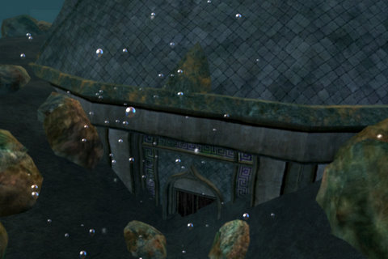
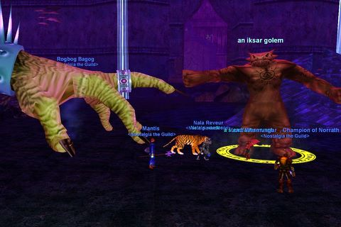

Back to: [West Karana](/posts/westkarana.md) > [2008](/posts/2008/westkarana.md) > [August](./westkarana.md)
# EQ: Veksar Rising

*Posted by Tipa on 2008-08-08 08:13:29*

The number one rule of Nostalgia the Guild is that we level together and nobody gets left behind (unless they stop showing up). Last night we had the twin goals of getting everyone up to our current cap of level 55, and to explore the sunken city of Veksar, deep beneath the waves of the Lake of Ill Omen. SOE introduced the original Veksar as a free content update in June of 2003, and are poised to do it once again in EverQuest II.

If you travel to the Lake of Ill Omen in the Fans of NASCAR zone in EQ2's Kunark, you can see that the recent live update did more than enrage the void storms... that tremor was some power forcing the long-buried city back to the surface. Who knows what's entombed in those ancient ruins?

Maybe we'll find "Bad touch" Rogbog still molesting Iksar Golems. I mean, it's possible, right?

The night started out slow, but people tend to trickle in and we have tricks like the campfire to help people get to the right place. Once we had a full group -- me, Ceipheid playing his 'zerker Rogbog, Warmunger showing off his shiny new epics, chanter Mantis, and Stargrace two boxing her cleric, Ishbel, and her beastlord, Nala -- we headed in. No issues, no wipes, we made it without getting too lost to the shops/iksar behemoth area, placed the campfire in a safe place (as opposed to "under where the behemoth pops", as SOMEONE suggested), fired up the Lesson of the Devoted and settled in for the night.

Callendra, Sisca and Binxs showed up awhile later, so I split off to be their tank, and we moved back to the pool room.

While we were in the other room, i was watching the first group on the web cast. It was pretty wild :) 

The aim was to get everyone to level 55. All but Binxs and Rogbog made it. And that's tenacity for ya. Veksar is not a hot zone and in fact the experience is pretty crappy, in general. It always was. Even back in 2003 when I was leveling my cleric there, we seemed to spend days there without making much progress.

But heck, we're not in a race, and a lot of people had never been to Veksar before, so it was worth a look on the way up. Rogbog, who was like level 6 or something when he got there, ended the night well into his forties, so that was good. I made 6 AA, and that didn't suck, either. I'm saving the first nine AA for Endless Quiver, but after that -- back to Combat Fury and Weapon Affinity.

Next week is the Plane of Hate. That DOES have a decent experience mod, so we should be able to get most everyone to 55 and also a fair bunch of AAs along with it.

Afterward, I went and did the GU48 void storm quest, and now have seven notes to my name. Just fourteen or so more, and I'll have the cool black armor :)

## Comments!

**[stargrace](http://mmoquests.com)** writes: Hey, UNDER the behemoth seemed like the safest location, honestly. I mean, I'd of course use the campfire first (knowing my luck) and be able to tell everyone whether or not it's safe.. 

*Zones back to PoK after getting smushed* Uh... yeah.. it's totally safe.. Tipa? You go first!

*grins* I had a blast.

---

**[West Karana » EQ: Hearts full of Hate](https://chasingdings.com/index.php/2008/08/15/eq-hearts-full-of-hate/)** writes: [...] “Bad touch” Rogbog? No, that’s the Hand of the Maestro playing one-fingered piano. The Hand is needed for the warrior epic. Ceipheid couldn’t make it last night, but we decided to go ahead and kill it anyway. When we had enough for a second group, we made a quick raid and entered the Cathedral to take the mob down. The Hand joined as we were killing the mob in front of it, so I offtanked that while everyone else killed the Hand and Qutey and Callendra, druids both, tried to keep people alive as the cleric, Coldheat, kept getting disconnected every couple of minutes. The Hand and the add died at about the same time. [...]

---

