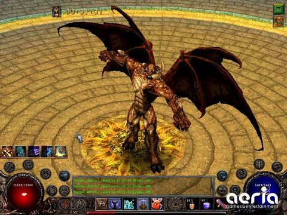

Back to: [West Karana](/posts/westkarana.md) > [2008](/posts/2008/westkarana.md) > [August](./westkarana.md)
# Cronous enters closed beta

*Posted by Tipa on 2008-08-09 10:38:23*

[Aeria "of course we will publish your free-to-play MMO for you" Games](http://aeriagames.com) has just announced that their free-to-play Diablo-like, [Cronous](http://cronous.aeriagames.com/), has just entered closed beta. More news later after I have had a chance to take a look, or [sign up for the beta](http://cronous.aeriagames.com/) and see for yourself :)

Guild Wars FTW!

## Comments!

**[Mythokia](http://blog.mythokia.net/)** writes: I was about the burst out yelling "Diablo" right after seeing the screenshot before getting a chance to read the follow text. The resemblance is huge. Diablo did have one of the best UI though - it's minimalistic and intuitive, and I'm glad they carried that aspect of it forward.

---

**[Cow Nose the 50 Pound Cat](http://cownosethe50poundcat.blogspot.com)** writes: Looks sick. :D Diablo rules! Will this finally be an Aeria game worth playing?

---

**[fatfoogoo](http://www.fatfoogoo.com)** writes: Has anyone actually played the game yet though? Cow Nose mentions 'Will this finally be an Aeria game worth playing', and there's no response. We're quite interested in this title as well, but haven't given it a whirl yet. Any thoughts?

---

**[Tipa](https://chasingdings.com)** writes: Hope to try it sometime this week. Saturday was Guild Wars day for me, and Sunday was wasted watching Season 1 of Battlestar Galactica all the way through :)

---

