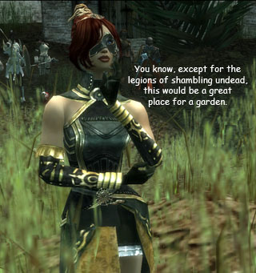
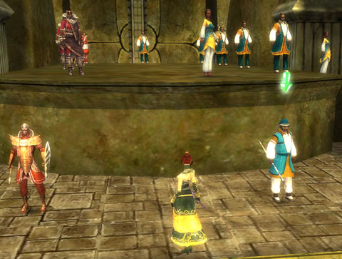

Back to: [West Karana](/posts/westkarana.md) > [2008](/posts/2008/westkarana.md) > [August](./westkarana.md)
# Guild Wars -- Day 2

*Posted by Tipa on 2008-08-11 08:14:08*

So before Guild Wars kindly implored me to log off after a mere four hours playing (and how kind of it to be so concerned for my health!), I had cleared out every single quest, aside from the main storyline quest, in my quest journal. Monuments had been protected. Salads had been made. Sentient seeds had been traded. A guild invite had been rejected (after I did some research in how to reply to tells... was the first time I had ever spoken to someone in the game). Forlorn lovers, brought together. Wayward children, found and brought home.

And the Sunspears were grateful. So grateful were they, that the Sunspear scouts would no longer give me bounty buffs. I guess once I became ***SUNSPEAR CHAMPION*** (woohoo), I was above such things as "promotion points" and "experience" and "loot". I did learn that my party takes a share of loot, and that in a full eight character party, I am getting 1/8 of the loot that drops. Which seems unfair. For some of the rarer drops, I had to boot everyone from the party and go out hunting alone.

Just me and my giant, eight foot, pink flamingo. Of DEATH.

Now I know why people are always talking about "farming builds". You need to go solo so you can get the loot. But that's okay. I'm set on loot for now. I crafted all my level 15 armor and a new weapon and have stacks of raw materials in my storage vault for the next tier.

At level 18, I was ready to take on the main quest once again and save the world. After... I did some recruiting.

Is it like this in the real military, where just before you get shipped out on important missions, you have to go recruiting? Well, that's what they had me do, anyway. I had to placate some visiting dignitaries by agreeing to train one of their students. And THEN I had to go running around finding new Sunspear recruits, without letting them know the fates of the Sunspears they are replacing. Naturally, none of the recruitees would be at all available unless I took care of the critters that had been hanging around forever, eating children and the such.

I went back and mastered the Apocrypha mission, then moved on. In this mission, which I had to do twice due to not completing one of the bonus mission objectives, you find a corsair delegation, KILL them, dress up in their clothes (first pic), talk your way through some Kouran guards (Koura is an ally nation who is really your enemy but nobody on Istan knows that, officially), and this is important, KILL EVERY SKALE IN THE AREA for the occasional Rhiktul monitor lizard that hangs out with them. Okay, no, I don't know what this has to do with a clandestine meeting between the corsairs and the Kourans. But you only get 1/3 swords for completing the mission if you don't kill them.

Anyway, once you meet up with the Kouran spear marshall, the mouthy monk you were forced to bring along starts spoiling the whole thing by flinging off her disguise and vowing to kill them all. So, yeah, we're kinda forced to fight with our lives from that point. That was NOT part of the plan, and the Sunspears back home are LIVIDLY ANGRY. They know nothing about any corsair/Kouran conspiracy, and so it's off to face the Tribunal.

There's a couple of progress bars on the left which shows how well your case is going. Each person you summon to the stands makes your case worse. Every statement you make regarding the facts of the mission are twisted and distorted. All seems lost until Tennoli (the mouthy monk) brings Kosmir back from the hinterlands, and she puts a quick stop to the kangaroo court. Because she has PROOF the Kourans and the corsairs are in collusion, and she knows what Nightfall is.

And that was the end of Day 2. Level 19 and about dive more into this dark conspiracy. I haven't changed my build, it's still working out fine, and I think I have to get access to more skills before I can really start with the complicated builds.

There's little hints that I will be sent to the mainland soon...

## Comments!

**[mbp](http://mindbendingpuzzles.blogspot,com)** writes: Ahem Tipa. If I am reading you correctly you are approaching the end of Night falls Noob training grounds and about to graduate to the big bad mainland after only YOUR SECOND play session. That is fairly impressive going. You have clearly become a Guild Wars addict ;)

---

**[Tipa](https://chasingdings.com)** writes: It's a good game, I'm glad I only play it one day a week though, I think it would go too fast otherwise.

---

**[Scott](http://pumpingirony.net/)** writes: I wouldn't even concern yourself with uber builds and solo farming. Play the game normally, and gold starts dropping off trees once you're on the mainland in the level 20+ zones (which is all of the mainland). Most of the solo builds are designed for specific bosses for players seeking their green items, but if I recall, Arena.net changed the code so that only human players will see green drops; the heroes/henchmen don't get a shot at those. The remaining solo builds are designed for specific professions to tackle specific mobs in specific areas of the elite zones such as Underworld and Fissure of Woe to farm rare crafting materials for the Obsidian armor set, etc.

---

**[Scott](http://pumpingirony.net/)** writes: As for time, yeah you could complete the story itself quickly (if you chose to) but I've been playing since beta (not full-time, but still) and I'm nowhere near doing all the content yet. I've been in FoW maybe 3 times total, UW once or twice. I've never been into any of the Elite Missions yet. Not to mention working on titles, etc. There's plenty of post-storyline content, especially if you have all three campaigns plus the expansion.

---

**[Openedge1](http://simple-n-complex.blogspot.com/)** writes: Since I have returned, I bought all campaigns and expansions. What was fun is this past weekend we made the final trip to Vabbi, where the gorgeous armor for the wife was waiting.
Then we went back to the Eye of the North storyline. We are working on Asura rank so I can get a cool set of Armor.
We set goals. 
We play quests to gain money and kills. 
We do missions to complete storylines.

There is a lot to do.

And you are correct in play time. But, not for long. You fell into the "Level to max" trap that Guild Wars does not have.
Right now, you have made it to level 19 in two sessions. Now, get to level 20, and then open up the real adventure. As was stated by others, now is the time to learn builds, capture Elite skills, farm for cash, get some Prestige armor.
Get to the mainland, and play when you wish. And as you have seen, time will fly (we had a 6 hour gaming session this weekend when we blinked once...). The game is so casual that an hour is fine...yet there you are at 4, 5 or 6 hours...lol

Enjoy, and great stuff.

---

**[Tipa](https://chasingdings.com)** writes: Oh I dunno, I wasn't really trying to level. It just happened :) My goal for the day was just to finish all the quests in my log or that I could find, master the Apocrypha mission, and do the next mission. It doesn't seem very easy to grind xp anyway; most of the mobs I am killing now no longer give xp, anyway. I'm getting virtually all of it from quests. But I do try to keep things going, largely because I want to see more of the story :)

---

**[Openedge1](http://simple-n-complex.blogspot.com/)** writes: @Tipa
The best part? You finish those quests in your log, and then BAM a whole NEW set of quests open up...lol
We keep going back to various cities as we continue to complete missions, and then there is another quest.
That and collecting various sundries like the claws, etc, and now they give you NEW stuff to collect when you start opening up the mainland...lol
Unreal!

The story btw has only just begun on the noob isle...
WooT!

---

**[Tipa](https://chasingdings.com)** writes: I am loving those collections. Salvage kits? Covered. Identify kits? Covered. Bags and bag expanders? Covered. Pieces of incredibly ugly armor? Covered. But why :P

Yeah, I am noticing all the new quests that crop up; I dutifully add them to the list :)

---

**[mbp](http://mindbendingpuzzles.blogspot,com)** writes: On the time factor .... One thing I really loved about Guild Wars was the fact that you could actually take the game in 1 hour chunks and still make progress. That makes it a terrific choice for casual players.

---

**[Sente](http://adingworld.wordpress.com)** writes: There is certainly a number of quests to do. I have taken two characters through Istan to 20 now; while a number of quests were the same for both there were also a number of them that I only did on one character. Especially those that triggers by a dialog when you pass by.

I also have a couple of other characters that play through Prophecies and Factions. I do like Prophecies post-searing although progression is a bit slower; the pre-searing part was a bit too slow and not that exciting IMHO. Factions also got more interesting after running through the first story-line mission in the monastery.

Money certainly starts to flow in better quantities when you get into the mainland, but I find myself still far from being able to obtain the armor that can be crafted from the NPC in the Consulate Docks. The fees are fine, but the material is something I do not have or can afford (at least the rare material). But it is something to strive for.

---

**Graktar** writes: You're not getting xp from mobs (or sunspear promotion points) because you're pretty over-leveled for where you are. Neither of the two characters I've run seriously in Nightfall hit 20 until well after reaching the mainland. I'm not a completionist though, there are piles of quests lying around that I didn't finish.

---

**[almagill](http://gudeman.co.uk)** writes: Reinstalled and returned to GW last week and... oh dear, I've been there for like, forever!

My Nightfall toon is only lvl17 and sounds like he's at about the same point of progression as yourself. Maybe I should really have started off with a totally new toon. This guys got a stupid name AND a comedy build, lol.

---

**Krabat** writes: Well, one day a week is definitely not much, but may be it's a good strategy to grow up your appetite. :)

As said by others there's a lot of contents. If you continue play like this you will finish Nightfall story line by November. Don't forget that there's 3 campaigns and EOTN too, though. Plus a lot of stuff to do in addition to leveling.

As you seem to be a completitionist at this moment, I'd also recommend to buy all mesmer skills that are available...

---

**[stargrace](http://mmoquests.com)** writes: Went and picked up the platinum edition (only one that was for sale at EBGames here in Ottawa) of guild wars, played it for an hour or so (so far) .... lots of fun! Totally your fault, Tipa. How dare you introduce me to fun new games!

---

**[Tipa](https://chasingdings.com)** writes: lol... well, blame all the people who kept telling me GUILD WARS GUILD WARS GUILD WARS until I finally picked it up :)

---

**[Openedge1](http://simple-n-complex.blogspot.com/)** writes: ooo, ooo...me, me...

I LOVE it...

Make sure to ask any questions you may have from us, we are very polite. (ok, I have been told I am not so polite...but, really I am, don't listen to them)

You have the Eye of the North addon also, and with you starting with Prophecies, you have a long road ahead (Prophecies is the longest to play, with Nightfall being the easiest to level in I think), so enjoy Stargrace.

Careful of those dance parties in Pre-Ascalon though...they get kinda wild.

Later

---

**[MmoQuests.com » Tipa&#8217;s Fault&#8230; Again.](http://mmoquests.com/2008/08/12/tipas-fault-again/)** writes: [...] have been following Tipa’s adventures through guild wars for the past little while. They sounded interesting. All of the comments made it sound [...]

---

