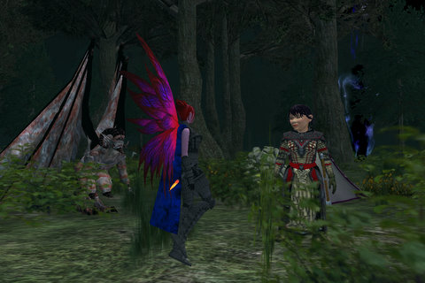

Back to: [West Karana](/posts/westkarana.md) > [2008](/posts/2008/westkarana.md) > [August](./westkarana.md)
# EQ2: At long last, Dorah becomes Adora-ble

*Posted by Tipa on 2008-08-13 06:25:27*

Struggling with allergies, I collapsed into bed at about 9PM last night, so there was a potential night of gaming gone :/ When I woke up at 4AM, I figured I'd catch up on my email and do some writing and -- there was a note from SOE about why my characters weren't getting moved. It included the exact reason, and it was something I could correct. You see, it said you couldn't have any items on the broker, and I didn't. However, you also couldn't have the sales crates enabled. I removed them and transferred Dorah -- now Adora -- over to Najena just fine.

Whereupon she immediately made all my assassin Brightknife's combat arts and some decent jewelry to boot. So now, FINALLY, I'll be able to do the sort of dps assassins are supposed to do. Since Dorah Adora comes with a built-in tank -- AND heals -- Brightknife doesn't have to tank and can use all her stealth moves.

Very nice. Very fast kills now. Went and killed the level 25 Void Tempests in Nektulos Forest (a place nobody goes unless they have to == opportunity for me!). Fantastic experience, as I was killing yellows and yet not dying! Even mentored, Adora's tank pet had no trouble keeping aggro and keeping alive, and necros are pretty insane damage machines all by themselves.

The void beast dropped a cool looking sword and one of the rare hammers that is actually a decent weapon. Fighter and priest only, unfortunately.

Now that I know how to transfer, this opens up the possibility of transferring Dina and Dera as well. I would feel semi-bad about leaving the guild I just joined, but -- I haven't played (aside from doing the void storm quests) since that night. Well, life will get a lot less hectic in the fall.

## Comments!

**[stargrace](http://mmoquests.com)** writes: Congratulations on being able to move servers!
Figures it'd be when I was off playing guild wars *snickers*

---

**[Tipa](https://chasingdings.com)** writes: Heh :)

---

**Randolph Carter** writes: I'm sure I should know this already, but is it expensive to move characters to different servers? I have a couple I would like to migrate myself if possible. Just curious. Thank you.

Oh, I happen to love Nektulos Forest. I'm thinking of settling down and raising a family there.

RC

---

**[Tipa](https://chasingdings.com)** writes: It's $50 for all sorts of moves; account to account, server to server, or acct/server to acct/server.

I'll send you a bouquet of hate roses when you move in :)

---

**Randolph Carter** writes: Thank you for the information. You've created an excellent blog here. Thank you as well for the hours of enjoyment I've gotten from reading your posts.

RC

---

**[Tipa](https://chasingdings.com)** writes: Thanks :)

---

**Kyelesa** writes: I'd like to welcome Adora to Najena! Thanks for the great blog. See you in game!

---

**[Mythokia - It&#8217;s my first day](http://blog.mythokia.net/2008/08/28/its-my-first-day/)** writes: [...] read about Tipa’s problem with having her characters transferred due to sales crates, I wisely logged in and remove them [...]

---

