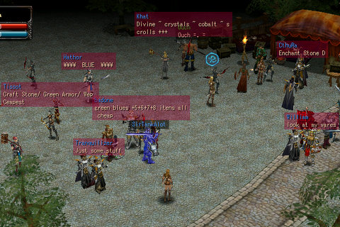
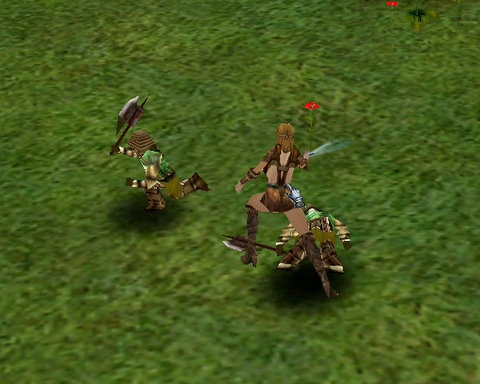

Back to: [West Karana](/posts/westkarana.md) > [2008](/posts/2008/westkarana.md) > [August](./westkarana.md)
# A first look at Cronous

*Posted by Tipa on 2008-08-14 01:30:15*

There's a Diablo-shaped hole in my soul. With Mythos gone and Dungeon Runners going, there is a giant opportunity for a action-oriented RPG to swoop right in and make a grab for the crown. If there is a game like that out there, Cronous might be it... but on the first quick look, probably not.

You get a choice of four classes -- Warrior, Valkyrie, Mage and Savage. But whichever class you choose, you're dumped nearly naked in the middle of a busy city.

A city full of people hawking their wares -- the prime indicator of an Asian import. I found no obvious quest givers or clues as to what to do, so I wandered out to the newbie grounds and left clicked on monsters.

They died pretty well, and after a few minutes, I dinged level 3 and had found some armor I need to be level 10 to wear.

Any MMO these days needs something to do besides merely level to interest me. I need to be part of a story, or an adventure. But this is a closed beta and there's not much you can say for sure about it. There are bits of graphical brilliance that implies more to come. Quests can, and likely will, be added. The graphics will be punched up. I have seen people use some higher level techniques and they are pretty impressive.

But at this stage of the closed beta, if someone asked me if there were any good Diablo-like MMOs around that could take the place of a Mythos or a Dungeon Runners, I would hesitate to mention this one.

But I'll be keeping it on my hard drive to take another look later.

I just got into another beta, but this one has an NDA, so I'll have to check carefully what I can say about it. More when I know.

## Comments!

**[Hudson](http://hudshideout.blogspot.com/)** writes: Hmm that looks kinda cool. Is it straight hack and slash because I need a game like that right now? WIth random loot drops and things like that? MIght have to sign up for that beta

---

**[Tipa](https://chasingdings.com)** writes: You should definitely check out the beta. I haven't gotten very far in the game, just level 3, so I can't really talk about stuff I don't know anything about. I got one bit of normal loot and a lot of cash. Class abilities start at level 5, so I'll have to play more to get a real feel for the game. All I did was go to the newbie grounds and autoattack whatever looked mean :)

They have an interesting death mechanic....

---

**[Openedge1](http://simple-n-complex.blogspot.com)** writes: Wow...that is...uh...ugly
If I need a Diablo clone, would be better off looking at Legend: The Hand of God.
Single player and no class selection, but it sure does look pretty and plays great (and you can select class styles for the one character...so follow the patch of magic, faith, warrior, etc)

No more Asian imports for me until one actually gives me a reason to play (Aion maybe?)
Cheers

---

**[Malekith](http://caffo.chaosnet.org/)** writes: Hey Tipa! 

Malekith, the lowbie nostalgia necro here. I got disappointed with Cronous too, but at the same time was accept into Warrior Epic beta, a pretty decent diablo clone. 

They also gave me some invites, so let me know if you want one :)

---

**[kalamaf](http://www.kalamaf.com)** writes: Dungeon Runners is going? First I heard of that, kinda surprised since they just put out retail boxes not too long about and there was a big "Bling Gnome" advertising push.

---

**[Tipa](https://chasingdings.com)** writes: @Malekith = Hi! I've heard good and bad things about Warrior Epic, dunno which to believe :P

@kalamaf -- NCSoft laid off most of the Dungeon Runners team. From what I understand, they were close enough to release of their next update that they are finishing it up. The prospects after the next update are likely uncertain at best. They must just elect to keep it running and doing only bug fixes until conditions improve; I have no idea obviously, but I'm not expecting much.

---

**[TheFlying.Tree](http://www.freewebs.com/penis)** writes: This post is old , the game is full out i have been playing for 3 days with a total time of about 5 hours and im lvl 23 with 300,000 in items and 611,000 in the bank ;]

---

