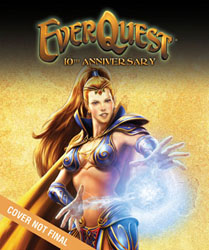

Back to: [West Karana](/posts/westkarana.md) > [2008](/posts/2008/westkarana.md) > [August](./westkarana.md)
# EverQuest's 10th Anniversary Book

*Posted by Tipa on 2008-08-14 08:14:40*

Remember those spam books that you could get in the 80s that would claim to have all the genealogy of your family name and trace your roots and print your family crest and stuff? And then it would turn out to have the phone book information of everyone in the country with your last name, along with some really generic information and a totally made up crest.

I'm not saying [EQ's 10th anniversary book will be anything like that](http://www.bradygames.com/promotions/promotion.asp?promo=136637). The description of the book just reminded me of it. Here's what it includes:

 * The original storylines for EverQuest and EverQuest II.

 * Interviews with key contributors to the EverQuest legacy, including John Smedley, Russell Shanks, Brad McQuaid and many others.

 * See the world of Norrath come to life! Concept art to final 3D art representations of famous EverQuest and EverQuest II locations, as well as descriptions and commentary from the development and community teams.

 * Concept and promotional images of famous NPCs, with interview notes from the developers about why and how they were created.

 * Wireframe model shots, rendered shots and previously unreleased artwork.

So, screen shots and copy/paste from old interviews.

I'd love to see a round-table discussion with the original EQ devs where they talk together about making the game, share stories, whose baby was born in crunch time, you know, the cool stuff. Or some of those old long flamewars that would follow Abashi whenever he posted on the EQ forums about ANYTHING, that led SOE to closing the EQ forums entirely because every new player that tried to ask any question at all would be mercilessly flamed.

EQ, to me, is so much more than its concept art. It was a game whose success depended almost entirely upon its community. To have a book that only talks to the devs misses an opportunity to make a truly memorable EQ memories book.

I'd like to read about the adventures of the first people to kill Nagafen and Vox. About the "duel wars" when the results of a duel would be broadcast through the world and people would make fake alts just so "Cokeclassic has defeated Pepsicola! Pepsicola has fled like a cowardly dog!", though usually they were not that generic. Reports of the Battle of Bloody Kithicor from the troops. The list of steps you would need to do, in order, to gain access to the Plane of Time. [The banning of Ewle](http://eq2flames.com/your-guild-sucks/818-ebonlore.html) and Ebonlore. The sad tale of [the people who first woke the Sleeper](http://www.mmorchive.net/2008/03/20/ban-galore/#more-74). Or when the pranksters of Tarsis Shriners [went to Kedge Keep and shouted EVAC!](http://www.gweep.com/posts/evac.htm) in the zone and half the groups in the raid that was killing Phinny suddenly poofed. Or the weekly "uberscore" list tracking raid guild kills that evolved into a community discussion thread. Or when soon to be ex-Guide Tweety (and soon after to be DAoC community manager) posted her infamous "[Nutless Assmuncher](http://eatingbees.brokentoys.org/the-wayback-machine/try-being-a-guide-you/)" post.

There are so, so many stories in EQ, and very few of them were told by the devs. A book collecting the stories of the PLAYERS would be an instant classic and sell millions. A hardback book of concept art and tired interviews... I dunno. Heck, I bought the instantly outdated EQ Atlas when it came out, I have it around somewhere. I'll probably buy this as well. But it could be so much more and with this book, we'll never get the book that tells the story of the REAL EverQuest as it was loved by millions. Well, a million.

## Comments!

**[Tony](http://perception-is-truth.blogspot.com)** writes: There are as many points of view about everything that ever happened in EQ as there are people involved (and in fact, people not involved), I doubt you'd ever get people to agree on what really happened.

Would be interesting to try though.

Would probably cause the biggest flame fest in the history of the 'net of course.

---

**[Genda](http://www.thegrouchygamer.com)** writes: Ahh, the Shriners.

Three of my real life friends are Shriners, and in fact are the ones that got me into Everquest in the first place. They have some epic stories. The KK incident is legend on Emarr, but they had antics everywhere from Castle Mistmoore to the Plane of Mischief (where the Shriners were bound, of course.)

If you don't know the stories of the shriners, it's pretty hard to get you up to date, but Tipa's link above will at least give you the flavor.

The stories of "burned woods," Fansy, and "I'm waaaaaaaaaaaaaaad" also come to mind. (http://ancarett.com/eqhumour.html) read all four of those stories if you have ever played EQ.

---

**[Tipa](https://chasingdings.com)** writes: A book of EverQuest stories illustrated by alpha/beta/concept art and what not, along with the STORIES of the developers themselves, would be a valuable book and perhaps explain why people play EQ ten years later. It's clear, though, that the compiler of this book is doing nothing more than what was done with those movie picture books in decades past, which just had stills from the movie alongside a very brief description of what was going on in the movie. All the kid movies had those back when, and maybe still do.

Do we need one for EQ? Probably not, and I guess I am thinking that making one cheapens EQ's true legacy, a story which has (as far as I know) only existed on the rapidly disappearing message boards that were the cornerstones of the EQ community.

---

**Rooks** writes: There's also a lot of the game's history that's worth telling, such as the plane of hate opening into Kithicor, when it happened, why it happened and how the community reacted to it. There's the nightmare opening of the Gates of Discord and the mini-exodus that occured because of it. Then there was the invasion of Grobb. Or how about the uniqueness of some of the zones, such as the huge aggro range of the Plane of Fear (and the all-night corpse runs that ensued from it). I'd even like to hear more of the backstory about the zones, mini-stories about Mistmoore, Unrest, Befallen and so on. I'm a real sucker for the lore of the game.

Mind you, this all sounds like a project suited for the web rather than a book but it would make a fascinating read. It would also allow the possibility of video memories, such as raids from the original Veeshans Peak for example. I hope someone does something on these lines for the anniversary.

---

**[almagill](http://gudeman.co.uk)** writes: Ten years though.
TEN years.
I mean, in the game game, ten years, that's like, what? Three lifetimes?

If Everquest was a dog it'd be older than Yoda.

And almost as wise.

---

**[Tony](http://perception-is-truth.blogspot.com)** writes: Yeh, can't deny the staying power. I started playing between Luclin and PoP and the amount of change in the game has be huge (both for good and ill). I still think one of the things that keeps EQ going is the lack of server restriction based on your geographical location. The 'net has shrunk the world and crushed geographical boundaries and then MMO producers seem intent on putting them back. It's harder and harder to move to a major MMO with friends I made in different parts of the world, thanks to enforced geographical restrictions.

---

**Tangurena** writes: I loved Tweety's rants. They are what got me motivated to be a guide - which I did for more than 2 years. 

The reason the game endures is because of the players, so the book should also be about the players. I remember having the first Brady guide to EQ and it mostly sucked (it had lists of gear that were never in the game, like a banker's box {a container that let you swap coin around like a banker}), so I bet their 10th anniversary book will suck too.

---

