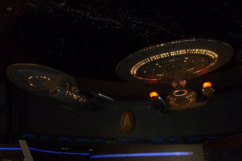

Back to: [West Karana](/posts/westkarana.md) > [2008](/posts/2008/westkarana.md) > [August](./westkarana.md)
# Lost in the Shadow of Destruction... or something.

*Posted by Tipa on 2008-08-16 04:05:45*

Long,LONG day. Son wakes up with an ear infection. Go to work. Do some work. Find doctor. Take son to doctor's.Wait forever. Doc says, hey, ear infection. I /sigh. Go to pharmacy. Wait there forever. Go home, give son meds. He goes to sleep. It's 1PM. I opt to do some laundry before we leave. Give the cat a huge bowl of water that scares her,it's so huge she may drown. Go to airport. Remember in the security line that I brought a full sized tube of toothpaste. Expect to be arrested immediately, but they let it through. TSA, my teeth thank you. Thunderstorms in Hartford delay the flight an hour and a half. We barely make the connection in Cincinnati. Try to sleep on plane, but it is SRO. Get to Vegas Slots everywhere. Shuttle to Hotel. Registration guy wants to talk about EQ and WAR for fifteen minutes, which is weird. He's in the WAR closed beta Lucky.

Get to room. Hook up my Eee to the internet and get to reading all the EQ and EQ2 announcements. Start downloading all the videos and pictures and stuff. Go to Massively and see that all possible things I might have written about have been written. No idea what I will do tomorrow.

Went downstairs to take picture of Quarks to prove I have been there. Forgot there are places people still smoke indoors. Looked at all the casino games and realized I had no idea how to play any of them. I'd just be handing the casino money. 

This is why I hate Las Vegas. Smoking, gambling and drinking.

Anyway, not sure what there is to do here that doesn't involve smoking, drinking or gambling. 4AM by my body clock so.... bedtime.

