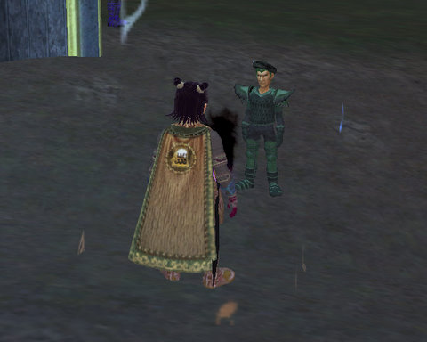
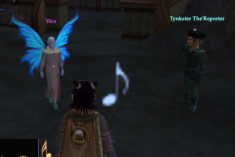
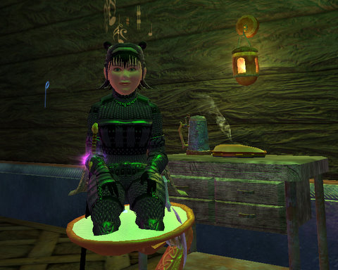

Back to: [West Karana](/posts/westkarana.md) > [2008](/posts/2008/westkarana.md) > [August](./westkarana.md)
# EQ2: The things I do for pie...

*Posted by Tipa on 2008-08-22 01:55:55*

It's just my duty to Norrath to fight back against the Void Tempests, but when I heard a reporter with the Befallen Banner shouting about some marvelous device in Neriak, well, I just had to turn in my shards and check it out. There was a gnome with shoulderpads that would have fit someone twice as wide. when i asked him about them, he said he didn't have a choice, that was the uniform, and the human who had worn it last had forgotten to re-adjust the shoulderpads and there just wasn't time and ... but you know, gnomes have those high, squeaky voices, so I excused myself and went inside.

Well, turns out some bug -- um, some Arasai -- had just invented a new lamp, but needed some bits of glowing fairy dust to activate it. I tried to separate the Arasai from his fairy dust, but he waved of my attack.

I sullenly looked for some fairy dust in Neriak, but apparently they clean up after themselves almost like real people. Darklight Woods -- no fairies! Nektulos Forest -- not far from the tunnel to Darklight Woods in the forest.... fairy heaven. I took care of the fairy problem AND filled the lantern with bits of fairy dust.

Twenty dead fairies later, the lamp shone with a deep yellow glow. I returned to Neriak, and the bug graciously allowed me to keep the lamp, and even gave me some Steaming Jumjum Pie! I was so happy! The gnome from the Banner interviewed me, and when the paper comes out, I'm going to buy a dozen and give them to everyone in the Fool's Gold Inn so they can see how I finally made good after all these years.

The lantern and the pie are the pefect start to a Pie Shrine! People will come by to look in shock and awe at its mystical crust... its steamy filling... it's unmistakable aroma...

Plus, I finished the Void Storm quests, got my armor, some shinies, an emerald that bathes me in green light and some furniture, and still have some points left :)

And all I was PLANNING on doing tonight was getting ready for the move to Najena. Oh well, maybe another day.

## Comments!

**Aarkan** writes: Awesome! I actually ran into the same event from Vicx on Antonia Bayle a month and a half ago I'd say. It was fun, especially sneaking into Neriak as a Ranger. For a little while that was the ONLY way to get that pie too so it was ultra rare but now you can get it from the void tempest quest iirc and the lamp you can get from red shinies I think. Still very sweet, sounds likea fun night Tipa!

---

