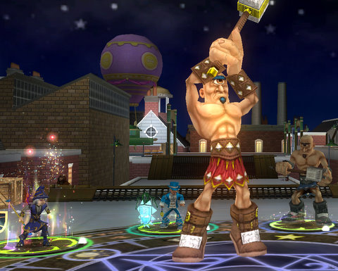

Back to: [West Karana](/posts/westkarana.md) > [2008](/posts/2008/westkarana.md) > [August](./westkarana.md)
# Wizard 101 update

*Posted by Tipa on 2008-08-22 07:56:31*

Kid's MMO Wizard "Harry WHO?" 101 came out with a huge update yesterday. Even though I stopped playing the game much to avoid burning out before it goes live, it seemed a big enough deal to warrant stopping by.

The big news is the revenue model. It is likely that there will be a two-tier model for the game, with a certain amount of content available for those who play for free, and additional areas reserved for subscribers. It looks like the fee for subscribers will be about $10/month. Nothing has been announced officially, though, so it is all subject to change.

Enounter difficulty has been revamped once again. In my limited testing in Hyde Park in Marleybone, the mobs were higher rank -- rank 4 instead of rank 3 -- but weren't elite and came one at a time. This makes those fights significantly easier. 

Moo Shu, the highest level world currently released, was widely thought to be un-soloable by any level appropriate (30+) character. Combined with chained encounters containing thirty or more battles in Marleybone in order to unlock Moo Shu in the first place, a lot of players have gotten to Moo Shu only to give up in frustration. I'm not sure what the patch has done for them; I didn't see any friends on in Moo Shu so I couldn't check it out.

The real test would be to return to Krokotopia and try the Emperor's Throne Room instance again. That was broken the last time I tried it.

It's still a fun game. Now that it seems certain that it will cost some money to see everything, it's fair to ask if it's a $120/year-fun game? I can't answer that. My gut feeling is that there is not a year's worth of content in the game, and there is almost no replay value. If they keep the grueling, multi-battle instances as they are now, it would be hard to imagine anyone playing through it more than once.

It's definitely worth playing it through that once, though, perhaps re-subscribing as needed as they add new worlds.

## Comments!

**[Tipa](https://chasingdings.com)** writes: I meant to mention the new chat window. The same dictionary-based word filtering is still in affect, but now you can scroll through old messages and easily reply to tells. 'o' brings up the movable and resizeable chat window, and 'r' replies to tells.

---

**[Cameron Sorden](http://random-battle.com)** writes: Okay, you finally convinced me to check it out. The interesting card combat mechanic has me intrigued... downloading it now.

---

**[Tipa](https://chasingdings.com)** writes: I'll be interested in what you think of it :)

---

**[Relmstein](http://relmstein.blogspot.com)** writes: I'm glad to hear it's following a tiered subscription model and will have a free to play portion. I'm hoping once it's gone live that I can get one of my friends to try it with me. I would join the beta now but I got Disgaea, Sprore, and Warhammer all in a row to make the next few months gaming nirvana.

---

**[Scott](http://pumpingirony.net/)** writes: Just based on forum opinion from testers a month or so ago, $10/month might be too much. $5 or $6/month or simply using a GW model of charging for content only then play for free would suit the game better, in my opinion. Pirates of the Caribbean Online went for the $10/month, but I have no idea if it's doing well at all. No one ever writes about it.

---

**[Tipa](https://chasingdings.com)** writes: I've written about Pirates of the Caribbean a couple times over at Massively, but you have to understand, we are not their market. If you hang around Disney.com, you'll probably hear about it more often, but it probably comes down to the reason we don't really hear much about EverQuest and Dark Age of Camelot -- those gamers talk more on message boards than on blogs.

Anyway, you just missed a Pirates of the Caribbean free preview weekend :P I'm not really a fan of movie tie-in MMOs like PotCO, The Matrix Online, Star Wars Galaxies and such. Even though Lord of the Rings Online was kind of cool, I felt like having to stay in the wings while the main NPC characters did all the heroic stuff really epitomized my dislike for that kind of thing.

Since W101 is currently an extremely linear game with just one thing to do -- advance -- even if they do have a monthly subscription, I imagine you'd be done with the game before you would have paid as much to KingsIsle as you would have spent buying a game box.

---

**[Meg](http://simpsonsparadox.com)** writes: I've been playing the beta version as well, I really liked it, and the parts I didn't like reminded me that it's geared for 9-14 kids.

---

**torchedbread** writes: I played Wizard 101, it was fairly fun - an added bonus is that I convinced my sister to play and she really liked it. So we could quest together instead of sitting around for people to party with or die a whole bunch.

It went live recently and me and 4 of my friends quit. It's 10$/month now (or excuse me 9.95)... you can't even post on the forums without subscribing, which is hilarious. Sucks to see them ruin a game by overcharging. And oh yay, beta testers got limited access to a special pet, and then three days later it goes live and we can't play anymore.

Sigh... I guess I'll play on some private Cabal server while waiting for Diablo 3

---

