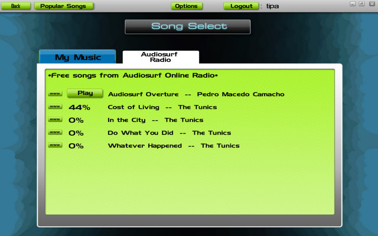

Back to: [West Karana](/posts/westkarana.md) > [2008](/posts/2008/westkarana.md) > [August](./westkarana.md)
# Weekend Gaming

*Posted by Tipa on 2008-08-25 01:54:55*

I didn't just play Guild Wars this weekend. I stopped into Wizard 101 a little, and, oh, finally got around to moving Dina from Befallen to Najena, where she happily joined Nostalgia. Almost as soon as I got transferred and reset my AAs, I got a group invite to Runnyeye 2. Who was going to be the enchanter for the run? Me. Yup, troub mezzes were going to be the only thing between us and total annihilation. It got a little nervewracking on the final epic x2 mob, since the usual strat is to mez all the adds, kill the boss, then kill the adds. Well, I can only keep two locked down. Three with no resists, but that's iffy. The group leader figured out a strat where only two needed to be mezzed at a time, we did it, and we won.

Vindication for troubs in groups :) The main tank had actually never grouped with a troubadour before, and wanted to know what, if anything, troubs could do that was useful. Well, troubs can mez... that should be good for something. By the end of the run, everyone in the group had learned the pleasure of Song of Magic, Countersong, Perfection of the Maestro and Jester's Cap as well. 

I won a Brigand master in the group, Dispatched. I sold it within minutes for 400p. Unfortunately for me, troub masters on Najena are so expensive that even with 400p, I would only be able to buy a couple of the more useless ones. So I opted to not buy any of them. Unless I am planning on raiding, I don't really need them if I have Adept 3 spells.

Today, before I started with Guild Wars, I took a couple of hours to rearrange my bank, get all my crafting materials set, put what I didn't need on the broker, and get my tailoring from 52 to 56, taking advantage of the double xp weekend, a full bar of tradeskill vitality, and two Drafts of the Skilled.

Next time they have a double xp weekend, I'll finish it up to 60. But Tier 6 tailoring is so mind-blowingly awful, that I want every possible benefit I can get before I put shuttle to loom.

I stopped into Vanguard a little because I'd heard they finally updated the character models. So on the left, you see my bard in EQ2. And on the right, my bard in Vanguard. It should be noted that both halflings are fair skinned. This is part of the reason I don't play Vanguard much. My character creeps me out.

Played some wake-me-up Audiosurf. Since the last time I played, they have started adding new artists you can download and play to -- today, "The Tunics", a pretty good English indie-style band. You can send the songs you play to to Last.fm, and you can see a quick list of which songs you are the champion on. So, some nice new stuff.

I also finally joined Xfire. I'm tipadaknife there, if you want to add me. I'm Tipa on Last.fm if you want to friend me there, and if you want to add me on LinkedIn or Facebook, let me know :) Or if you know my real name (no huge secret, but that doesn't mean I want it grabbed from here by a spambot), well, use that for LinkedIn and FB.

## Comments!

**[Mythokia](http://blog.mythokia.net)** writes: Hope I added the right person on Facebook :)

---

**[Tipa](https://chasingdings.com)** writes: You did :)

---

**[stargrace](http://mmoquests.com)** writes: Glad you had such a great weekend!

---

**[Cow Nose the 50 Pound Cat](http://cownosethe50poundcat.blogspot.com)** writes: Welcome to xfire tipa! Great blog!

---

**[Tipa](https://chasingdings.com)** writes: Creepy thing about XFire is that now everyone will know what I'm doing all the time, unless I turn it off. But then I won't be able to see what YOU all are doing all the time!

Grats on 1500 hours in L2 :P

---

**[Openedge1](http://simple-n-complex.blogspot.com)** writes: Ah, openness is good. We all can see what we do when we do it.
I keep trying to knock down that 2 hour bathroom break in the list, but no luck. Try not to look for it too hard..k?
So, about those Vanguard models. My return hinged on the update. Yet, the visual of your model is still weird. 
But, did you do this on the test server? As that is the only place they updated (that I know of)..
Also, I heard armor had a makeover, and you should have been a little "sexier" according to all accounts (guess Vanguard wanted that AoC vibe going on)

Let me know
thanks

---

**[Tipa](https://chasingdings.com)** writes: No, I wasn't on Test. I'll go back and look at it there. The armor my bard is wearing is a little more well-defined and the shoulder pads are larger. You know, I was just looking around on Google to see if there was an actual name for shoulder pads as armor. And they don't appear to have been a separate piece of armor at all. When did MMOs start making epaulet-shaped armor pieces? Was that another WoW innovation?

Anyway, my VG model is WORSE than before. I could not get her face illuminated no matter which direction I turned, and it was a sunny day. Very disappointing. I have no idea what happened since the last time I played. I hope I can log on to Test and it will be all better.

---

**[stargrace](http://mmoquests.com)** writes: You can turn off the privacy settings in Xfire that show where you are and what you're doing (I do it from time to time) or if you set yourself as AFK it'll stay that way until you manually change the setting as well and leave your whereabouts blank (or at least.. mine does, but knowing me I may have broken it...)

---

**[Openedge1](http://simple-n-complex.blogspot.com)** writes: Hey, I found this ditty on TTH
[Vanguard Test Models](http://vanguard.tentonhammer.com/index.php?module=ContentExpress&func=display&ceid=975)

Of course, I was still not too impressed.
Bummer.

---

**[Toldain](http://toldaintalks.blogspot.com)** writes: Yeah, Dispatched is probably the most sought after brigand master. So congrats on hitting the jackpot!

Our guild events roster used to look something like that, but we finally turned off writ completion events because we could never find anything else, lol!

I find it just wierd that your MT had never grouped with a troubie. But then, troubies are better with casters than with melees -- for a metal-wearer, dirges are preferred.

---

**[Rob](http://www.lostaneighth.com)** writes: I guess it is just a matter of taste. Since day one with EQ2 I have thought that the character models look... like plastic. Don't get me wrong, EQ2 has some beautiful stuff in it and I love the game, but I always felt like the characters looked like those cheap knock off action figures that you can buy at gas stations. The alternate models always looked a little too anime-ish for me as well.

While the Vanguard Character models are nowhere NEAR perfect, I look at the picture above and think that your Vanguard halfling looks much cooler. I will say though that without a sense of scale, your Vanguard halfling does look like it could be human. Maybe it is just too ... skinny? 

Another thing about Vanguard is that I MUCH prefer the combat animations in it to the ones in EQ2. Again, not to be hatin' on EQ2 or anything ... I love the game. I just really like the look of Vanguard. :)

---

**[Openedge1](http://simple-n-complex.blogspot.com)** writes: @Rob
And what is funny is I also do not like Vanguards clunky models. The animations seem a little jilted, and the faces and bodies have always been weird to me. The new models are hit or miss (I found some on the forums that looked good, but all the women were scantily clad now)

Yet, I like EQ2. 
Must be taste for sure. 

How about LOTRO models? Do you like those as well?

Cheers

---

**[Tipa](https://chasingdings.com)** writes: Both EQ2 and VG would be vastly improved, IMHO, by going for more of a flat, high ambient lighting style for characters similar to that used in WoW. The shadows in both games are far too sharp; at high quality levels (the EQ2 pic was taken at a medium quality level), the sharpness of the shadow reveals the polygons in the character models, specifically the face, and that's just not right.

I'm going to have to go through the graphics settings of both games and see if there is a lighting mode which preserves realism but adds more radiosity. My bard's face in VG did NOT look that way last time I logged in, though.

I liked the LotRO models, but found the animations stiff.

---

**[Rob](http://www.lostaneighth.com)** writes: I like the LOTRO models ok. The animations are a little off ... something about the way characters run, that bothers me. I don't mean to sound picky though. I still play these games and the looks don't bother me when the game play is good.

In defense of EQ2 I always thought the Iksar models were fantastically done. So are the Fae and Arsai, IMHO.

---

**[Openedge1](http://simple-n-complex.blogspot.com)** writes: For those who feel LOTRO models are awesome, here is a "deeper" inspection...lets take a look shall we?...

[Men with size 2 waists](http://img242.imageshack.us/img242/5897/40234671he2.jpg)

[Women whose "assets" look to be shelved, oh and is it true what they say about the size of a persons hands? LARGE.](http://img515.imageshack.us/img515/16/19818749fc3.jpg)

Of course, I did not mention the body suits
[Since when should plate look more like Spandex than bulky armor?](http://img515.imageshack.us/img515/999/43757056ln0.jpg)

I am sorry, but give me EQ2 models any day...or better yet, Guild Wars or Age of Conan...
Thank ye!

---

**[Ogrebears](http:www.ogrebear.com)** writes: Grats on the level.

---

