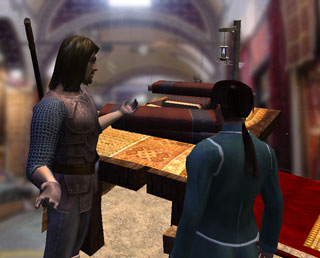

Back to: [West Karana](/posts/westkarana.md) > [2008](/posts/2008/westkarana.md) > [August](./westkarana.md)
# Stout Henry at the Market

*Posted by Tipa on 2008-08-26 20:36:20*

Stout Henry walked with a quick step toward Cotsberry Market, leading a beautiful brown mare. He looked up at the morning sun, adjusted his broad brimmed hat, flipped back the corners of his tattered cloak with the hand-stitched emblem of a wolf howling at the moon adorning the back, and took a sip from the water skin slung at his hip.

Before long, he caught up with an old woman pushing a cart full of apples. "Hail, apple merchant!" called Stout Henry cheerily, "Tis a beautiful day, is it not?". The old woman looked back over her shoulder. "Hmmph. Be a darn sight better day if'n your horse could pull this cart to market."

"Oh ho, no, no can do, grannie. A horse like this one costs at least six thousand gold coins. She is far too nice to pull a cart."

"Six thousand coins, you say?" croaked the woman. "One gold coin would buy a dozen like her. Why, I doubt there are a hundred gold coins in all of Farthingham. You're putting me on, you are."

"Well, that is what I'm going to sell her for at yon market. She's a good one, she is. I was lucky to find her in the Duke's stables."

"The Duke, you say? If I were you, boy, I'd get on that horse and ride as fast as I could. You best be well away from here before he comes looking."

"Oh, no. I'm only twenty-five. Have to be thirty to ride, you know. I say, though, you ARE planning on selling those apples at market?"

"What kind of idiot question is that?"

"Well, then, I have some things I need to sell to you." Stout Henry unswung his pack and set it on the ground. "There's these brass candle sticks I got from the chapel up the way, I'll sell them to you for a dozen gold coins each. Here's a shiny pebble I found on the ground, I think it may be magic, perhaps you could use it for jewelcrafting. I found a squirrel dead on the road where a cart had crushed it, so I have some squirrel eyes and a really nice squirrel tail for you. What say, a hundred gold coins for everything?"

"You're mad," she muttered, and went on her way. "You don't see pebbles like this one every day!" he called.

She continued to ignore him as he passed her by. Soon, he topped a hill and saw the brightly colored tents and pavilions of the Cotsberry Market spread below him. He marched into the middle, horse in tow, and yelled at the top of his voice, "[Duke Ferd's Parade Mare] 4 SALE. HAS 4 LEGS, TAIL, TEETH, CAN BE TURNED IN FOR Find the Duke's Stolen Horse QUEST OR SPLIT INTO PARTS. 6000 GOLD OBO. PST."

"What the hell does OBOE PISSED mean?" asked a young cloth seller from the door to her tent. Her raven hair was tied back in a knot 

"It means, babe," said Stout Henry, leering, "that I'd like to imagine you with your clothes off. What say you and me... pretend to undress each other."

"Hah," she laughed, smirking. "The only thing you're gonna lose is your head. That's Duke Ferd coming up the road with his elite guard, or I'm blind. He'll be wanting his horse back, I think."

Stout Henry stood staring at the plume of dust raised by the galloping horses. "LFG Duke Ferd's Revenge! PST!!!!!"

"Loofug? Pissed? That's Ferd, but he is most definitely pissed."

## Comments!

**[Openedge1](http://simple-n-complex.blogspot.com)** writes: OH NOES

WTB Healz, lol

Poor Henry. Imagine how much more powerful he would have been finding 9 more of those pebbles that the guy down the road would have traded a most powerful sword for.

Indeed...a big Rofol

---

**EZ PLAT 4 J00** writes: /em smile
/wave
/yell WTB VET REWARDS 4 PLAT!!! Also buying:
pebbles (shiny) (polished) (shiny)
horses (Lord Ferds) (Glue Factory Reject) (Meat Pie Filling)
*New Zone Shinies!!*
/rotateTargetOut
/tellTarget
Wanna buy plat cheep? All majir credit cards taken! Power levelling too! PST w account name and p/w
/em bow
/dance

;)

---

