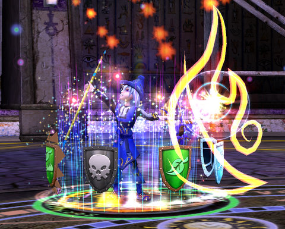

Back to: [West Karana](/posts/westkarana.md) > [2008](/posts/2008/westkarana.md) > [August](./westkarana.md)
# Wizard 101 beta is nearly over

*Posted by Tipa on 2008-08-27 01:30:07*

Wizard 101's beta is ending, and all characters will be deleted prior to the game going live. So this is a goodbye to Tara Mythcrafter, Adept Conjurer and part time Pyromancer.

A lot of people look to Free Realms as an alternative to run-of-the-mill MMOs. I look to games like Wizard 101, with very innovative design and mechanics, to show us what the future might look like.

I did go back to the Emperor's Throne Room in Krokotopia, by the way, and it seemed about the same as before, though not as buggy. 

No word yet on the subscription price, or whether a portion of the game will be free. Beta testers will get an item nobody else can get, which is likely a pet of some sort.

Here's the email:

> The faculty here at the Ravenwood School of Magical Arts would like to say THANK YOU to everyone who joined us for the Summer Semester of beta test play. We could not have done this without you.

The game, with many new improvements, will launch soon! While we are very excited about rolling these new changes out to the Wizard101 community, it means we will have to delete all characters (but not accounts) from the game. We truly apologize for this inconvenience. We will let you know very soon when the characters will be deleted. Be sure to check the website and your email for details.

When you come back to Ravenwood School, there will be a few surprises just for you, our beta test players. As a special thank you, beta test players will get a limited edition game item that no other Wizard101 player will EVER be able to get. To get your reward after launch, be sure to log in using your beta test username and password again. Stay tuned for more information on your special reward.

We know you’ll miss your characters. Take lots of screenshots of your characters, so you can recreate them after launch! We would love to see your screenshots, too. Send them to us at community@wizard101.com, and we’ll put them up on our community site!

We hope you will join the Wizard101 community to celebrate the game’s launch and start a whole new adventure to save Wizard City!

They are also [having a screenshot competition](http://www.wizard101.com/site/posts/list/1684.ftl); send in your favorite screenshot, and they may be posted on the official [Wizard 101](http://www.wizard101.com) website.

Good luck, and see you in Ravenwood Academy sometime soon!

## Comments!

**[Scott](http://pumpingirony.net/)** writes: They announced last week (or so?) the sub would be $9.99/month USD, which I thought was a bit high but it's the same as Pirates of the Caribbean Online. I still think they'd see more support for $6 to $8 per month, though.

---

**[Tipa](https://chasingdings.com)** writes: Ah, cool. I'd heard that figure but didn't know it was official. Was there any word there about a free to play portion of the game?

---

**[Tipa](https://chasingdings.com)** writes: Update: Okay, I just went back to the W101 forums. During my beta hiatus where I didn't play because I was saving the game for live, the instituted a "cash shop" using KingsIsle Crowns, which apparently can be bought and are also given monthly to subscribers. It does look like there will be a free to play trial account, where you can play to a certain level for free. I'll have to look into this some more when I get home.

---

**[GrnTxtonBlk](http://www.grntxtonblk.com)** writes: What was innovative about Wizard 101? In my short foray, it felt alot like Toontown, with wizards instead of cartoons.

---

**[Tipa](https://chasingdings.com)** writes: I thought the card battle mechanic was well done and surprisingly strategic at higher levels.

---

**[GrnTxtonBlk](http://www.grntxtonblk.com)** writes: Interesting. You always seem spot on, so I'll give it a longer go. I just hope its more free to play than subscription based.

---

**[Scott](http://pumpingirony.net/)** writes: Ah! I haven't been to the beta forums in awhile, I had no idea about the F2P part. I'd almost rather them do F2P and buy more card packs ala real-life CCG's provided they didn't set the game up so that players who bought the card packs got to whup the players who didn't.

---

**[eric](http://gmail.com)** writes: this game is cool but i dont like your school i;m fire school

---

