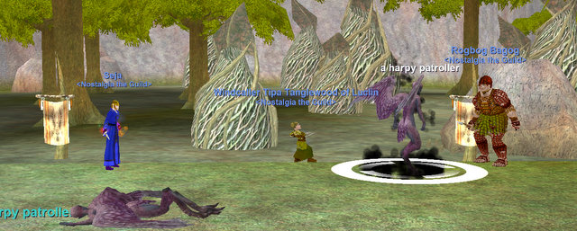
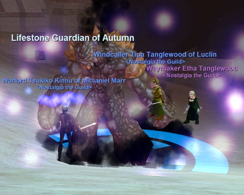

Back to: [West Karana](/posts/westkarana.md) > [2008](/posts/2008/westkarana.md) > [August](./westkarana.md)
# EQ: I love the smell of Harpies in the morning

*Posted by Tipa on 2008-08-29 08:43:03*

The regular Friday group was postponed this week because of the Labor Day holiday, but that didn't mean we weren't going to have any EQ action this week. Sejal, still reeling from the horrible news that cruising through the Plane of Justice Execution trial no longer flags you to enter the Planes of Storms and Valor. Apparently there's still some level 55 barrier in place...

Nobody ever thinks of us poor mid-levels!

So last night's goal was two-fold. First was to do the Aura quests for Tsukiko and Sejal. Auras are buffs that radiate from the caster and buff anyone within range. They are amazingly vital for raids, and a nice bonus when just in a group. Tsukiko's warrior aura increases everyone's AC and proc rate, and Sejal's increases mana regen for everyone in the area. Cool stuff.

The whole quest took place in the underground lost city of the Sand Elves, Takish-Hiz. Which was filled with... sand, sand golems, sand drawings, sand in the shoes, sand in various other uncomfortable places... like being at the beach at midnight, with monsters. And no water.

What's up with elves, anyway? They can't move anywhere without turning into whatever they are near? Like wood elves -- they live in trees. Okay, got it. Sand elves, live in sand. Okay okay. Dark elves -- live in the dark!

Um, so that means High Elves like to get h... nah, never mind.

And half elves? Let's not go there.

Afterward we went to Blackfeather Roost, the level 55 hot zone. Blackfeather Roost takes an exciting example from the Plane of Sky -- a zone divided into islands, and a quest to get from one to another. So before we could settle in for some experience, we had to do a couple of collection quests. Along with a couple of other groups doing the same (actually, it appeared they were just collecting all the mobs on the island and AEing them for xp).

Making the night more interesting were the special aug mobs that hot zones get. Monsters of far greater than normal difficulty, and loot. Our first was an "injured mountain snake". A poor, injured snake, with its bent tail dragging in the dirt, one eye kinda tracking, the other eye not so much. Venom dripped weakly from its fangs. Rogbog almost had to apologize when he pulled it to the group.

Where it HIT FOR LIKE 56,000. OUCH! This thing is INJURED. So we had to kite it; I plinked it with arrows while Sejal nuked and set his pet on it, and Rogbog tried to avoid getting killed.

We did eventually finish the quests and head to the third island for some XP, where Sejal first discovered the Lesson of the Devoted buff that would have given him half an hour of double experience each and every one of the days that he spent leveling to 52.

The group went fine, though we were in constant danger of wiping due to adds since Sej couldn't mez the harpies. We even picked up a frogadin. When a griffon saw us killing his harpy friends and came down to help play, we did wipe, and that ended the night.

Sejal ended the night 20% from 55, I am about halfway through 57 and gained another AA (10% xp going to AAs) for a total of 31 -- which isn't bad for a new character my level.

What's this picture? Oh, nothing much. Just interior designer to the stars, the queen of feng-shui herself, [STARGRACE](http://mmoquests.com), building the Tanglewood Community Theater in my apartment in Gorowyn. I am sooooo excited :)

## Comments!

**[stargrace](http://mmoquests.com)** writes: First of all...
Is that.. SOGA I see? OH NOES!

*starts ripping up all the hard decorating she did* 

Seriously.. you should see your new theater area... I'm hard pressed not to blog about it, I'm leaving that for you to do (or for you to at least see the place first before I spill the beans) ....

I'm so excited... it's not even MY house and I'm excited....

---

**[Tipa](https://chasingdings.com)** writes: Oh hell please do blog about it. It's the only way I'll get to see it. I have to pick up my sister right after work so it'll be like 8PM until I see it unless you blog it.

Don't worry, I'll ALSO be blogging it :)

Actually I was using the SOGA models, btw, as a test to see if I could get used to them. Obviously I don't use SOGA for my haffers :) Since I only play haffers and Fae/Arasai, the other races don't really grab my attention so much.

I'll go back to the old models, for inkies anyway :)

---

**[stargrace](http://mmoquests.com)** writes: Hmms I won't be around tonight either, you'll just have to wait!
The suspense is killing me... I've been hanging out in your house all day just to look at it... Had a few visitors drop by too to take a peek... =x

I'm no good with surprises, but I'm determined to keep this one.

---

**[Tipa](https://chasingdings.com)** writes: You're an evil lady ><

---

**[stargrace](http://mmoquests.com)** writes: Omg are you home yet..... 
Oh.. don't be surprised at the things in your mail, either.. I mailed back all the items that used to be in the room that I couldn't use.... .. consider it a nice friendly postal surprise!!

---

**[Tipa](https://chasingdings.com)** writes: I told you, I won't be home until around 8 :( I'm dying inside.... :((( I want to see it! I know it's amazing, it's like the night before Christmas!

---

**[stargrace](http://mmoquests.com)** writes: The well known adventurer and traveler - MALFI! Took a tour today of Tipa's new theater and had THIS to say: 

"WOW!" 

It has been rumored that Silhouette is charging 10p a tour, but Malfi slipped through the cracks. Other notables include Dalven, Calreth, and it's said that Lucan D'Lere himself may be stopping by soon!

Everyone gets to see this amazing new feature -- except the owner herself. 
*giggles*

---

**[Rogbog](http://www.dcstanton.com/EQ2blog)** writes: I look like I am trying to take a crap or something up against that rock in that picture but the harpy will not leave me alone. I hate the new ogre models so much!

---

