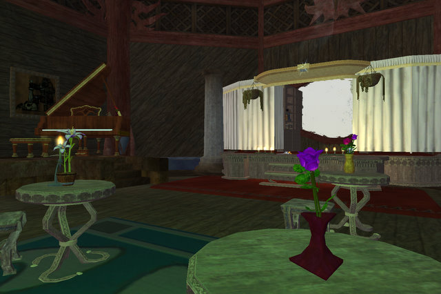
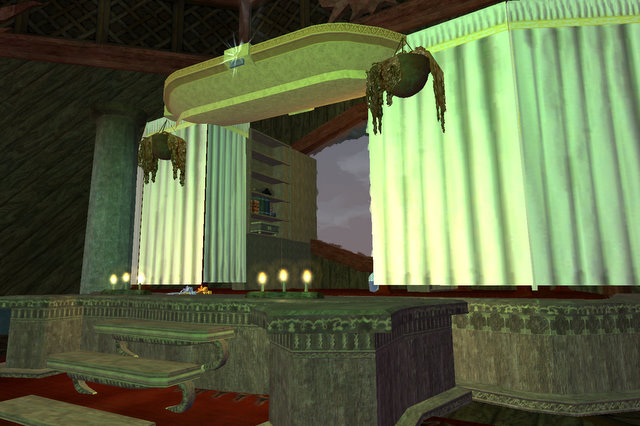
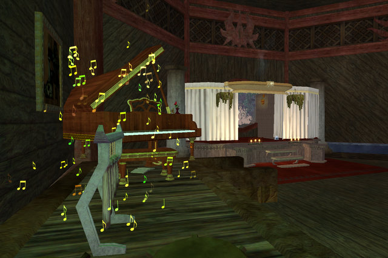
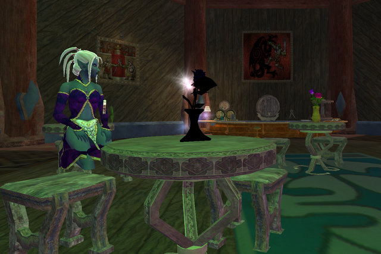

Back to: [West Karana](/posts/westkarana.md) > [2008](/posts/2008/westkarana.md) > [August](./westkarana.md)
# EQ2: Welcome to the Tanglewood Community Theater

*Posted by Tipa on 2008-08-30 11:10:11*

My sister Hillary and her husband just bought a condo in Boston. They were supposed to move in weeks ago, but the workmen just haven't been able to get it finished on time. She still hasn't been able to move in.

It's all about choosing the right contractors. [Stargrace finished building a theater](http://mmoquests.com/2008/08/29/goudias-ratonga-hovel/) in my spare room in just (!) six hours.

I can't tell you how thrilled I was when I saw it. When I logged off to go to work in the morning, it was just some curtains and the start of a stage. When i got back... it had been transformed into the kind of place a bard would entertain dinner guests with songs of her many adventurers or the latest news of the battles the gods wage high above Norrath's racing clouds.

Allow me to show you Timorous Deep's newest attraction, the Tanglewood Community Theater (visit Dinah in the five room house instance of Gorowyn, Najena server).

The stage. Notice the attention to detail -- footlights, decorative hanging plants, shelves in the back to store reminder scripts, and even a bouquet of roses tossed on the stage by a fan!

Accompanists can complement the action on stage via the piano and the bone xylophone, from Mistmoore's Castle and the Troubadour Epic quest respectively.

Looking through the dining area toward the lobby. Well, the entrance room where my sales containers are stashed. I think I will try to make it into a ticket seller's window and a coat room, a stand that sells souvenirs and a sales display :) Kasul is waiting to be seated.

The designer herself, Stargrace, relaxes after finishing the room. Behind her is a full bar. And this bar includes PIE, and pie-flavored beverages. Whiskey *a la mode*? We server that! Apple brandy? Naturally -- with just a hint of crust!

I am SO gonna write a play to perform here. A two person play, and everyone is invited!

## Comments!

**[stargrace](http://mmoquests.com)** writes: I'm glad you like it, and pleased with the way it came out. Sign me up for tickets, I am so there!

---

**[stargrace](http://mmoquests.com)** writes: Oh, also WOOT for no more soga models! *cheers*

---

**[almagill](http://almagill.livejournal.com)** writes: *speechless*

Will get back to you with effusive praise and stuff when jaw is off floor. That's just.. wonderful.

/cheer Stargrace
/congrat Tipa

---

**Ryver** writes: Great job stargrace! That is an awesome theater you have there Tipa.

---

**Malfi** writes: Yay!!

I'm super happy you like it Tipa. I was AMAZED when Star ran me through on Friday. The place looks amazing! She did a great job. I will definitely come over to see the play when you get it ready to be performed!

---

