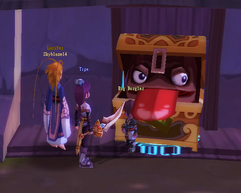
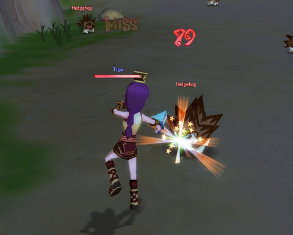

Back to: [West Karana](/posts/westkarana.md) > [2008](/posts/2008/westkarana.md) > [December](./westkarana.md)
# Dream of Mirror Online: Starting Over

*Posted by Tipa on 2008-12-02 10:10:54*

With Wizard 101's Dragonspyre world still in the unforeseeable future (WHEN, KingsIsle?), and Chronicles of Spellborn also months away (and the German one that should be showing up in a few days almost certainly impossible to play from the US), I needed a casual game. EQ2 is still my main game (and hours spent yesterday in the Moors and Befallen prove that), but I just can't play one game... so I went back to an old favorite, Dream of Mirror Online.

  
*I hit level 10 as a Commoner, and a Mirror King popped in to tell me how to select my first Job.*

Dream of Mirror Online -- DOMO -- scratches the same casual game itch that W101 satisfies. It's a casual game, very different from most MMOs that is simple to play but becomes incredibly deep. Also, it's free to play -- and unlike W101, entirely free to play. Aeria Games runs by selling appearance items, pets and other goods through their item mall, so you don't have to spend a dime if you don't want to.

  
*You can spend hours fishing, herding, farming, mining, meditating etc. You'll **have** to if you plan on crafting.*

Similar to other Asian MMOs like Final Fantasy XI Online and Runes of Magic, you can choose both a job and a subjob, after unlocking them through special quests. From then on, you can mix and match them freely -- though having to level up each one individually can be kind of onerous. Everyone starts out with the Commoner job. Commoners are the harvesters and crafters of DOMO; their levels bring greater abilities to find raw materials and make useful items from them.

  
*The quest to unlock the Blademaster job is defeating the Blademaster trainer in combat. That a level 10 Commoner was able to do this doesn't speak well for the job...*

DOMO helpfully gives you coupons for full sets of gear appropriate to your first two jobs. After that, you're on your own, and will have to either make the gear yourself (you DID do the crafting quests, right?) or find a friendly Alchemist (crafter) to make the gear for you. Or stop by one of the numberless player shops that litter Eversun City and see what they have to sell.

I wanted to unlock the Thief job, but that's pretty involved, so I took Blademaster job so I would have the battle skills to get the job. I didn't need them, really, but the money from killing stuff and finishing quests came in handy while I was running around the world working on the Thief quest.

  
*Second to last step in the Thief quest -- unlocking the chest! Wait! THAT'S NO CHEST!*

Grouping is rarely necessary in DOMO, but groups are fun and easy and very similar to those in World of Warcraft (Yeah, I said it. Bring it on, spammers.) The kind of WoW groups where you group up and then everyone just goes wild killing stuff. When you have quests like kill 40 Pure White Pus, 40 Li'l Pus, 40 Dairy Pu Mamas and 40 Dairy Pu Dadas, seriously, you want to group. And then everyone puts their AEs together and BOOM.

Fur and Pu-meat EVERYWHERE.

Thieves, btw, are an AE class in DOMO. So much fun :)

  
*Stabby Stabsworth takes on a hedgehog. Rawr. Love the Thief job.*

The game runs on anything. At low settings, it looks like a Hanna Barbera-style cartoon. At high settings, it looks like a REALLY NICE cartoon, with cel shading, shadows, goofy expressions and cartoony action. Even at the highest settings, though, I have no trouble running it on my laptop. So that's a total win for me.

  
*Me and my friendly robot bear pet in front of some mysterious temple I happened across.*

When I returned to DOMO, having played it for a few hours last spring, I decided I was just going to set aside my concerns about the grind and the RMT-based business model. MMOs shouldn't be about how fast you level, they should NEVER be about that. The only question that an MMO needs to answer positively is, am I having fun when I play? 

I do have fun when I play. I don't worry about levels because -- who cares what level I am? Besides, leveling isn't THAT slow. There are repeatable quests everywhere that are simple and quick to do if leveling is your only concern. It's the thrill of learning entirely new game mechanics (I haven't even scratched the surface of the differences between DOMO and Western MMOs in game mechanics. Equipping different weapons to see which ones fly the best? Yup. Not even scratched the surface.). It's the joy of finding utterly strange places and not knowing what the heck to do or where you are (though the numerous DOMO fan sites will help you out). It's meeting all the people from Brazil and Portugal who think Tipa is a Portuguese name :P

Okay, that's a little weird. Still, the DOMO community is fantastic, and I don't understand why that is. Most F2P games are exactly the opposite. But everyone I grouped with was helpful and it was far more common for people to invite others into their groups to make the mass killing go faster than in games like WoW, where people begrudge forming parties with people they don't know.

The game designers, by the way, must have been insane. There had to have been competitions among the devs over who could think of weird things to put in the game. I haven't even mentioned the *plot* that runs through the game, complete with cut scenes and mini adventures. Or the romance features (love someone? make it official and you get healing powers and other abilities). You can set relationships with other people (like rivals, friends, teachers, etc) that give you additional abilities with them. Your weapons evolve as you use them, too... in fact I evolved my thief's dagger so much that I can't use it any more (my mistake, and I was warned and went and did it anyway), so I'm back to Blademaster while I save enough money for another... or maybe I'll just use my thiefly Pilfer ability and see if I can snatch the recipe for one from some rats in the Eversun Inn, and then use Alchemy to craft a new one... Hmmm....

## Comments!

**[Saylah](http://notadiary.typepad.com/mysticworlds)** writes: I'm still reading thru this post but wondering if the content you're waiting for in W101 was available now which game would you prefer between the two? I'm asking because I've been dabbling in W101 as a result of YOU *smile* because I also want another MMO but one that is very casual. I think W101 is cute but am concerned about the length of battles as time goes on. You mentioned crafting and farming in DOMO which are things I love to burn time doing so that sounds appealing. So I'm wondering if I should just go DOMO which is free vs. W101.

P.S. I do hope you realize I was teasing on the post blaming you and Stargrace for my wandering eye. :-) It was a compliment actually because I value both of your opinions on games because our tastes are similar even though my play-style is very different.

---

**[Saylah](http://notadiary.typepad.com/mysticworlds)** writes: I finished reading your post and have a favor, like you're not busy. *smile* Do you mind doing a quick review or comparison on Runes of Magic, DOMO and W101? I'm looking thru the internet but separate information on each doesn't help me understand which if these might be good options for me and don't want to burn time trying all three. If you don't have time no worries, just wondering you're opinion.

---

**[Tipa](https://chasingdings.com)** writes: Well, luckily, I don't have to choose. If Dragonspyre was out, I'd play that some nights, DOMO some nights, EQ2 some nights. W101 and DOMO are very different games. W101 is based, though, entirely around its card battle mechanic -- if you don't like that, W101 has nothing else for you. DOMO is a full MMO with all the features modern MMOs have. W101 is pay to play, DOMO is free. W101 is heavily bent toward kid play, DOMO is meant for everyone. Has guilds, multiple chat channels, a full pet system (yes, sitting around and chatting while playing with your pet is a vital part of playing DOMO).

I guess if I HAD to choose between them, I'd have to go with DOMO just because I know how fast I'll go through Dragonspyre when it's released. And I WILL because I really like W101. But then it will be over in a month or less, and I'll be back to my regular games.

As far as the length of W101 battles, you can greatly improve the speed of battles by playing with a small deck. Unless you're in a boss battle, you probably should have no more than a dozen or so cards in your deck, and they should be precisely tuned toward killing stuff fast. Since I started using short decks, my time to kill has sped up drastically.

---

**[Tipa](https://chasingdings.com)** writes: @Saylah second comment :) I haven't installed Runes of Magic yet. Still hoping to get into the Shin Megami Tensei beta ;) Plus there's another beta on the horizon. I think it might be useful to compare DOMO and RoM, but W101 is *not* a full MMO like the other two. I think W101 has to be taken on its own terms. If you were to compare it to something, it would be MMOs like Puzzle Pirates and Toontown. And I think it comes off wonderfully compared to those.

---

**[Pete S](http://dragonchasers.com)** writes: Thanks Tipa, I've been waiting for this post (since I noticed on XFire you were playing DOMO). I played it for a few hours some vague time in the past and still have it installed.

I'm kind of making a mental list of casual games to either try for the first time, or return to, after my current glut of MMO subscriptions dries up (which it must, for fiscal reasons). Sounds like I should have stuck with DOMO a bit longer; I do love me some crafting. I think Mohingo (spelling?) lured me away... have you tried that one?

---

**[Caffo (Malekith)](http://caffo.chaosnet.org/)** writes: Looks really fun. I will give it a spin when I get some free time. Thanks for the tip! BTW Tipa really looks like a brazilian nick :)

---

**[Beau Turkey](http://www.voyagesofvanguard.com)** writes: Alright, I've been loving Wiz 101, but I'll go try this one. I've heard good things.
 
 You oughta check a look at Mabinagi. It's grindy, but has some fun options!

 Beau

---

**[Tipa](https://chasingdings.com)** writes: I've heard lots of good things about Mabinogi, that's definitely going on my list.

---

**[Saylah](http://notadiary.typepad.com/mysticworlds)** writes: There's something very cute and simplistic about W101 but I haven't gone far enough to figure out how I start customizing my own deck vs. the hand-me-down-starter version. I see people with vanity pets, i likie and want some. The thing I think of when I'm wandering around is I'd be content with a Harry Potter MMO if it's kinda like that if it's made and must be designed for kids. Wandering around W101 is enjoyable but if it was branded to a story and characters I love then it would be even better.

I'm a bit of a crafting whore so I guess I should check out DOMO because of crafting and pets. My sidekick game doesn't have to be deep or full featured. I want it like a nice side of light dessert. Thanks so much for the detailed reply.

---

**[Saylah](http://notadiary.typepad.com/)** writes: Semi post hijack... 
Just finished your posts on W101. The Sept 6th review post was great. You pointed out things that players might overlook simply because the game looks so cute and aimed and young players, that you might not think about exploring the depth of strategy. I'm not one for re-rolling so I like to be pretty sure upfront where I'm going. 

Any thoughts on Death/Life or Ice/Life. W101 Central had several players claiming Death/Life was great for solo, a consideration I always keep in mind. But something about Ice appeals to me. I was wondering if you had any thought s on Ice/Life or even Ice/Balance? You felt Balance/Life was good but wondered if Balance feels rather vanilla?? Quick opinion if you see this. Tnx.

---

**[Tipa](https://chasingdings.com)** writes: Death/Life is weak on the dps, but you can certainly go and do anything with it. My personal feeling is that it would be a rather boring spec.

Ice/Life is an interesting choice -- you have so much health hardly anything can kill you, and if something comes close, there's your heals. You bring good elemental resists and Life gives death/myth resists, which helps.

Ice/Balance is VERY interesting. Since, as Ice, you don't need as many heals (Ice gets a 50% works-against-everything damage shield), Balance could work with that to make weaken the enemy even more.

Any spec can be made to work; those including Life or Death are somewhat easier. But the best way to avoid damage is to make all your enemies dead faster. Storm/Balance is the ultimate dps spec -- shields against both spirit and elemental magic, plus a buff that makes you fizzle less, plus the highest damage of all the schools. Keep a short deck, and the self-heals everyone gets should be more than enough to keep you healthy. If you need more help, invest four or so training points into death to get the Vampire and you should be set from then on.

---

**[Saylah](http://notadiary.typepad.com/)** writes: Thanks for the lengthy response. I'm noodling it over but am digging W101 for casual play. It also has the spreadsheet hugger & list lover planning aspect I do have fun messing around with when I'm bored. :-)

---

**Zikka** writes: You're a theif? I was a shaman, but now I'm a Dancer :)

---

**[Tipa](https://chasingdings.com)** writes: I'm just starting out, so I wanted the Job I felt most comfortable wth. I'm a thief or rogue of some sort in most every game :) How are you liking the Dancer?

---

**Zikka** writes: You're a human? I'm a Sylph

---

**[Tipa](https://chasingdings.com)** writes: That's okay, I'm not one of those humans who feel Sylphs should keep to the Sylph part of town. We're all equal, right? As long as you aren't coming around trying to teach my kids to float, you and I won't have problems.

;-)

---

