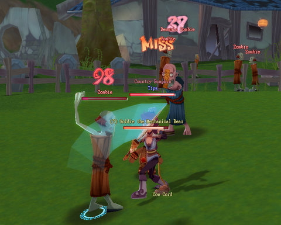
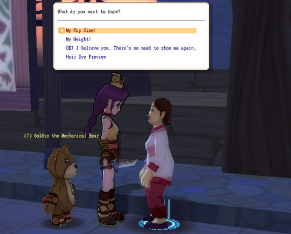
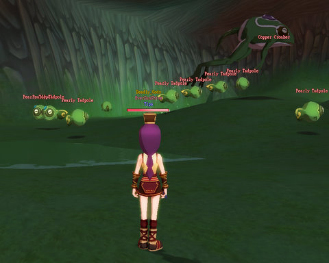

Back to: [West Karana](/posts/westkarana.md) > [2008](/posts/2008/westkarana.md) > [December](./westkarana.md)
# A little this, a little that: Building a character in Dream of Mirror Online

*Posted by Tipa on 2008-12-04 09:24:01*

In Dream of Mirror Online -- DOMO -- there's no real need for alts because your character can change classes to any they have unlocked with a free class change at your friendly local Career Advisor, such as the one in the dojo in Eversun City. But even then, your main job is just one aspect of your character. When you change jobs, you you can take up to five skill sets from the other jobs you have unlocked.

In the screen shot above, I've just switched to my Blademaster job (light tank that sacrifices health to build power). All three of the job's skill sets (Bestial skills, Martyr skills, and Blademaster skills) are available. However, I have *five* slots in which to place skill sets from other jobs -- here, I've slotted in the Commoner's harvesting and crafting abilities along with all of my Thief skill sets -- Close Combat, Sneaking Attacks, and Thieving Skills. The first two require that I have bought the skill on my Thief that lets other jobs equip daggers, but the Thieving Skills skill set lets me pickpocket mobs with Pilfer :)

In this way, you can build any character you like. Want heals? Slot in some Doctor skills. Want to buff people? Add some Musician in to the mix. Get to level 30 in a job and buy the skill, and you won't even have to change out your armor when you change jobs.

I was fiddling with jobs because I really wanted to be a Thief again, but after crafting an upgrade to my dagger, it became a level 15 weapon, one I could no longer equip. Without a dagger, I couldn't use most of my Thief abilities, so I reluctantly changed jobs back to Blademaster and set out to find the recipe for the dagger so I could make a new one. They went for 750 gold at the store, and I was far from having that kind of money.

Searching out information on the DOMO Wiki, I found the recipe could be stolen from rats in the Eversun Inn basement... a place I did not have access to. To get access required doing some investigative work in the Mortuary, which, being DOMO, required killing lots and lots of zombies.

This Leech Life turned out to be behind all the zombie attacks. Even though she was 15 and I was a 12 Blademaster, I figured I'd have a shot. I charged up my combo (another post), headed in, let the combo fly, and it barely made a dent in her health. She then made a dent in the sidewalk with my head.

Ouch.

While I was being dead at my bind point in Eversun city, I figured I'd go grab the Fencer job while I was there. Like the Blademaster job, all I had to do for the Fencer job was to defeat the trainer in combat. Which I did naked and weaponless. Another great advertisement for a stellar job opportunity, that.

I had enough money then from selling zombie drops to buy the dagger I wanted, so I did that and changed jobs back to Thief and got my old Thief uniform back out of the bank.

  
*Hey! I'm the creepy Eversun mail box! Stick something into my slot!*

I spent the rest of the night mostly doing quests in Eversun City itself for money and xp. They have a Job Counselor who points you to quests you may have missed -- has a list of all of them, actually, so any time you're bored and want a quick quest, you can head to this guy and he will fill you in on quests for your level.

There are some seedy NPCs in Eversun City. This old lady stopped me as I was passing and told me that just by looking at me, she could tell me my *cup size*. Because, that's a service I really needed? "A-", she told me. And, turns out there's a quest I can do for a title so I can tell the world (in NA, that title is "-A-cup Abuses Alcohol", apparently).

So yeah, I'll be rushing right out to do that one. Strangely, I don't see one for penis size for male characters. Maybe next patch?

The Eversun City quests brought me to the sewers below the city, where I got into some group AE action with five other people. That many people make quests go by fast, but when I died, I had trouble catching up to the group again, and by the time I did find them, they had already killed the slow-to-respawn boss of the dungeon, the Man-Eating Spider, and were off doing something else.

I watched "Oklahoma" on the other screen (a movie I was too embarrassed to watch while my sister was here) and killed Pearly Tadpoles for the rest of the night until the movie ended and I went to sleep. The spider never spawned, but this revenge-craving frog did, when enough tadpoles had been killed. I made level 14 on my Thief job, which puts me just an hour or two from level 15, where I can take on the quest to learn to fly on the weapon of my choice.

I also stole a BUNCH of recipes from the mobs in the sewer, and grabbed the alchemy pots I saw there as well. My mechanical bear is nearly dead now, though, so before I do anything more, I'm going to have to buy some Mechanical Bear Chow to heal him back up.

## Comments!

**Zaviun** writes: I have been really craving a casual mmo features the cute anime style characters and now there are many out there to choose from. My GF and I started playing ROSE way back when it was first starting and we really enjoyed the atmosphere and the look of the huge swords and things you can get for your cute little character. 

The only problem with ROSE is that it has been out a while and it feels a bit too late to get back into that one, and it has the outdated eastern grinder feel to it. I don't mind the grind so much if I were able to change my jobs around, it's really not fun to grind on the same 2 or 3 mob types(well for each level range) all over again just to try out a new job.
 
With a casual style game I really don't want to be putting so much time in to 1 job style. The idea of changing to any job when you want in DMO sounds like what we want. Out of the cutesy blocky big head anime style games would you say that DMO is where it's at right now? We are looking at Flyff, Fiesta, and Florencia right now, but DMO looks like it may be more polished and since it lets you change jobs instead of rerolling it might just be good for our casual game pick.

Since you can just use 1 character and build him to do it all I think it would allow us to go and see all the content while also trying out all the job styles. Just want to know if you think it's a worthwhile game to invest some time in compared to the other anime offerings.

-Zaviun

---

**Mallika** writes: Tipa, I love your posts on off-the-normal-path, non-AAA games. They sound so interesting and are probably what is best suited to me right now, as I am more in the mood for a casual, light game I can play. I don't know. I think I'm just horribly dissatisfied on a deeply personal level with the usual AAA subscription games -- not that they're horrible or anything, but the things I want apart from the leveling/skills thing (crafting, housing, fluff) tend to be pretty much the LAST possible thing that developers consider. Yeah, yeah, I'm probably a typical female carebear, but dude, I like fluff. I enjoy fluff, I love crafting and housing and all the other RP-ish bits. Hell, I came into the world of online gaming through the doors of MUDs and not Counterstrike or its ilk, for heaven's sake. You know, places where you had to give your character an actual NAME, not some stupid-ass thing like Ipwnurmom -- so I have my biases. ;)

I wanted to try Mabinogi, but that title unfortunately blocks IPs from outside of NA. I've been meaning to try DOMO since the hands-on review that was posted on Massively quite a while back, but for some reason never got into it. Now your posts on it have reminded me that I really need to rectify that situation. 

By the way, do you partake in the item malls that these f2p games have? The last time I was looking for a f2p I was trying to find one that didn't push you too hard into making purchases (i.e., your in-game sword is +3 dmg, but you can get one from the item shop that will be +95 dmg).

---

**Mallika** writes: Ah, yes, Zaviun's comment reminds me -- the whole mechanic of being able to change classes or use skills from other classes is one of the things that really interests me with regards to the game. Always had a fondness for skill-based systems (of course DOMO isn't that exactly, but just saying). 

By the by, do you know if there's a way to change the game fonts? I've found them to be a bit thin and hard to read on Asian MMOs, but I suppose it's due to them using the same font for the alphabet as they do for their own language. I know that when I'm typing letters to my parents with Angsana New (a Thai font), the Thai characters look perfectly legible and wonderful, but the English alphabet will look too ... eh ... spider-webby.

---

**[Tipa](https://chasingdings.com)** writes: I need to point out that, in DOMO, you level your jobs individually. If I were to take my thief to max level, if I then wanted to train my Blademaster up, I'd be right back to level 12 -- however, I'd be able to use my high level Thief skills, which would make things a bit quicker. The ones that don't require a dagger, anyway. I could use the ones that DO require a dagger if I bought that skill for my Thief to allow all jobs to use Thief weapons, but other jobs use it at only 5% power, so I'm not sold on the usefulness of that.

Of the anime-flavored games, I've played Final Fantasy XI Online, Florensia, Hello Kitty Online, DOMO, Pi Story and Stone Age 2. Playing FFXI was not good for my health, it was so frustrating. HKO was a dull grindfest, Pi Story is fun but repetitive, and SA2, I didn't spend enough time on. It has some nice bits, though. Florensia is like DOMO in many ways, but isn't as much *fun*, which is entirely subjective, I understand.

I like DOMO, but it's a game I put aside for other games months ago. The only reason I'm playing it now is because I finished with Wizard 101 for now and Spellborn isn't out.

Still, it's a fun game, has a lot of innovation and humor, and you kill bunches of mobs really fast, which is always a blast :)

---

**[Tipa](https://chasingdings.com)** writes: @Mallika you can enlarge the fonts used in the chat windows by right-clicking in them. As for the game fonts, I, too, find them nearly impossible to read. I don't know how to make those larger, except by playing in a lower resolution. I might end up doing that.

---

**[Tipa](https://chasingdings.com)** writes: @Mallika (working backward) yes, I do use the Item Malls. I've already spent $20 in DOMO on pets and custom outfits, and definitely plan on using it more as I level. The pet can offtank and do decent dps on its own, so it certainly helps. I don't mind spending money on these games -- they have to make money somehow, after all, and I am perfectly willing to support games I like.

That said, you can buy most item mall stuff from other players anyway for in-game gold.

RMT-based games will definitely push you toward RMT, but, that's their business model.

---

**Mallika** writes: True, that. I have no objection to the item malls, in any case. One of my favorite games of all time worked similarly on the RMT model, and no other game ever gave me as much enjoyment (of course I also gave them some parts of my monthly salary during the four years I was playing, heh).

---

**Mallika** writes: Well I'm back here to say that I now remember why I didn't try out DOMO. Due to licensing and stuff, it kind of blocks access from IPs from various European countries, so I'm pretty much shit out of luck with it as I was with Mabinogi. Ha, poor me. :P

---

**[Another Average Guy](http://anotheraverageguy.wordpress.com)** writes: This game is perverse.

---

**[Tipa](https://chasingdings.com)** writes: @Mallika You might be able to play DOMO from [Game Tribe](http://www.gametribe.com/gt/domo.do). I can't check their served countries from work, but it might well be something that works out for you.

---

**Mallika** writes: Thanks Tipa!

---

**Aliesthan** writes: Dear Tipa,

I hate you!
You keep posting info about new (at least to me) and cool games. That's screwing my game time as I find myself bouncing between several games all day .\_.

- Aliesthan

P.S.: I Don't really hate you. Infact, I check your blog several times a day, awaiting for one of your wonderful entrys.
I hope to meet you ingame one of those days.

---

**Bonedead** writes: The third picture (the person who made a dent in the sidewalk with your head) avatar looks like an upside down hand.

---

**[Tipa](https://chasingdings.com)** writes: Heh... kinda... good shape for slapping people ><

---

