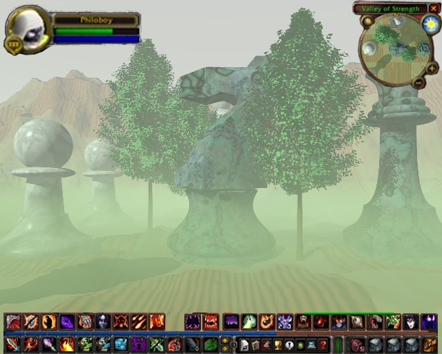

Back to: [West Karana](/posts/westkarana.md) > [2008](/posts/2008/westkarana.md) > [December](./westkarana.md)
# Chess: The MMO game update 1 now live

*Posted by Tipa on 2008-12-05 00:58:34*

We here at West Karana Games Inc. have been blown away by the positive response to our new Chess MMO. Taking a game from tabletop to the MMO arena is a challenge and an opportunity, and I am so pleased that our teams of artists and designers rose to both.

Big news first: You might remember in beta that we were forced to cut the Bishop and the Rook jobs from the game as playtesting proved neither were as popular with the testers as we would have liked. We are happy to announce that both the Bishop AND the Rook are back in the game -- initially, only Black will have Bishops and White will have Rooks while we take careful note of balance issues. We expect both sides to have the chance to play both jobs in an upcoming game update.

We've added support for DirectX 10 in this latest release. The ground fog and realistic weather options -- including wind speeds from breeze to gale -- are quite stunning and add an entirely new dimension to gameplay. We have also added "LOW" and "SUPER LOW" settings to the graphic detail slider so that people with older machines can get acceptable frame rates.

More news below:

**General**

 * The White King no longer disappears after castling. It should now be possible for the Black team to win a game.

 * Lag has been severely improved in gatherings of more than three pieces. We're still looking at issues with Pawn blockades. Improving the performance of all strategies is our number one priority. Until next patch, if you are still having lag problems, avoid the center of the board if possible.

 * Zoning from the north side of the Board to the south side of the Board has been made far quicker due to new caching technology. However, starting a new game will be somewhat slower as the game preloads the new board data. Pieces on the North side of the board will still not be able to see pieces on the South side, and vice versa. A fix for this will be in an upcoming patch.

**Pathing**

 * After 30 seconds of pathseeking while attempting to move your piece to its new square but being prevented by possible crowding, undergrowth, or gale force winds, a dragon will swoop down and move your piece to its destination. You're welcome :)

 * Castling no longer causes the Pawns on your team to become rooted in place.

 * When the King moves, the Queen no longer follows.

 * 
Due to griefers blocking Pawns so they can not make even one move, we have given all Pawns the ability to both capture and move forward on their first turn.

**Quests**

 * The "Move One Space Forward" quest is no longer offered to Knights. Knights are now offered a new quest, "Move Like An 'L' With A Short Bit And A Long Bit".

 * Either QB1 or QN1 may be set ablaze to satisfy the "Rank and File" quest.

 * Corrected some confusion where quests would say "Night" when they meant "Knight". You do not need to wait for darkness to finish these quests.

 * The "Pawn Promotion" quest will no longer let you promote yourself to King if you are playing a male piece. Sorry, guys. Nice try.

**Classes**

 * Pawns gain the *en passant* ability (see Pathing for the reasons)

 * Knights will no longer be able to attack the pieces they jump over.

 * 
Kings and Queens may now purchase new crowns at the Item Mall. Hats for the other jobs will be added in a future patch.

 * Kings have been made slightly taller to make it tougher for them to hide behind a crowd of pawns.

**Animations**

 * All pieces can now /wave, /bow and /dance. Go wild!

As a "thank you" to all the players who have supported us through beta, release and our first game update, all currently subscribed players will receive the ability to recruit an extra Pawn to their team until the next game update. We couldn't have done it without ya!

If you are having troubles downloading the 1.3GB patch from our servers, we have arranged with Filefront to host it as well.

---

*Scene rendering done with the POV-Ray for Windows ray tracer v3.6. Tree rendering done with POV-Ray 3.6 for Linux using diestel@steloj.de's Arbaro program. Chess piece models by Miguel Garcia Diaz, WoW UI from someone's screenshot.*
## Comments!

**PekkaR** writes: Great! Written with more care than most jokes of similar theme that I've seen. :)

For a lengthy while there I was wondering if this was referring to issues in Warhammer since launch but I suppose you wouldn't...

---

**[Tipa](https://chasingdings.com)** writes: lol... nah, this was in response to Scott Jennings' post about the low barriers to join [Community Management](http://brokentoys.org/2008/12/02/can-you-post-on-message-boards-then-an-exciting-career-in-community-management-awaits/). If I ever apply for a CM job, and they ask if I can write patch notes that put a happy face on a game that is more in love with using the latest technology than being playable, I can point them right here :)

I just put in issues related to WAR, AoC and EQ2 just for the fun of it :P

---

**[Sente](http://adingworld.wordpress.com)** writes: Brilliant Tipa! 

This put a big smile on my face while waiting for my flight at the airport, thank you for that ;)

---

**[mbp](http://mindbendingpuzzles.blogspot.com)** writes: "The White King no longer disappears after castling."

EPIC FAIL. 

When are the Devs gonna stop rolling over every time a bunch of NOOB WHINERS complain. Do they even play their own game? If they did they would know that castling is not an easy move to pull off and that it only works against noobs in crappy plastic gear An experienced black team in half decent ebony gear will eat those rooks before they get anywhere near castling. There was no NEED for this MEGA NERF. Sure it allows a decently geared team to get an easy win against noobs but if you think that lametards who play ony a couple of hours a week should be able to beat hardcore players who invest thousands of hours to to get full Ivory / ebony gear then GO PLAY MONOPOLY.

---

**[Tipa](https://chasingdings.com)** writes: @mbp OMG I'm sitting here at work trying not to laugh and I CAN'T!!!! I'm DYING!

Epic win :)

---

**[Toldain](http://toldaintalks.blogspot.com)** writes: I can hardly wait for the expansion. I heard it was going to be called Tweedledee and Tweedledum: The Battle! I call dibs on Dee.

---

**[Openedge1](http://simple-n-complex.blogspot.com)** writes: OMG ...this RAWKS.

I spent all night moving my pawns from one section to the next. The story was fluid and I almost cried when I lost the Queen.
I prevailed though.
Don't let anyone tell you any different about the game. This is some of the best PvP imaginable!
And we get PvE to boot. I can choose between black or white. I can control a knight or a rook...
I do wish they would add a little timer toolbar on the side that I can click when my turn is done...but, hey, maybe in the next update?

Thanks for a great game. I plan to blog about it, and tell everyone to buy this..

Believe the HYPE!

---

**almagill** writes: Chess SUX! There's no player housing and crafting is just a big time sink! Besides, the economy died after they removed barding for Knights as a Pawn craftable.

Then again... nice screenshot! What sort of system are you running that on to get it looking as solid as that? I get tears and blobs all over the place and don't even ask me what happens if I put shadoes and shaders on...

---

**[Prezzer](http://nutsinnorrath.wordpress.com)** writes: 8eta invite pls!

Hilarious stuff, very, very cleverly done! :D

---

**[Scott](http://pumpingirony.net/)** writes: OMG! First WAR and now THIS? Where's my /dance emote?!?!1?

---

**[Openedge1](http://simple-n-complex.blogspot.com)** writes: Geez...look at how many posts...and still no response from the CM.

Figures.

---

**[Danshir](http://themmoexperience.blogspot.com)** writes: Whats with the OOC chat with people talking about Chuck Norris doing something awful to the Knight?

I love the talents though as you level, My pawn can now explode in fiery rag...wait..no..

Thats a glitch. Damn.

---

