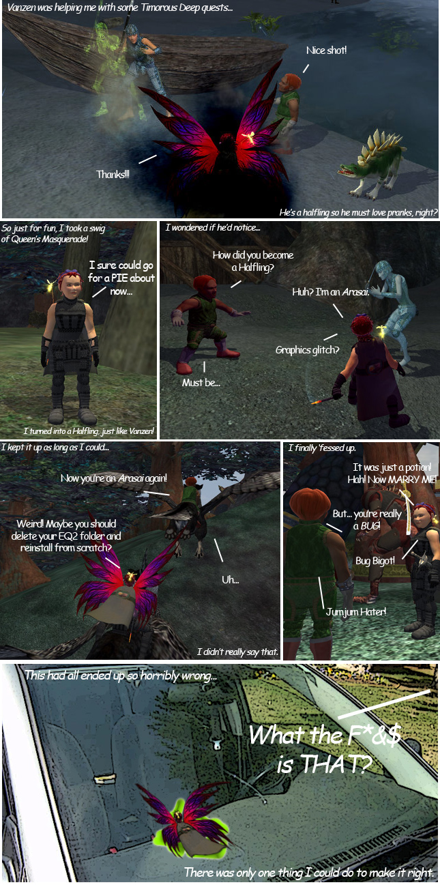

Back to: [West Karana](/posts/westkarana.md) > [2008](/posts/2008/westkarana.md) > [December](./westkarana.md)
# EQ2: Pranking in Timorous Deep

*Posted by Tipa on 2008-12-06 13:44:39*

## Comments!

**Gidgit** writes: Hahahahaha! :P

---

**Fuan** writes: Awesome. And nice job making a RL photo not look so much like... RL!

---

**[Tipa](https://chasingdings.com)** writes: I *do* like EQ2's graphics. But I sure didn't four years ago, when the game came out I could barely move around and everything looked awful. EQ2 is the perfect example of a team that let technical goodies get in the way of making the game sufficiently fun -- and it hurt them, BAD.

They never really recovered from that.

Sure, it looks great NOW and everyone can run it as it was meant to be run, NOW. Why'd we have to wait four years for that, again?

---

**Gnewton** writes: LOL I haven't been able to check your blog for a while Tipa... This was fricken hilarious! So... that makes two days in a row where you played tricks on me! And I fell for it BOTH days!!! /sigh

/wandering off I'm unable to get that annoying "cackling" out of my ears

Gnewt (Vanzen)

---

**[Tipa](https://chasingdings.com)** writes: Oh, oops... I thought you'd seen the comic when we grouped in Mok Rent ><.

I thought it was kinda weird you didn't mention it.

/Sigh...

You can feel sorry for my kids, who've long ago become accustomed to taking anything I say with a grain of salt :)

---

