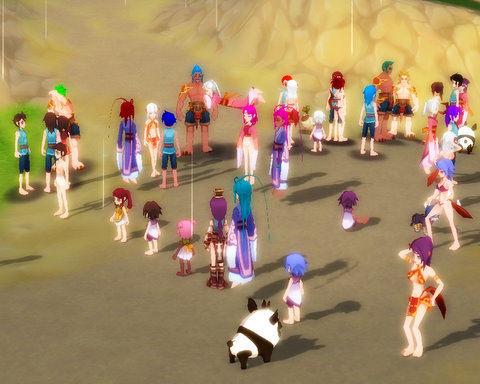
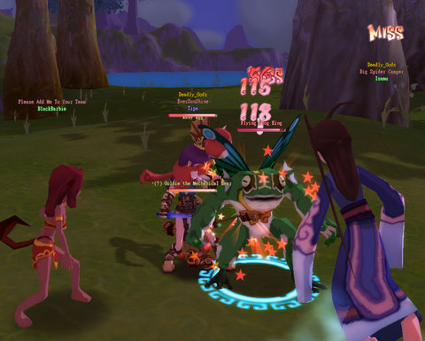
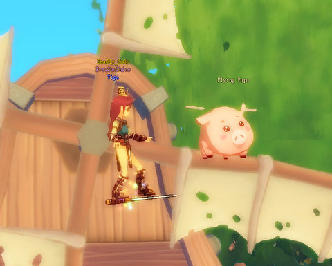
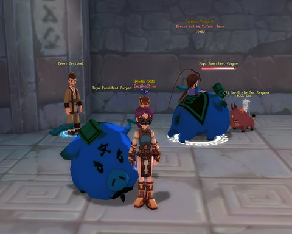

Back to: [West Karana](/posts/westkarana.md) > [2008](/posts/2008/westkarana.md) > [December](./westkarana.md)
# Dream of Mirror Online: Learning to Fly

*Posted by Tipa on 2008-12-08 02:00:22*

People just get looking meaner and meaner as they level in Dream of Mirror Online. Well, I do, anyway. I have NO IDEA why most other people seem naked, or nearly so. Maybe their inhuman physicques (few people seem to choose human characters, as I did) just don't take well to clothing. I dunno.

The mask is a 7-day free mask given out by GMs at a GM event celebrating DOMO's birthday.

It was supposed to be some dance contest, and everyone had to be wearing masks. I was the only one I could see wearing one, so I guess I just can't see anyone else's clothing? Weird. Anyway, they were taking forever to get ready, so I got bored, logged off and played some Rock Band 2 for awhile. Completed all the first rank solo challenges, and then accompanied myself on guitar for the ones that required a band.

When I turned 15, a Mirror King popped in to remind me that it was time to learn to fly. Easy quest; all I had to do was to kill a hard-hitting level 20 Boss mob that has 60,000 hit points. I formed a group with two other people lower than me, and managed to cajole a higher level Dancer from my guild to help as well. His name was Isamu; he didn't think anyone would ever guess where his name came from, but Macross Plus is one of my favorite animes, and I named him right off.

We were two thieves and two dancers, and though it was a long fight, nobody came close to dying, even though we had no healer. I'm thinking of starting a healer at some point, or a bard...

That's all you have to do to learn how to fly (and you can fly on any weapon you can equip). You don't fly very fast right off, but mediating a bad relationship between the quest giver and a fairy he wronged gets a couple of upgrades, and looking for pigs on the wing in Swan Lake Basin gets another couple of upgrades. There's further upgrades in one of the more distant cities, but even flying, it was a longer trip than I was willing to make.

Instead, I figured I'd try my luck with the Life Leech over at the Eversun Mortuary. She killed me without a thought last time I met her, at level 12. Now, at 15... she didn't stand a chance. She barely scratched me, and I got her dead.

This got me access to one of the game's best leveling spots for levels 15-20, the Eversun Inn Basement. And in all the time I was there, I never pilfered even ONE recipe from any of those rats.

There were LOTS of people in the dungeon, grinding quests and levels. I got in several groups; the one that lasted longest was a duo with a higher level thief. Watching how he played was an education, and as I leveled, I picked the skills *he* was using. That dungeon is full of great loot. Pretty sure I have over 3,000 gold now, and all the armor I need up through level 20.

I used a magic monster trapping mirror to capture this cutie when my mecha-bear died. He's no paper tiger. I had to run from a fight, and he kept fighting on. I figured he'd quickly die, but while I was sitting and resting, quite far away, I could see him still fighting. I ran back when I was ready and he was STILL fighting! So I helped him finish off the mob and finished farming Ancient Gold Coins for the third of the four Eversun Inn cellar quests. The fourth requires an uber group. so that will have to wait. Kinda reminds me of old EverQuest; there is usually a group camping it, but it's difficult to get to, and they shout for replacements way in advance because nobody wants to lose the camp.

I ended the night 2/3 through level 17. Next level, I can make or buy a new dagger which will keep me to 20, when I can upgrade my CURRENT dagger -- its last upgrade. Then at 23, I can upgrade the level 18 dagger. I won an Onyx for upgrading armor, but not sure how to use it... which is a regular worry of mine. I pretty much still don't know what's going on. Every time I kinda have it figured out, it's time to move on to something new.

Not much of the game reminds me of EverQuest, except for the dungeons. They aren't as elaborate as EverQuest's, but they FEEL the same. Dangerous parts deep inside with mega bosses that you can't even imagine killing yet, but uber people are always heading deeper in for groups. People soloing at the zone in. Scattered groups as you head in. Death usually meaning a run back from your bind point (though you don't leave a corpse). If you bound in a city -- have a nice run back.

It's just a casual, fun, sometimes silly MMO.

## Comments!

**[Mordiceius](http://www.mordiceius.com)** writes: Tipa, this game interests me quite a bit. Is it free to play or is it limited like W101 or what? I really want to try out healers there (I only play healers in every MMO I play).

---

**Norikue** writes: Tipa, check out the options panel. It's not obvious at all, but there is one for seeing other player's armor. I wondered why I saw everyone in their starting armor myself when I was first playing. I fiddled around around with the graphics options (I think that's where it was.) and presto people had on all different armor and costume clothing. Oh yeah, I think you need to either check the box or uncheck it. It was something weird that seemed to me to be the opposite of what you would normally think it suppose be. I hope that helps out.

---

**[Tipa](https://chasingdings.com)** writes: @Mordiceius -- the game is entirely free to play, but has an Item Mall (and they won't let you forget it, either). You don't have to buy anything at the mall, and can play just fine without it.

@Norikue -- YES! You're a LIFE SAVER! If you UNCHECK "Show Player Equipment", you can see everyone else's armor. I THOUGHT it was weird that I was the only one wearing anything :P

---

**Norikue** writes: *big grin* Yeah it drove me crazy. At first I thought, "Wow this game doesn't have unique armor appearances." Then I noticed on my husband's screen he was able to see people's armor, unlike mine screen. So we both went into the options and started to click away and see what happen. There's another box for vendor appearance. I keep on box vendor look because it reduces lag. Although the sprites look really cute as a vendor. 

Btw, your blog is starting to draw me back into to DOMO!

---

**[Tipa](https://chasingdings.com)** writes: Uh oh!

Is this a good or a bad thing?

---

**norikue** writes: It could be a good thing. :) It won't happen soon though. I'm beta testing A Tale in the Desert IV. I've always been curious about this game because it's so different. It's basically a trade skill game, no fighting, no mobs. Just build this, collect this, learn more. It's not the most user friendly game either. Plus the communication system was defaulted off for person to person because it was bugged in beta. I had to wade through menus just to find it and turn it back on. Many menus to wade through with this game. It's interesting though.

---

