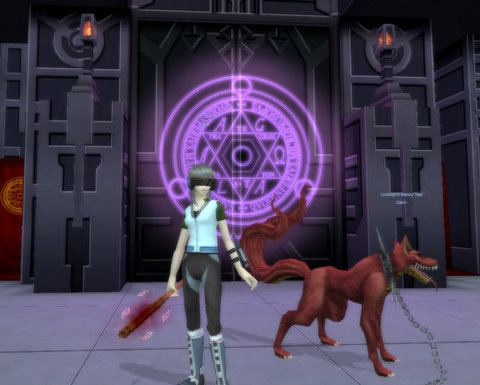
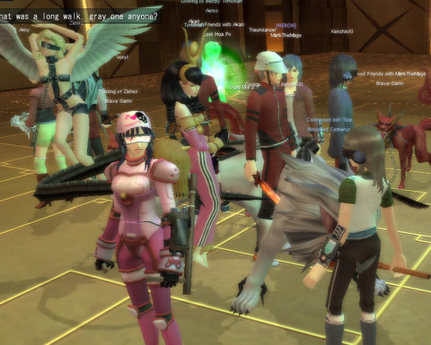
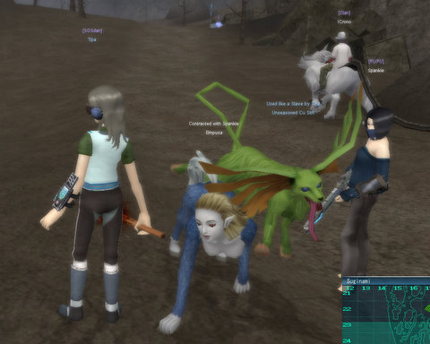

Back to: [West Karana](/posts/westkarana.md) > [2008](/posts/2008/westkarana.md) > [December](./westkarana.md)
# Shin Megami Tensei: Uberer than thou

*Posted by Tipa on 2008-12-08 09:41:02*

Constant disconnects making it impossible to finish any instanced dungeons are getting a little bit aggravating. Talking to other SMT testers while playing DOMO confirms it: It is hard to get a really good sense for the Megaten closed beta when it's so hard to stay connected in dungeons.

And dungeons (and groups to do them with) are vitally important to advancing in Megaten. The loot dropped there sells for a lot, the experience is 5-10x better than in the outside world, you can gain access to more powerful demons ages before you could get them via fusion... Dungeons are central to SMT, and when they aren't working, it's just frustrating.

Especially when it's clear people are having some success in them. I'm always hearing people calling for groups for the higher level dungeons, and the people in my guild seem to be exclusively running the higher instances.

It's so easy to tell the uber people apart in this game. They have the best demons, the most impressive looking armor and weapons... SMT is a game where there is the very best, and then there is you, the worm.

That's the way I feel sometimes :P

This is a particularly disturbing demon, basically a woman with a bushy tail walking on all fours. This one isn't mine -- the greenish dog looking one is mine.

I finally figured out how to capture demons -- you just have to keep talking to them until they try to kill you, or agree to join you. You can use other verbal tactics as well, if being pleasant isn't working for you. Or you can always choose to try the bribes. You know, whatever works for ya.

Fusing two demons causes the new demon to be born possessing some of the skills of its parents, as well as other skills it can learn as the heritage of its particular type. The real risk is fusing a valuable demon and ending up with something which is not going to match your play style.

I love using Rush attacks along with some light spellcasting. So I want my demons to Rush as well. A fusion that gives me a demon that does not Rush is, well, not so useful to me.

But this being closed beta, it doesn't matter. It's fun just seeing all the different fusions I can do. There's even triple fusions -- I haven't done one of those yet -- where you get together with two others, and everyone contributes a demon to the mix. Everyone loses their old demons; you get the new demon; and you can set rewards for the other people in the event the fusion works, so they don't get nothing for giving you their demon.

The game? Dead serious. This is not a game you will want to play casually, I don't think. If closed beta is any indication of the live game, it will be way too easy to get left behind.

I haven't decided if I will play SMT when it goes live. I think it will be a lot more fun when they have the connection problems sorted out.

## Comments!

**[Openedge1](http://simple-n-complex.blogspot.com)** writes: Yup...lag, disconnect, weird AI, and overall major grind all add up to another Asian Grinder (tm).

There are some things to like, but too many not too like to continue.
I will come back after some time has passed.
My wife watches me play games sometimes though, and I got a "This is boring" from her, so, this one moves to the backburner..

If she is bored, no way I can convince her to play..

Ah well. It did not suck, it just was not too fun after a while.

---

**[Tipa](https://chasingdings.com)** writes: I am liking DOMO a lot more than Megaten... I intend to log into SMT but then find I've launched DOMO instead :P

---

**[Mordiceius](http://www.Mordiceius.com)** writes: I have to agree with you, Openedge1. I did a write up of it this weekend after playing it with the girlfriend. We played for a little over a half hour (this is the second Asian MMO she's played, the first being ROSE Online) and she just got frustrated with poor translation in areas and the, to her, confusing skill descriptions. We played for about an hour and a half before she stopped and I played about another hour beyond that before I gave up on it. Oh well, DOMO looks a lot more fun so I'll be trying that later.

---

**[Pete S](http://dragonchasers.com)** writes: I've back-burnered this one for now because of the disconnects. Also, I'm interested enough to potentially want to play it after launch and don't want to get a "bad taste in my mouth" from beta testing (which sometimes happens to me).

On the plus side, it got me back into playing Persona 3, which I never finished. :)

---

**[Danshir](http://themmoexperience.blogspot.com)** writes: As much as I hate to say it, the constant stream of disconnects is really making me turn away from MegaTen. Which is a sad thing considering how hooked the game had me in its initial atmosphere and playstyle. I've already found several glitches and reported them, but I think I'm gonna take a break for about a week, and see how the game is then. If the disconnects are still rampant, I'll probably try out DOMO with the lot of you, so look out for Danshir..and help him...for he is scared of new MMORPGs... ;)

*sighs* 

Maybe Beta Testing for The Old Republic and Blade & Soul won't be so bad once they happne?

---

**[Tipa](https://chasingdings.com)** writes: Picking it up after a couple of weeks may be the best way to not get a bad feeling about it all. I DO think the game has great potential, and it has totally nailed the look of the Persona games.

---

**[Danshir](http://themmoexperience.blogspot.com)** writes: I agree that it has the whole atmosphere of the Persona games, which is a mark in it's favor. I just hope a lot of issues get tinkered with. They have a rock solid game if they can edit a few things.

---

**12th Nightmare** writes: I may have just gotten lucky but I managed to get through an entire dungeon (the huge-ass Garm at the end did kill me though), and play-session, without any disconnects today.

---

**[Tipa](https://chasingdings.com)** writes: You, sir, lead a charmed life :)

---

