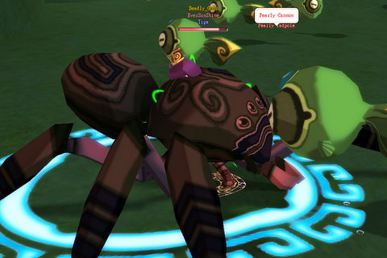

Back to: [West Karana](/posts/westkarana.md) > [2008](/posts/2008/westkarana.md) > [December](./westkarana.md)
# DOMO: I'm a filthy camper.

*Posted by Tipa on 2008-12-09 22:23:22*

Dream of Mirror Online was down most of the night last night. When it came back up, I mostly just ran around collecting jobs -- after Norikue's cool suggestion to have Musician as my secondary job to give my pet somewhat more survivability, I figured I should definitely get that one. I stumbled onto the Shaman job (honestly, I didn't know that was the job quest until I finished it). 

I didn't feel like buying/making all the new gear I'd need for the Musician job (really missing those coupons that give you a full set of newbie gear for a job, lemme tell ya), so I put my Thief clothes back on and went exploring.

Flew around Placid Plain and some other zones for awhile, then decided to see if I could finish some of the quests that have been taking up space in my quest log.

The Man-Eating Spider in the Well Sewers dungeon -- the newbie dungeon in the game -- spawns very rarely, and I kinda swing by to look for it when I'm bored. Back when I was seriously working on the dungeon, there was no way I could have taken him myself (and earlier had died to the Revenge Boss in the area, the Copper Croaker, I blame my sister, whom I was talking to at the time). When I got to his spawn point, i saw a lot of suspiciously high level people in the area. I had picked up the (repeatable) quest to kill 30 Pearly Tadpoles on my way in, so I'd started on that when -- there it was. The Man-Eating Spider.

Should I back off and try to get a group for it, or should I just wade in and take it for myself?

Dropped a lot of goodies, and all of them were my goodies because, c'mon. Rare boss spawn in a hotly contested dungeon? EverQuest didn't teach me to waste any time, here.

I'm not sure anyone saw me kill him. I finished killing Pearly Tadpoles and went to the Watch Captain for my reward.

And he called me a filthy Big Spider Camper, and gave me the title to prove it.

I protested for awhile, but he was absolutely inflexible about it. Sigh.

I realized this morning that Dream of Mirror Online had become my New Shiny, like Wizard 101, EQ2, WoW, DAoC and EQ before it. So, thought I, still sleepy this morning, I should fire up Photoshop and make a New Shiny Badge!

I dunno why I do these things. I'm no artist. But all day at work today, I was thinking -- not of playing DOMO and not of SOE's new RMT initiative -- but on what this stupid badge would look like. So, with no fanfare (even though this is my 1001st post!), I bestow upon Dream of Mirror Online the least prestigious award in MMO blogging, the West Karana NEW SHINY Award :P

ANYWAY, now that that's out of the way, I got to thinking, just what is it that makes an MMO, or any game, really, a "New Shiny"? Why do I pass Age of Conan over to play Wizard 101? Why do I skip Warhammer to play DOMO? Why am I not on EverQuest 2 right this second?

First, it has to run well on my computer. Seems simple, right? But this one little thing is why I don't play Vanguard much. It runs like crap on my computer. You couldn't pay me to play a game that doesn't run smoothly on my computer. Seriously. I was supposed to write a Vanguard article, for money, but I just couldn't do it because the game runs so crappy on my computer. I get so stressed out about it, I start getting really angry. Finally, i refuse. If you can't make your game run well on my computer, I'm not gonna play it.

That one insight let me dismiss AoC and WAR right off the bat. I do not have an uber system. So I probably can't play your system-straining game.

EQ2 runs okay. DOMO runs fine. Wizard 101 runs fine. It's no secret.

Secondly, don't tell me what to do. The more on rails your game is, the less likely I am to play it. Wizard 101 gets a pass here because the game is too damn fun, but I'm not playing through it a second time because why? What has changed from the first time?

Not a thing. Same reason I couldn't play WoW after the first time I maxed a character. Why would I want to go through all that AGAIN? No reason. So I quit.

Third, be FUN. This is what EverQuest finally did to lose me. I'd come home from real work and have to log right in for my volunteer part-time job playing EQ. That was STUPID and it was making me crazy. I wasn't having any fun. I couldn't get groups on off times as, being a cleric, my class was the #1 pick for being someone's 2-box alt and if they could have swung it with the officers, everyone would be bringing their boxed clerics on raids (and they often did when we were short clerics). So I played EQ until it was no fun, and then I kept playing long after.

So, if your game runs well on my computer, doesn't force me into a certain path, and is FUN (to me), I'll probably give it a shot. Make some system busting game where I am forced to do what your designers thought I should do where my fun depends on other people not being jerks, you lost me from the start.

## Comments!

**[Danshir](http://themmoexperience.blogspot.com)** writes: The third part, fun, is perhaps the hardest to find in an MMO...

---

**[Openedge1](http://simple-n-complex.blogspot.com)** writes: I always suggest people upgrade after 5-10 years of computer use. That should alleviate issues.

(*snicker*)

---

**[Tipa](https://chasingdings.com)** writes: lol... my laptop is just a year old, and was meant for gaming. This is why I don't accept MMOs that won't run well on such a recent computer.

---

**Mallika** writes: I'm with Tipa on this one. My computer is two years old and I did a bit of an update a while back with a 8600GT (dude, I would rather pay about 80 euros for that card and get some games with the left-over money than get one of the uber cards for 200+ euros) -- if I need to buy a whole new computer system or drop hundreds of euros just to be able to play a game smoothly, I'm just going to pass. Or wait until it's actually a decent time for me to upgrade my computer. For my husband and me, it doesn't make sense for us to keep upgrading our computers every single year or whatever. I guess on this issue we're more casual than hardcore. :P

---

**Mallika** writes: And hell, I can run Fallout 3 on the highest settings quite fine but I find that some MMO games (like EQ2[!] and Vanguard) get chuggy. Beh.

---

**[Openedge1](http://simple-n-complex.blogspot.com)** writes: I always have the issue that the older the game is, the worse it runs..
I can run AoC full blast, yet LOTRO, Vanguard both choke on me.
EQ2 was worse, but have not tried since the dual core update.

As to the "gaming" laptop connotation, I believe it IF I know what the specs mean. 
Luckily, I know specs, and Dell advertises a gaming laptop that is crud, and I was actually forced to upgrade it myself.
[THIS is a gaming laptop](http://www.excaliberpc.com/588981/asus-g50vt-a1-15.4-notebook.html)
Does yours match this? (PS: This DOES run AoC perfectly fine!)

---

**[Tipa](https://chasingdings.com)** writes: Mine is also made by Asus. It really is a gaming laptop -- it had good reviews, and it runs EQ2 okay enough to play and raid at decent settings.

Not Vanguard, though.

Anyway, I'm not going to gamble away my money on the hope and promise that a machine-stresser like AoC or WAR might work on my computer.

---

**[Tipa](https://chasingdings.com)** writes: I bought an Asus Eee for actual portable computing. So my next gaming computer will be a regular tower computer, that I can easily upgrade on my own. Since I bought the Eee, the Asus has been rooted to my desk, so where's the value in a laptop? Especially one that chokes on Vanguard.

---

**[Openedge1](http://simple-n-complex.blogspot.com)** writes: What model of Asus is the gaming laptop? I love Asus stuff. 

But, do not think your laptop cannot run other games because of Vanguard and it's single threaded engine nightmare.

I have 3 machines that run that game like crud...all with different video cards and configs (including a 4870 video card and DDR3 memory, an 8800GT, all well above spec cards)...but, then LOTRO runs like crud ..WAR also runs like crud, and it has nothing to do with specs either...

Yet, EQ2 was at least acceptable, and AoC is shockingly good on good hardware. 
There is the difference in that if an engine is made for better gaming, then it will run well on good machines.

But, I digress. 

I actually think your interest in those games makes the decision on whether you will even try them. You have never even tried AoC or WAR (according to everything I have read, correct me if you have recently) and it seems unfair to stack them into your "I don't play them cause they run bad on today's hardware" analogy.

I feel compelled to give you my Buddy Pass to AoC so that you will at least play those awesome 20 levels, and make a decision on if the game is worth a darn to root for...of course as long as you have the latest updated drivers, and are willing to try the game in PvE.

---

**[Tipa](https://chasingdings.com)** writes: You got me. I have zero interest in AoC and WAR. A friend here at work has tried both, and even gave me his AoC disks, but absolutely nothing about the game appealed to me or made me inclined to try it. Same for WAR. I like the idea of PvP, but my time in DAoC and EQ2's PvP server let me discover I find PvP dull. Once you add PvP into a mix, every game suddenly becomes about boasting and trash-talking. I can't take either.

That doesn't change the fact that, based on what I have read, that both games would run poorly on my machines. The screenshots for WAR, especially, that I have seen posted on blogs, look so unsaturated, low on detail, muddy, and so very different from those posted on the official website. I was astounded at how poorly WAR looked on Stargrace's screenshots, and I know she has a fantastic rig. If her super computer could only manage that at the best, then it would certainly kill my computer.

I only get 12-15 fps on EQ2. I get about 4-5 fps on Vanguard. I get 60+ fps in DOMO. I was getting an astounding 100+ fps on MegaTen! 45 fps on W101, so consistently that I think they must lock it there.

Faster games are dramatically more fun for me.

---

**[Openedge1](http://simple-n-complex.blogspot.com)** writes: 12-15 in EQ2? Uh...yep...ouch. 

Whoever said that was a gamer laptop...lied...lol

Sorry about that.

As to WAR...yea, it actually looks like that with all options on...YUCK eh?

As to the speed differences, it takes a lot to run those "uber" games (settings and drivers are important)...

Finally, I think we can see there is a line toward what games you enjoy. The cartoony and simplified visuals catch you more than a realistic gritty look. You enjoy games with color and stylized visuals. LBP, Domo, W101, Megaten? These all have an unrealistic flair to them, and are overly stylized...

And there is nothing wrong with that.

I think I took issue with you stating your reasons for not trying WAR or AoC in your post as performance, which we see is not the case...but, instead an underlying dislike of their mechanics and other qualities..

Cheers

---

**[Danshir](http://themmoexperience.blogspot.com)** writes: I ran WAR with max settings and with 50 FPS...

and I still thought it look like crap =( I just don't like WAR at all, in any way..

---

**[Tipa](https://chasingdings.com)** writes: Well, i *am* planning on getting a new computer. I took a risk buying a laptop, a computer I don't really know how to work on. It's going to be my son's, and I'll get a desktop and I will be building it based on specs from Tom's Hardware or some other gaming hardware site.

I want to be able to play EQ2 and never worry about running through Gorowyn again.

I don't think that I only like brightly colored children's MMOs. I don't like WoW, and do like EQ and EQ2, so...

I like immersive games that let me be an individual, not a generic cog. I want my character to look distinctive and I don't want to chart a unique path through the game. AND, I want the game to run well. Realistic or fanciful graphics don't matter to me, but if I start thinking about the computer more than the game, it's a problem.

I want MMOs that I can use to tell my own stories.

---

