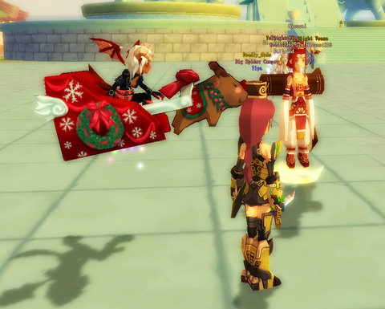

Back to: [West Karana](/posts/westkarana.md) > [2008](/posts/2008/westkarana.md) > [December](./westkarana.md)
# DOMO: If you're gonna have RMT in your game...

*Posted by Tipa on 2008-12-11 12:00:43*

If you're going to have RMT in your game, make it weird, kooky and over the top -- like this Santa's sleigh mount from Dream of Mirror Online. Complete with reindeer (but it looks like the shadow costs extra or something). And me in my Mecha outfit, killing Pus with hydraulic power.

## Comments!

**[Another Average Guy](http://anotheraverageguy.wordpress.com)** writes: I just want a brigand hat

---

**[Hudson](http://hudshideout.com/blog/)** writes: That mecha outfit is pretty sweet... and sexy I might add...to us Robotech nerds.

---

**[Danshir](http://themmoexperience.blogspot.com)** writes: the mecha suit seems very KOS-MOS ish. I like it.

And I want that mount, on a character that is a paragon among evil.

---

**Zaviun** writes: Where did she get that Santa sleigh anyway? We can't find it in the item mall anywhere. Heck I can't even find that mecha suit. Maybe they were a limited supply and are all gone now?

-Zaviun

---

**[Tipa](https://chasingdings.com)** writes: I didn't ask; I haven't seen it, either, but I wasn't looking for it. Mounts that you can ride are WAY above my level.

The mecha suit was part of a limited, one-day promotion. I got it because I'd never seen anyone in a mecha suit, and this one looked AWESOME :)

---

