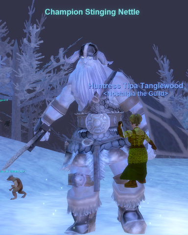
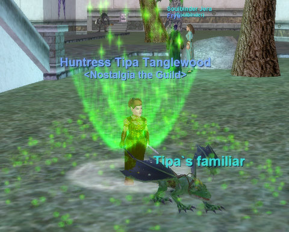

Back to: [West Karana](/posts/westkarana.md) > [2008](/posts/2008/westkarana.md) > [December](./westkarana.md)
# EQ: Frostfell comes to Velious

*Posted by Tipa on 2008-12-12 10:11:38*

I think I'm still hurting from the smackdown those giants in the Great Divide put on me.

I was kinda thinking that EverQuest winter holiday events would be something you could pretty much do solo, no matter what you're level. I was kinda thinking WRONG.

The first two, kill ten goblin scouts and a boss, and then kill ten lower level Dark Mistletoe giants and a boss (above), were easy. Some of the giants were clerics, but they'd run out of mana eventually.

The third quest, where the giants were light and dark blue (to a 66 ranger), I thought I might be able to do them with the help of my cleric mercenary, but she was nearly out of mana and I'd used my weaponshield by the time I managed to kill the first of the two I brought on my first pull.

The second one killed me when my cleric ran out of mana. Well, at least I got this little gem. It's colorful! It's sparkly! It's not something a ranger could use because, well, it's not a bow. The first three quests all give this item, with better stats as you go through the chain.

The fourth quest, killing the big baddy who wants to ruin Frostfell for everyone -- well, he was guarded by storms that were all "what do you want your tombstone to say?" and "ready to attack!" and red as hot blood spilled on snow to me... so I wasn't going to even touch that one.

Besides, EQ2's Frostfell celebrations are begging me to check them out. Maybe tonight!

## Comments!

**almagill** writes: Jingle bells
Frostfell smells
Santa Glug's on his way...

I *love* this time of year :)
Even if Coyoute DID get our snowballs nerfed!

---

