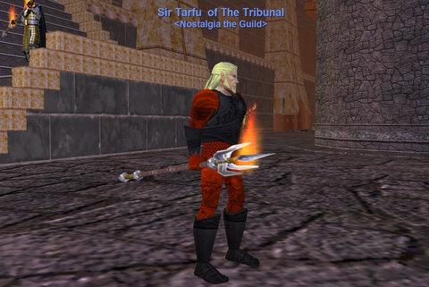
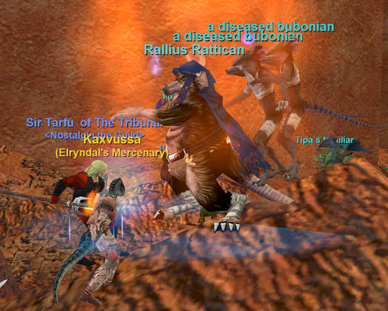
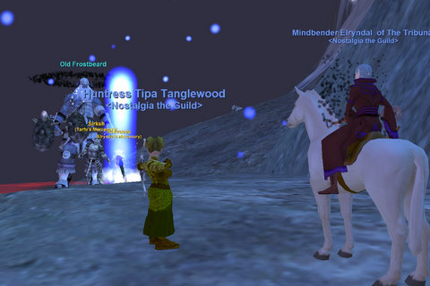

Back to: [West Karana](/posts/westkarana.md) > [2008](/posts/2008/westkarana.md) > [December](./westkarana.md)
# EQ 'Cide edition: Raticide, Spearicide, Gianticide.

*Posted by Tipa on 2008-12-15 09:42:18*

Rejected post titles: "The Spear-it of Christmas", "The Mob that Dis-speared", "Spear-ritually yours".

Last week, we were saddened by the cruelty whose name is Doomfire, the Burning Lands, where none of the many nameds of "C1" bothered to show. Sure, we got levels and AA off their minions, but that wasn't the point. We wouldn't leave until Tarfu got his Spear of Fire, the paladin pet weapon that procs paladin epics.

We made some sacrifices to the appropriate loot gods, and returned to the Plane of Fire once more. This was our third time in the Plane of Fire, the only zone we've been to more than twice, except when we were farming Naggy and Vox. But those weren't xp nights.

On the second round of repops, the Captain of Fire spawned right on Tarfu's head. It was like, "OKAY, HERE'S YOUR DAMN SPEAR ALREADY".

So, thanks :)

We stuck around for another couple of hours, working on xp and watching that spear proc. Ding 67; Tarfu and Elryandel both made around 6 AAs, and Elry also dinged 70, so grats there :)

There wasn't any real reason to hang around the Plane of Fire any more. I kinda thought it would be cool to try and kill Pyronis, the giant frog that is the easiest of PoF's raid bosses, but I wasn't sure we would have the dps or healing for it.

Elry has been working on the Secrets of the Planes book for awhile. This quest takes you all through the Planes of Power, and was pretty uber in its day. We got a pretty rare drop for it in PoF, the Hope Stone, and the next fight for it would be Ratticus Rattican in the Plane of Disease. We haven't been to PoD yet in Nostalgia, so off we went.

I last did this fight for my rogue about five years ago. I don't remember it being this easy (the level cap back then was 65, which may have been one reason). I vaguely remember some sort of ring event, and giant spiders guarding the exits, but we rolled in there, killed Ratty and his zillion adds, and rolled right back out.

Aside from trying to put any of the vague threads of half-decade old memories together into some sort of real thought, it wasn't that exciting. But it SHOULD have been! It was back when I, Cass and Szel trio'd it so long ago. Cass and Szel had just joined Crimson Eternity, too :)

With that done, we figured we'd finish up the group Frostfell mission in the Great Divide. According to the mission text, we would kill five of Old Frostbeard's summoned storms, then Frostbeard himself. He's a level 72 group kill with a couple of nasty AEs -- one that dots you a little and halves your attack speed, and the other that dots you A LOT. It would have been nice if we'd looked this guy up before we started the fight, because we went in... um... we went in COLD.

Sorry.

Anyway.

My cleric merc ran out of mana when Frostbeard was at 40%. Tarfu was healing for dear life himself, but there's a limit to what a paladin can do. But somehow my cleric just kept pulling CHs out of thin air, and in the end it was Nostalgia: 3, Old Frostbeard: 0.

That's when Elry, I think it was, pointed out that the mission required us to kill five summoned storms BEFORE killing Old Frostbeard.

Sigh.

Next Friday, maybe Stoneroot Falls, get some more xp. I'm eager to get to 70 and start gathering AAs again. 42 AAs just isn't enough to do much these days.

## Comments!

**Elryndal** writes: I guess third times a charm applies to our outing, was a fun night all in all, i got the 'Secrets of the Planes" quest finished btw, the graphic on the book is really cool. Thanks again for a fun time.

---

**[Cassaendra](http://cassaendra.blogspot.com)** writes: Nothing like doing the boss the tough way and winning! Grats!

I certainly miss the old days of EQ. Well, once you got keys out of the way. :) Szel is a rogue on WoW - I swear it's because of all the cool things you and West did.

---

