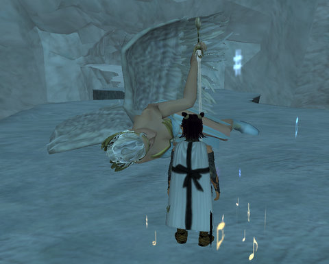
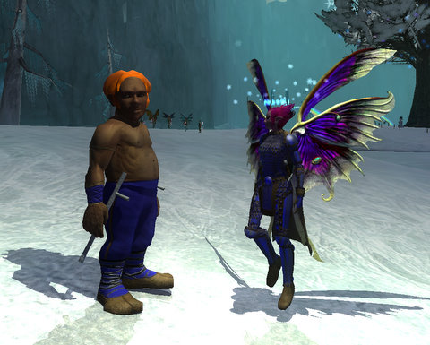

Back to: [West Karana](/posts/westkarana.md) > [2008](/posts/2008/westkarana.md) > [December](./westkarana.md)
# EQ2: The Icy Keep ... of LAG.

*Posted by Tipa on 2008-12-15 10:16:44*

The Icy Keep is EQ2's new addition to their winter wonderland of Frostfell fun, a nicely laid-out retooling of Permafrost that not only provides an hour's group fun, but also moves the ongoing EQ2 plot ahead slightly.

Long ago, the ice goblins of Permafrost were in thrall to the villainous Lady Vox, an ice dragon whose control over the northern reaches of Norrath was merciless and absolute. Her continual death at the hands of adventurers and, finally, at the claws of the prismatic dragon Kerafrym, left her a shadow of her former self, and set the goblins free.

Now they fear the Ice Maiden Di'na (!!) has found the egg of an Ice Dragon, and is planning on hatching it and once again bringing a great evil to the world. Who can stop her nefarious scheme?

Who do they ALWAYS come to when there's dragons to be killed?

Yup. Adventurers.

After looking for a group for the instance for all of about, oh, 30 seconds, I thought I'd see how far I could get solo. The dungeon, after all, has an Easy and a Heroic setting, and people were making it sound SO easy, I figured, why not?

First named went fine, I was pretty pleased, but the second named had two helpers, and keeping the adds charmed and/or mezzed while the boss guy himself proced what looked to be a reactive stun or maybe just spell reflection, I dunno... it was pretty tough. Besides, killing Protectors of Di'na was making me, Dina, feel like I was working against my best interests.

Besides, what would I get out of this even if I managed to kill everything? Wasn't much on the vendor. The appearance armor was just a tinted version of that RMT Seafury armor and... hey, that stuff looked GREAT on my Arasai assassin in the dressing room...

Plan B: Two box the dungeon with my defiler on my second account mentoring. And not only that, but keep on doing it until I had enough tokens to buy the entire set of armor. Brightknife, my assassin -- a word about her name. I really love naming my characters, but I couldn't think of good names for my Fae and Arasai characters. I finally decided that the Fairy folk have their own private names that they don't tell anyone, or that it would be hard for anyone to pronounce correctly, so they would take different, public names of their own choosing. So, Winterwing, Brightknife, Tinkerbell, etc :)

Anyway, I had this idea that if I ever hit a rough patch, Etha (the defiler) could just un-mentor and clear the way, but I never actually bothered to do that.

Killing Ice Maiden Di'na was an adventure. Every so often, she shatters the ice imprisoning an ice elemental, who then joins the fight. If you don't kill it right away, she runs around and brings more. So, not knowing this, I tried to burn her down, but then about thirty ice elementals had spawned and we died. We died so hard.

New plan: Kill the adds as soon as they spawn. That worked pretty well.

Unfortunately, we spent too much time killing Di'na. By the time we got to the egg to shatter it, it was ready to hatch. The baby ice dragon was born! It froze us in blocks of ice and took off.

And then this army of ice goblins arrive to help kill the dragon (or make a nice dragon omelet, or something). If they found out we hadn't actually killed the baby dragon, we wouldn't get any loot. So we snatched up some egg shells and used that as proof that we'd done the deed. They were so happy! They gave us loot!

Still a tiny (but growing) problem: What to do about the real, live, totally UN-killed baby dragon that was still prowling around the Icy Keep (and, clearly taking a page from the cleric Vox, resurrecting all the bosses)?

Stage 3: CYA. Yup. Our new mission: Return to the Icy Keep, and remove the evidence. Ice cubes with tasty goblin surprises in the middle? Melt them, kill the goblin. There must be no witnesses. Re-kill all the bosses.

Rinse, repeat.

I did the two-box run a couple more times, then convinced Vanzen to join the fun. We picked up a couple of other people and tried the run on Heroic.

That was a little bit much for me to handle healing, so we restarted in Easy mode and burnt through the dungeon. That got Brightknife her last bit of the quest armor -- server discoveries on every piece -- and Vanzen got that cool looking gi -- also a server discovery.

Rawr. Bare-chested, tubby halflings. What's NOT to love?

## Comments!

**[Toldain](http://toldaintalks.blogspot.com)** writes: Bare-chested, tubby halflings in the SNOW, no less!

---

**[Tipa](https://chasingdings.com)** writes: Heh, yeah :)

I should have mentioned the first quest in the series, the solo part. There's this guy being sneaky, and so when you start talking to him about needing help or something, he wonders why you possibly felt he needed help with anything. And you try to dance around the fact that he has a glowing feather above his head... "Oh, you look like you were being crushed by the weight of a feather on your head," or something.

That was pretty funny, as was the McScroogle quest before it, where the boss questioned your desire to do meaningless "kill ten rats" quests for loot -- yes, he mentions Kill Ten Rats explicitly :)

---

**[Openedge1](http://simple-n-complex.blogspot.com)** writes: (PS: Shadows off = less lag, and more frame rates for Non-gaming equipment....lol)

---

**[Tipa](https://chasingdings.com)** writes: New definition for NGE :)

The last shot was at high graphics for the screen shot. The first two were taken in my normal graphics settings -- no shadows... :P

Just can't get Brightknife's armor lit right. The struggle continues. I think her glowing circlet (another quest reward) isn't helping.

---

**[Pete S](http://dragonchasers.com)** writes: We did that run a bunch of times over the weekend. Berserker and Defiler, the Defiler mentored down to Berserker's level. 

It was really laggy, wasn't it? Too many instances running at once, someone said. But we filled the guild's bank with frost-bitten toes, and my berserker made 4 levels, earned himself that frozen paw trinket and the Sword of the Melting Keep or something... good upgrade for him in any case.

We'd pull Di'na up the tunnel (BETWEEN the two piles of broken barrier...the first time we fought her in one and the chest she dropped was inside an ice shard and we couldn't loot it) which made her adds bunch together for easy AOE attacking, I guess. When it comes to EQ2, I'm the noob and my Defiler pal was directing the action. Sometimes we had bunches of adds, other times only 1 or 2, and I never figured out any causality to the numbers. Maybe just random?

I'm saving tokens and going to try to get the Berserker to the next tier (and, presumably, a whole new set of goodies on the vendor).

---

**[Tipa](https://chasingdings.com)** writes: Have to admit, the xp was VERY good. What with the 10% xp bonus each character received for having an 80 on the account with them, rest xp, mentoring xp, discovery xp and the like, Brightknife gained four levels and two AA, and Etha gained a level and I think an AA as well.

I'm not sure why sometimes the boss drops dozens of mobs sometimes. I thought it was because I didn't change targets fast enough, but maybe it was just bugged.

---

**[Another Average Guy](http://anotheraverageguy.wordpress.com)** writes: The appearance gear looks pretty cool. It's a tiny bit different thant he seafury gear though. it look like the arms are not bare.

---

**[Tipa](https://chasingdings.com)** writes: Yeah, and both the shoulder pads are there. More or less the same, though.

---

**Gnewton** writes: Hey, I worked hard to get that SWEET physique! (I shudder each time I look at the old models... the new/alternate models look SO much better). 

I better get to the gym, my belly is embarrassing...

---

**[Tipa](https://chasingdings.com)** writes: See? I can't stand the new models. They look so generic and shapeless. Creepy.

I love the old models with all their endearing flaws :)

I imagine the skin/hair color combo works better in the new models, though.

---

**Wrapye** writes: I had wondered where the little ice guy came from when I fought her. I did the complete zone four times, only saw 1 add twice, none the other two times (or maybe they were there, they were just killed by AEs).

---

**[Tipa](https://chasingdings.com)** writes: It's wildly inconsistent. First time I had dozens. Second time I had maybe four. Then dozens again. Then two. Then the time I did it with a group, just one.

I have no explanations :P

---

