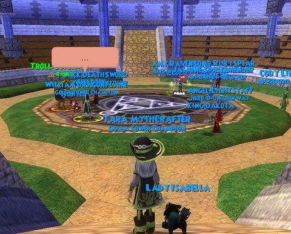

Back to: [West Karana](/posts/westkarana.md) > [2008](/posts/2008/westkarana.md) > [December](./westkarana.md)
# Wizard 101 Arena Season 1

*Posted by Tipa on 2008-12-15 23:53:44*

Given a games company founded by the developers of the PvP-centric MMO Shadowbane, and the fragfest shooters DOOM and Wolfenstein 3D, making a game centered around a bloodless card game where kids could battle monsters with funny monsters of their own must have been a little tough.

Stingite over at [The Friendly Necromancer](http://thefriendlynecromancer.blogspot.com/2008/12/pvp-time-for-smack-talkers-to-come.html) says that that's [all about to change](https://www.wizard101.com/site/posts/list/2710.ftl). 

Just in time for Christmas, the small dueling arena (picture on top) is being entirely revamped. There will be leader boards, ladder, arena ranking, matches, betting, special PvP loot... This is all sounding [so incredibly familiar](http://www.worldofwarcraft.com/pvp/arena/index.xml).

I'm not sure that adding a strong PvP element to Wizard 101 should have taken priority over pushing Dragonspyre out, but, there ya have it. A WoW-like Arena system is coming to W101.

Full details past the fold, but I'd like to point out this quote from Director Todd Coleman:

> "If you prefer questing or mini-games, great... you never have to duel another player," said Todd Coleman, Director of Wizard101. "But families -- and a lot of core gamers that are playing Wizard101 too -- are going to have a great time competing against other players in the Wizard Arena."

In the best of all possible worlds, perhaps... but we all know what happens in arenas. The absolute worst impulses of your MMO player come out. But Coleman does point out that a lot of core gamers -- if you read this blog, you are one -- play W101.

Were you really waiting on an arena? As a core gamer myself, here are the things I put above an arena: An unfiltered chat server for adults. Guilds. Appearance slots. Customizable housing. Some basic means of crafting, perhaps combining the stats of one item with the look of another. A broker for treasure cards where players can make and trade them. Guilds -- I list that again because how can you even have structured PvP without guilds or clans?. Larger battles than 4v4. Some sort of basic raids. The new, rumored Astral magic. The ability to re-spend training points.

I'll play the Arena, but I find PvP fairly dull. I do like the sense of danger it brings to a game world, but when I'm involved in PvP, I usually wish I were doing something fun instead.

Today we announce the pending launch of full featured wizard vs. wizard card duels in Wizard101. The newly expanded Wizard Arena will enable players to participate in practice or ranked spell-casting duels against each other. All other aspects of the current worlds in Wizard101 are collaborative, and community members play spell cards that come to animated life in order to battle zany creatures like Ninja Pigs.

"If you prefer questing or mini-games, great... you never have to duel another player," said Todd Coleman, Director of Wizard101. "But families -- and a lot of core gamers that are playing Wizard101 too -- are going to have a great time competing against other players in the Wizard Arena."

We will launch the enhanced player versus player (PvP) Wizard Arena this week. Players will be able to access the Wizard Arena from any of Wizard101's worlds. Upon entering, one of multiple Arena looks in the style of Wizard101 worlds such as Moo Shu, Marleybone and Krokotopia will be generated. All dueling in the game is turn-based so that victory is more about strategy and deck building, rather than button mashing or internet connection speed. The new launch will give players two ways to compete against each other using the characters they have developed in other areas of Wizard101:

Practice Duels (non-ranked)
• Two teams of up to four wizards compete against each other
• Players can either quick join a duel or set up their own team and chose opponents
• Free for all Wizard101 players
• Players may elect to place wagers of in-game gold on the outcome of their duel
• Any in-game gold winnings are split evenly between team members

Sanctioned Duels (ranked)
• A matchmaking service assigns duels based on Arena ranking and character level of individual players
• Players are ranked based on duel outcome
• Winners get Arena Tickets, redeemable for loot, some of which is unique to the Wizard Arena
• At the end of each quarterly Wizard Arena season, a top Duel Master will be crowned
• Free for Wizard101 subscribers or purchase by microtransaction for 80 Crowns (equivalent to 16 cents or less depending on quantity of Crown purchase) 

## Comments!

**JoeJoe** writes: When they sent out an e-mail about the wizard store, they said dragonspyre was going to be released in early january of 2009, so not too much longer of a wait.

I personally am excited to see how this is going to work out. After all, it is a card game based combat system, and how do you play cards in real life.... well, versus other people.

---

**[The Friendly Necromancer](http://thefriendlynecromancer.blogspot.com)** writes: @ JoeJoe: I think it's more "first quarter" 2009 myself. The quote from the December 10th e-mail said this:

Coming Soon!
Wizard101 will be launching Player vs. Player duels in the Arena in Unicorn Way and in the other worlds of the Spiral very soon! And the highly anticipated, new world, DragonSpyre, is launching in early 2009!

. . . so, early 2009 . . . call it pessimism, but I think that could be interpreted to be as late as March 2009. Of course, I'm hoping early January. 

/shrug

---

**PekkaR** writes: Yeah. If they're recognizing their core gamer audience, how about giving us a more powerful chat system. :p

---

**[The Friendly Necromancer](http://thefriendlynecromancer.blogspot.com)** writes: I will now eat my shoe . . . a press release just came out that said January 2009.

---

**[Tipa](https://chasingdings.com)** writes: Enjoy your leather :)

I'm just happy it's coming out! It will be fun to be playing again. I don't know how much time I will spend in the arena, though. Some, for sure, but unless they add some more incentives, I can't see sticking with it.

---

**[Edward](http://Wizard101)** writes: Does anybody know how to get arena tickets and how to get acces to areas like cyclops lane and firecat alley?

---

**[Edward](http://Wizard101)** writes: I wish I can unlock cool things.

---

