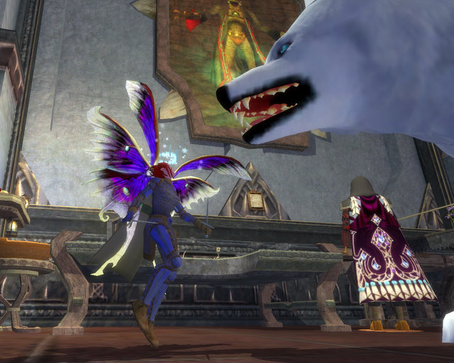

Back to: [West Karana](/posts/westkarana.md) > [2008](/posts/2008/westkarana.md) > [December](./westkarana.md)
# EQ2: When giant dogs attack!

*Posted by Tipa on 2008-12-16 08:26:40*

I was trying to get a decent screen shot of my new Frostfell quest armor when Buddy brutally attacked! One of Dora's final tasks when she betrayed to Freeport was to [befriend Buddy](../../../index.php/2006/06/21/eq-betraying-qeynos-proving-my-worth/), and then take evil delight in killing him. But Dora used her new necromantic powers to bring him back. Somehow she brought him back 'wrong' and he grew to enormous size. He's now the guardian of the guild hall...

But sometimes... when CERTAIN people forget to FEED the dog... he can be vicious.

Maybe it was the new wings that set him off. I didn't feel like my wings matched the armor at all, so I wondered if that gnomish barber in West Freeport could fix that. And for a single gold piece, he could!

I didn't think that a new wing design would set Buddy off, but I guess all he can really see of me is my wings.

Someone PLEASE call him off and feed him! I'm tired of hiding here under the woodworking table!

## Comments!

**[Stargrace](http://www.mmoquests.com)** writes: " when CERTAIN people forget to FEED the dog"

HEY, YOU promised to look after it when you bought him! That was the condition of him being in the hall! Every day who is it who cleans up the halfling sized droppings?!

---

**[Tipa](https://chasingdings.com)** writes: Well SOMEONE picked up all the papers I'd put down on the floor of the Library! Where's he SUPPOSED to go?

---

**almagill** writes: "Where’s he SUPPOSED to go?"

When a dog's the size of a house, pretty much anywhere he chooses to...

---

**[Tipa](https://chasingdings.com)** writes: Ar, ar, ar :P

---

**[Another Average Guy](http://anotheraverageguy.wordpress.com)** writes: I'll take care of him for a brigand hat as payment

---

