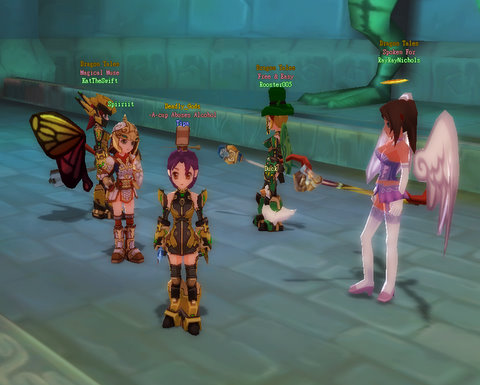

Back to: [West Karana](/posts/westkarana.md) > [2008](/posts/2008/westkarana.md) > [December](./westkarana.md)
# DOMO: Train to Zone!

*Posted by Tipa on 2008-12-18 10:09:02*

They say you can't polish a turd, but I beg to differ. Placid Plains is full of Premier Pupu, so, yum for that. After spending a good hour doing alchemy (now level 8 from making level 0 recipes; today I will make level 8 recipes to 10 and beyond, hopefully), I thought I'd track down the fairy that supposedly gives a quest to upgrade my flying speed in Collingwood City. Which is smack-dab in the middle of high level zones, so it was with some care that I flew there.

It's a really confusing city full of ramps and islands and teleporters, and I had no luck finding this fairy. The only quest givers I could find were ones that wanted me to kill level 40-ish mobs.

I decided to head back to Placid Plains and finish the last Raymond quest. Raymond just stands around at an intersection, like NPCs often do, begging people to kill various mobs for cash, experience, loot and titles. In DOMO, you **can** level by solo grinding trash mobs, but if you're planning on doing something like that, you might as well get the quest for it, and these sorts of quests are repeatable, so why not?

This particular one sent me off to kill Premier Pupus.

I was glad to see that they were just pigs. They were too high level for my level 20 monster mirror, so I used the mirror to capture a giant hedgehog. I figured out how to make my teddy bear pet tank, so I'd send the two pets in and use my Musician skills to keep Teddy alive and in mana, then I'd pull it to me with Bolt from the Blouse, follow up with a Super Stab and a Pilfer and then auto-attack it to death.

Since I can heal my pet but not myself, this worked out a LOT better than me tanking the whole way.

> DOMO tip: When someone says they are 'flagged', it doesn't mean that they have fulfilled certain requirements to enter a difficult zone. It means they have pressed the little button with a flag on it below the chat window and clicked the checkbox for looking for a group. When someone is flagged this way, they can be added to a group from a different zone. You can also choose the title "Please add me to your team" so people walking past you can see you're looking.

I'd flagged myself while stabbing poo, hoping that I'd find someone else killing poo and we'd be able to kill them faster together, or at least, form an autoloot group.

> 
DOMO tip: Mobs drop their loot right in the world, but it only lasts for half a minute or so before decaying. If you're killing monsters very quickly, you might not have a chance to grab the loot before it poofs. The usual solution is to ask the zone for an autoloot group. Everyone groups up, sets the loot order to automatic by team member, and all loot is automatically picked up. The team members continue to solo out of sight of each other so they don't share xp or loot.

Instead, I got an invite to come to "pt for mbops".

I moused over his picture to see that he was in Phoenix Tower, which I vaguely remembered as one of the places a flying pig hid when I was doing the flying quests, so I knew it was in Swan Lake Basin, several zones from where I was in Placid Plains.

But what the heck were "mbops"? Or "fbops"?

There's nothing that's going to stop me from going someplace new -- the Bartle test pegs me as a strong Explorer type, and it's not wrong. I headed back to and through Eversun City and off to Swan Lake and the dungeon.

Phoenix Tower is not much to look at from the outside, but from the inside, well, it felt like home.

I zoned in, and there was a group training mobs to the zone, and this guy who was afk at zone in got killed by those mobs.

It brought tears of joy to my eyes. EverQuest, I missed you so much.

I don't point out these similarities of DOMO to EQ with sarcasm, but with respect, and I'm being totally honest. Yes, DOMO is HARD. It has real penalties for screwing up. You do not level particularly fast. It is a VERY social game, and leveling up is NOT the primary goal. Chatting, making friends, crafting, working on outfits and such, and teaming up for challenging group content -- that was the purpose of the ORIGINAL EverQuest and is the purpose of DOMO. The fact that so many of their game mechanics are straight out of pre-PoP EQ when all conventional wisdom says that people want to level quickly to get to some end game and skip any social or group content is just amazing.

Most of the group was reluctant to actually come to the dungeon until we had a Doctor (healer) and Mercenary (tank). It's true that any character can take either or both of these jobs, but doctors, especially, have a hard time of it. Just like in EQ, groups are reluctant to have more than one healer because they need space for more dps -- especially AoE dps. This requires docs to have spent heavily on their group healing skills -- the "froggy" skills, since they take a small frog as a material component, as opposed to the single target heals, which are far more useful, since those can be used to fill out subjobs. It also means they have to have a lot of time healing for groups, and healers in DOMO, as in every game that swears by the Holy Trinity, are first to be blamed when things go bad.

> 
DOMO tip: The Holy Trinity are the three classes in EQ-like MMOs that form the basis of any group, and consist of a beefy class built to take damage, a healer to heal that damage, and a buffing class of some sort. In DOMO, the Trinity is Mercenary, Doctor and Musician. Play one of these jobs if you want groups all the time.

Once we'd gathered, it was time to head down to the **M**ale **B**irds of **P**aradise, past the **F**emale **B**irds of **P**aradise. I *knew* if I waited long enough, I'd find out what "mbops" and "fbops" were!

Once down deep enough, we pulled mobs here and there until the group leader suggested I start pulling.

Oh. So THAT'S why I got added to the team. They wanted a puller. Sigh.

Pulling, as in EQ, means gathering mobs and TRYING NOT TO DIE. I personally don't find it much fun, but if it gets groups, I'll do it. There was another group in the vicinity and we two pullers were trying to stay out of each other's way. The group was chatting and stuff, and nobody noticed when all the healer's spells were in cooldown just as I brought a big bunch of mobs, so that ended in a couple of deaths.

And later on, I was watching a movie and not paying as much attention as I probably should have been, and began pulling mobs to the other group... which got me a kinda curious tell from my own group. Oops.

Ding 24, though. One level before I switch from my Level 3 Pocket Knife to my Level 2 Hunting Dagger... I don't actual OWN a Hunting Dagger, though. That's what I am building alchemy up for. Once it hits 10, I can make my Hunting Dagger, level that quickly to level 2, upgrade it, and it will be waiting for me when I hit level 25. After that, my faithful Pocket Dagger can enjoy retirement in my bank vault, while I alternate Hunting Dagger with Damp Dagger through level 33.

Met LOTS of friends in game last night as well! Itzier, Gamerio and Ghostie, great to meet you :)))

## Comments!

**[Toldain](http://toldaintalks.blogspot.com)** writes: Dang, you've cast another "nostalgia" spell on me. My first EQ toon was a monk, and I loved pulling with him. The "not dying" part was usually handled by FD. We'd do FD splits, too.

---

**[Openedge1](http://simple-n-complex.blogspot.com)** writes: *And later on, I was watching a movie and not paying as much attention*

See, that gets to me. I would prefer a game that forces me to play the game, and not "babysit" a character...lol.

I still remember a friend of mine who while playing WoW, was watching Lord of the Rings, fell asleep, and leveled up from a PuG...all at the same time.

Impressive.

---

**[Tipa](https://chasingdings.com)** writes: @Edge -- it's a social MMO :P Not a hardcore action MMO. That's the whole point :) But pulling is fairly dull; just run around and aggro stuff and run it back to a group, hopefully yours. Not a lot you can do to make pulling more exciting.

---

**Gameiro** writes: Hey Tipa, great talking to you last night, just to tell you I rerolled to a sprite and consequentely changed name to Rodman still on Onyx, feel free to befriend me again anytime and hope to be ables to grp up with you sometime too :).

---

**Mallika** writes: I laughed at the bit where you pulled the mobs to another group. Hehe! :D

---

**Gnewton** writes: And actually Tipa... the Mythbusters proved you really CAN polish a turd.

---

**Aliesthan** writes: So...
We've got a little rollback today :(
All data from yesterday's 4 PM PST got wiped.
/sigh

---

**[Tipa](https://chasingdings.com)** writes: Yup, all of yesterday's progress is gone.

---

**[Pete S](http://dragonchasers.com)** writes: I wish I had your knack for meeting people. The one downside of being a crusty old curmudgeon is that "not being social" is one of the core skills.

---

**[Tipa](https://chasingdings.com)** writes: I'm just always LFG while doing something else :)

---

